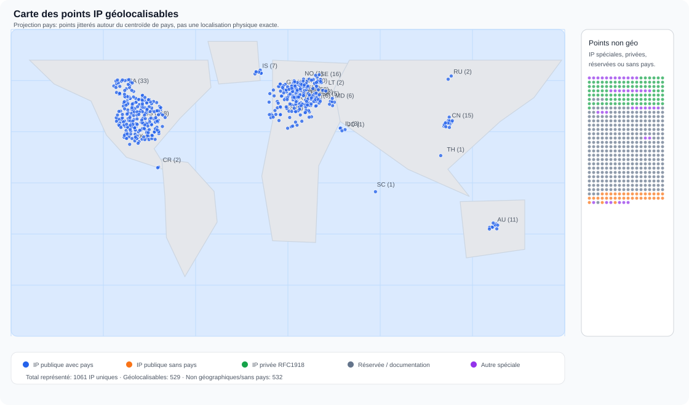

# Azure Microsoft Fun

Rapport Git minimal, construit à partir d’une extraction brute d’adresses IP. Le dépôt ne contient pas les chemins locaux, les noms de fichiers d’origine, ni le contexte des scripts: seulement une vue réseau dédupliquée et lisible.

> Note: la carte utilise le pays annoncé par les métadonnées ASN/BGP quand il existe. Ce n’est pas une géolocalisation précise d’appareil ou d’utilisateur.

## Synthèse

| Mesure | Valeur |
|---|---:|
| IP uniques | 1 061 |
| IPv4 | 598 |
| IPv6 | 463 |
| IP publiques/globales | 565 |
| IP publiques sans pays résolu | 36 |
| Pays identifiés | 28 |

## Carte

Chaque point géolocalisable est placé autour du centroïde du pays annoncé par les métadonnées ASN/BGP. Les IP privées, réservées ou sans pays résolu sont regroupées dans le panneau latéral de la carte.

## Lecture rapide

- `Public/global`: adresse routable sur Internet; l’ASN/propriétaire indique le réseau qui l’annonce, pas forcément l’auteur d’un contenu.
- `RFC1918 private`, `loopback`, `link-local`, `multicast`, `reserved`: adresses techniques ou internes, généralement non attribuables à une organisation publique.
- `Occurrences`: nombre de correspondances trouvées dans l’ensemble scanné; `Présence`: nombre de fichiers distincts, sans révéler leurs chemins.

## Pays les plus présents

| Pays | IP |
|---|---:|
| United States (`US`) | 218 |
| France (`FR`) | 98 |
| Germany (`DE`) | 58 |
| Canada (`CA`) | 33 |
| Sweden (`SE`) | 16 |
| China (`CN`) | 15 |
| Netherlands (`NL`) | 13 |
| Australia (`AU`) | 11 |
| United Kingdom (`GB`) | 11 |
| Denmark (`DK`) | 10 |
| Iceland (`IS`) | 7 |
| Austria (`AT`) | 6 |
| Moldova (`MD`) | 6 |
| Slovakia (`SK`) | 5 |
| Czechia (`CZ`) | 3 |
| Israel (`IL`) | 3 |
| Russia (`RU`) | 2 |
| Costa Rica (`CR`) | 2 |
| Belgium (`BE`) | 2 |
| Lithuania (`LT`) | 2 |
| Thailand (`TH`) | 1 |
| Spain (`ES`) | 1 |
| Luxembourg (`LU`) | 1 |
| Mexico (`MX`) | 1 |
| Jordan (`JO`) | 1 |
| Switzerland (`CH`) | 1 |
| Norway (`NO`) | 1 |
| Seychelles (`SC`) | 1 |

## Propriétaires / ASN les plus présents

| Propriétaire / ASN | IP |
|---|---:|
| IETF | 496 |
| (inconnu) | 68 |
| AS3215 - Orange S.A., FR | 46 |
| CLOUDFLARENET - Cloudflare, Inc., US | 33 |
| AMAZON-02 - Amazon.com, Inc., US | 33 |
| OVH - OVH SAS, FR | 30 |
| DATTO-DOM - Datto, LLC, US | 25 |
| LEVEL3 - Level 3 Parent, LLC, US | 19 |
| AS12876 - Scaleway SAS, FR | 19 |
| HETZNER-AS - Hetzner Online GmbH, DE | 15 |
| MICROSOFT-CORP-MSN-AS-BLOCK - Microsoft Corporation, US | 13 |
| FDCSERVERS - FDCservers.net, US | 12 |
| BACOM - Bell Canada, CA | 12 |
| HEXTET - Hextet Systems, CA | 12 |
| DIGITALOCEAN-ASN - DigitalOcean, LLC, US | 8 |
| ISPPRO-AS - ISPpro Internet KG, DE | 8 |
| TDDE-ASN1 - Telefonica Germany GmbH & Co.OHG, DE | 7 |
| FlokiNET - FlokiNET ehf, IS | 7 |
| AMAZON-AES - Amazon.com, Inc., US | 6 |
| netcup-AS - netcup GmbH, DE | 6 |
| MYLOC-AS - WIIT AG, DE | 6 |
| DATTO-INT - Datto, LLC, US | 6 |
| DFRI-AS - Foreningen for digitala fri- och rattigheter, SE | 6 |
| SUNET - Vetenskapsradet / SUNET, EU | 6 |
| DNIC-AS-00749 - United States Department of Defense (DoD), US | 4 |
| ATT-INTERNET4 - AT&T Enterprises, LLC, US | 4 |
| AKAMAI-AS - Akamai Technologies, Inc., US | 4 |
| IPAX-AS - IPAX GmbH, AT | 4 |
| AS-BENESTRA - SWAN, a.s., SK | 4 |
| DIGICERT - Tiggee LLC, US | 4 |

## Répartition par type

| Type | IP |
|---|---:|
| Public/global | 565 |
| IPv6 reserved | 338 |
| RFC1918 private | 102 |
| IPv4 this network | 11 |
| IPv4 multicast | 7 |
| IPv4 documentation TEST-NET-3 | 5 |
| IPv4 loopback | 4 |
| IPv4 link-local | 4 |
| IPv4 documentation TEST-NET-2 | 4 |
| IPv4 documentation TEST-NET-1 | 3 |
| IPv4 reserved | 3 |
| IPv6 multicast | 3 |
| CGNAT shared address | 2 |
| IPv4-mapped IPv6 | 2 |
| IPv4 unspecified | 1 |
| IPv4 limited broadcast | 1 |
| IPv6 unspecified | 1 |
| IPv6 loopback | 1 |
| Private/special | 1 |
| IPv6 documentation | 1 |
| IPv6 unique local | 1 |
| IPv6 link-local | 1 |

## Inventaire IP

| IP | Type | Pays | Propriétaire / ASN | Préfixe | Occurrences | Présence | Description |
|---|---|---|---|---|---:|---:|---|
| `0.0.0.0` | IPv4 unspecified |  | IETF | 0.0.0.0/32 | 6 643 | 87 | Adresse non spécifiée; souvent utilisée comme placeholder. |
| `0.1.0.0` | IPv4 this network |  | IETF | 0.0.0.0/8 | 2 | 1 | Adresse spéciale IPv4 liée au réseau courant ou à un placeholder. |
| `0.1.1.1` | IPv4 this network |  | IETF | 0.0.0.0/8 | 1 | 1 | Adresse spéciale IPv4 liée au réseau courant ou à un placeholder. |
| `0.1.1.9` | IPv4 this network |  | IETF | 0.0.0.0/8 | 1 | 1 | Adresse spéciale IPv4 liée au réseau courant ou à un placeholder. |
| `0.2.1.30` | IPv4 this network |  | IETF | 0.0.0.0/8 | 2 | 2 | Adresse spéciale IPv4 liée au réseau courant ou à un placeholder. |
| `0.2.2.1` | IPv4 this network |  | IETF | 0.0.0.0/8 | 2 | 1 | Adresse spéciale IPv4 liée au réseau courant ou à un placeholder. |
| `0.2.2.35` | IPv4 this network |  | IETF | 0.0.0.0/8 | 1 | 1 | Adresse spéciale IPv4 liée au réseau courant ou à un placeholder. |
| `0.2.3.11` | IPv4 this network |  | IETF | 0.0.0.0/8 | 1 | 1 | Adresse spéciale IPv4 liée au réseau courant ou à un placeholder. |
| `0.2.4.10` | IPv4 this network |  | IETF | 0.0.0.0/8 | 1 | 1 | Adresse spéciale IPv4 liée au réseau courant ou à un placeholder. |
| `0.2.5.1` | IPv4 this network |  | IETF | 0.0.0.0/8 | 2 | 1 | Adresse spéciale IPv4 liée au réseau courant ou à un placeholder. |
| `0.9.6.0` | IPv4 this network |  | IETF | 0.0.0.0/8 | 1 | 1 | Adresse spéciale IPv4 liée au réseau courant ou à un placeholder. |
| `0.9.26.0` | IPv4 this network |  | IETF | 0.0.0.0/8 | 3 | 3 | Adresse spéciale IPv4 liée au réseau courant ou à un placeholder. |
| `1.0.0.0` | Public/global | Australia (`AU`) | CLOUDFLARENET - Cloudflare, Inc., US | 1.0.0.0/24 | 86 | 83 | Adresse publique routable; géolocalisée au niveau pays: Australia; annoncée par CLOUDFLARENET - Cloudflare, Inc., US; préfixe 1.0.0.0/24. |
| `1.0.0.27` | Public/global | Australia (`AU`) | CLOUDFLARENET - Cloudflare, Inc., US | 1.0.0.0/24 | 3 | 3 | Adresse publique routable; géolocalisée au niveau pays: Australia; annoncée par CLOUDFLARENET - Cloudflare, Inc., US; préfixe 1.0.0.0/24. |
| `1.0.168.0` | Public/global | Thailand (`TH`) | TOT-NET - TOT Public Company Limited, TH | 1.0.168.0/24 | 3 | 3 | Adresse publique routable; géolocalisée au niveau pays: Thailand; annoncée par TOT-NET - TOT Public Company Limited, TH; préfixe 1.0.168.0/24. |
| `1.1.0.1` | Public/global | China (`CN`) |  |  | 2 | 1 | Adresse publique routable; géolocalisée au niveau pays: China; propriétaire non résolu dans le flux ASN. |
| `1.1.1.1` | Public/global | Australia (`AU`) | CLOUDFLARENET - Cloudflare, Inc., US | 1.1.1.0/24 | 122 | 63 | Adresse publique routable; géolocalisée au niveau pays: Australia; annoncée par CLOUDFLARENET - Cloudflare, Inc., US; préfixe 1.1.1.0/24. |
| `1.1.1.2` | Public/global | Australia (`AU`) | CLOUDFLARENET - Cloudflare, Inc., US | 1.1.1.0/24 | 83 | 51 | Adresse publique routable; géolocalisée au niveau pays: Australia; annoncée par CLOUDFLARENET - Cloudflare, Inc., US; préfixe 1.1.1.0/24. |
| `1.1.1.4` | Public/global | Australia (`AU`) | CLOUDFLARENET - Cloudflare, Inc., US | 1.1.1.0/24 | 16 | 16 | Adresse publique routable; géolocalisée au niveau pays: Australia; annoncée par CLOUDFLARENET - Cloudflare, Inc., US; préfixe 1.1.1.0/24. |
| `1.1.1.5` | Public/global | Australia (`AU`) | CLOUDFLARENET - Cloudflare, Inc., US | 1.1.1.0/24 | 102 | 51 | Adresse publique routable; géolocalisée au niveau pays: Australia; annoncée par CLOUDFLARENET - Cloudflare, Inc., US; préfixe 1.1.1.0/24. |
| `1.1.1.8` | Public/global | Australia (`AU`) | CLOUDFLARENET - Cloudflare, Inc., US | 1.1.1.0/24 | 52 | 51 | Adresse publique routable; géolocalisée au niveau pays: Australia; annoncée par CLOUDFLARENET - Cloudflare, Inc., US; préfixe 1.1.1.0/24. |
| `1.1.1.9` | Public/global | Australia (`AU`) | CLOUDFLARENET - Cloudflare, Inc., US | 1.1.1.0/24 | 52 | 51 | Adresse publique routable; géolocalisée au niveau pays: Australia; annoncée par CLOUDFLARENET - Cloudflare, Inc., US; préfixe 1.1.1.0/24. |
| `1.1.2.1` | Public/global | China (`CN`) |  |  | 11 | 11 | Adresse publique routable; géolocalisée au niveau pays: China; propriétaire non résolu dans le flux ASN. |
| `1.1.2.2` | Public/global | China (`CN`) |  |  | 11 | 11 | Adresse publique routable; géolocalisée au niveau pays: China; propriétaire non résolu dans le flux ASN. |
| `1.1.2.5` | Public/global | China (`CN`) |  |  | 52 | 51 | Adresse publique routable; géolocalisée au niveau pays: China; propriétaire non résolu dans le flux ASN. |
| `1.2.0.0` | Public/global | China (`CN`) |  |  | 2 | 2 | Adresse publique routable; géolocalisée au niveau pays: China; propriétaire non résolu dans le flux ASN. |
| `1.2.1.14` | Public/global | China (`CN`) |  |  | 1 | 1 | Adresse publique routable; géolocalisée au niveau pays: China; propriétaire non résolu dans le flux ASN. |
| `1.2.3.4` | Public/global | Australia (`AU`) |  |  | 8 | 8 | Adresse publique routable; géolocalisée au niveau pays: Australia; propriétaire non résolu dans le flux ASN. |
| `1.3.1.1` | Public/global | China (`CN`) |  |  | 3 | 1 | Adresse publique routable; géolocalisée au niveau pays: China; propriétaire non résolu dans le flux ASN. |
| `1.3.6.1` | Public/global | China (`CN`) |  |  | 3 | 1 | Adresse publique routable; géolocalisée au niveau pays: China; propriétaire non résolu dans le flux ASN. |
| `1.3.101.110` | Public/global | China (`CN`) |  |  | 9 | 9 | Adresse publique routable; géolocalisée au niveau pays: China; propriétaire non résolu dans le flux ASN. |
| `1.3.101.111` | Public/global | China (`CN`) |  |  | 9 | 9 | Adresse publique routable; géolocalisée au niveau pays: China; propriétaire non résolu dans le flux ASN. |
| `1.3.101.112` | Public/global | China (`CN`) |  |  | 10 | 10 | Adresse publique routable; géolocalisée au niveau pays: China; propriétaire non résolu dans le flux ASN. |
| `1.3.101.113` | Public/global | China (`CN`) |  |  | 10 | 10 | Adresse publique routable; géolocalisée au niveau pays: China; propriétaire non résolu dans le flux ASN. |
| `1.4.0.0` | Public/global | Australia (`AU`) |  |  | 1 | 1 | Adresse publique routable; géolocalisée au niveau pays: Australia; propriétaire non résolu dans le flux ASN. |
| `2.0.0.0` | Public/global | Sweden (`SE`) |  |  | 720 | 29 | Adresse publique routable; géolocalisée au niveau pays: Sweden; propriétaire non résolu dans le flux ASN. |
| `2.1.27.0` | Public/global | Sweden (`SE`) |  |  | 1 | 1 | Adresse publique routable; géolocalisée au niveau pays: Sweden; propriétaire non résolu dans le flux ASN. |
| `2.2.1.1` | Public/global | Sweden (`SE`) |  |  | 3 | 1 | Adresse publique routable; géolocalisée au niveau pays: Sweden; propriétaire non résolu dans le flux ASN. |
| `2.3.1.1` | Public/global | France (`FR`) | AS3215 - Orange S.A., FR | 2.3.0.0/16 | 3 | 1 | Adresse publique routable; géolocalisée au niveau pays: France; annoncée par AS3215 - Orange S.A., FR; préfixe 2.3.0.0/16. |
| `2.5.0.0` | Public/global | France (`FR`) | AS3215 - Orange S.A., FR | 2.5.0.0/16 | 1 | 1 | Adresse publique routable; géolocalisée au niveau pays: France; annoncée par AS3215 - Orange S.A., FR; préfixe 2.5.0.0/16. |
| `2.5.4.3` | Public/global | France (`FR`) | AS3215 - Orange S.A., FR | 2.5.0.0/16 | 1 | 1 | Adresse publique routable; géolocalisée au niveau pays: France; annoncée par AS3215 - Orange S.A., FR; préfixe 2.5.0.0/16. |
| `2.5.4.4` | Public/global | France (`FR`) | AS3215 - Orange S.A., FR | 2.5.0.0/16 | 1 | 1 | Adresse publique routable; géolocalisée au niveau pays: France; annoncée par AS3215 - Orange S.A., FR; préfixe 2.5.0.0/16. |
| `2.5.4.5` | Public/global | France (`FR`) | AS3215 - Orange S.A., FR | 2.5.0.0/16 | 1 | 1 | Adresse publique routable; géolocalisée au niveau pays: France; annoncée par AS3215 - Orange S.A., FR; préfixe 2.5.0.0/16. |
| `2.5.4.6` | Public/global | France (`FR`) | AS3215 - Orange S.A., FR | 2.5.0.0/16 | 1 | 1 | Adresse publique routable; géolocalisée au niveau pays: France; annoncée par AS3215 - Orange S.A., FR; préfixe 2.5.0.0/16. |
| `2.5.4.7` | Public/global | France (`FR`) | AS3215 - Orange S.A., FR | 2.5.0.0/16 | 1 | 1 | Adresse publique routable; géolocalisée au niveau pays: France; annoncée par AS3215 - Orange S.A., FR; préfixe 2.5.0.0/16. |
| `2.5.4.8` | Public/global | France (`FR`) | AS3215 - Orange S.A., FR | 2.5.0.0/16 | 1 | 1 | Adresse publique routable; géolocalisée au niveau pays: France; annoncée par AS3215 - Orange S.A., FR; préfixe 2.5.0.0/16. |
| `2.5.4.9` | Public/global | France (`FR`) | AS3215 - Orange S.A., FR | 2.5.0.0/16 | 1 | 1 | Adresse publique routable; géolocalisée au niveau pays: France; annoncée par AS3215 - Orange S.A., FR; préfixe 2.5.0.0/16. |
| `2.5.4.10` | Public/global | France (`FR`) | AS3215 - Orange S.A., FR | 2.5.0.0/16 | 16 | 16 | Adresse publique routable; géolocalisée au niveau pays: France; annoncée par AS3215 - Orange S.A., FR; préfixe 2.5.0.0/16. |
| `2.5.4.11` | Public/global | France (`FR`) | AS3215 - Orange S.A., FR | 2.5.0.0/16 | 16 | 16 | Adresse publique routable; géolocalisée au niveau pays: France; annoncée par AS3215 - Orange S.A., FR; préfixe 2.5.0.0/16. |
| `2.5.4.12` | Public/global | France (`FR`) | AS3215 - Orange S.A., FR | 2.5.0.0/16 | 1 | 1 | Adresse publique routable; géolocalisée au niveau pays: France; annoncée par AS3215 - Orange S.A., FR; préfixe 2.5.0.0/16. |
| `2.5.4.15` | Public/global | France (`FR`) | AS3215 - Orange S.A., FR | 2.5.0.0/16 | 1 | 1 | Adresse publique routable; géolocalisée au niveau pays: France; annoncée par AS3215 - Orange S.A., FR; préfixe 2.5.0.0/16. |
| `2.5.4.16` | Public/global | France (`FR`) | AS3215 - Orange S.A., FR | 2.5.0.0/16 | 1 | 1 | Adresse publique routable; géolocalisée au niveau pays: France; annoncée par AS3215 - Orange S.A., FR; préfixe 2.5.0.0/16. |
| `2.5.4.17` | Public/global | France (`FR`) | AS3215 - Orange S.A., FR | 2.5.0.0/16 | 1 | 1 | Adresse publique routable; géolocalisée au niveau pays: France; annoncée par AS3215 - Orange S.A., FR; préfixe 2.5.0.0/16. |
| `2.5.4.42` | Public/global | France (`FR`) | AS3215 - Orange S.A., FR | 2.5.0.0/16 | 1 | 1 | Adresse publique routable; géolocalisée au niveau pays: France; annoncée par AS3215 - Orange S.A., FR; préfixe 2.5.0.0/16. |
| `2.5.4.43` | Public/global | France (`FR`) | AS3215 - Orange S.A., FR | 2.5.0.0/16 | 1 | 1 | Adresse publique routable; géolocalisée au niveau pays: France; annoncée par AS3215 - Orange S.A., FR; préfixe 2.5.0.0/16. |
| `2.5.4.44` | Public/global | France (`FR`) | AS3215 - Orange S.A., FR | 2.5.0.0/16 | 1 | 1 | Adresse publique routable; géolocalisée au niveau pays: France; annoncée par AS3215 - Orange S.A., FR; préfixe 2.5.0.0/16. |
| `2.5.4.45` | Public/global | France (`FR`) | AS3215 - Orange S.A., FR | 2.5.0.0/16 | 1 | 1 | Adresse publique routable; géolocalisée au niveau pays: France; annoncée par AS3215 - Orange S.A., FR; préfixe 2.5.0.0/16. |
| `2.5.4.46` | Public/global | France (`FR`) | AS3215 - Orange S.A., FR | 2.5.0.0/16 | 1 | 1 | Adresse publique routable; géolocalisée au niveau pays: France; annoncée par AS3215 - Orange S.A., FR; préfixe 2.5.0.0/16. |
| `2.5.4.65` | Public/global | France (`FR`) | AS3215 - Orange S.A., FR | 2.5.0.0/16 | 1 | 1 | Adresse publique routable; géolocalisée au niveau pays: France; annoncée par AS3215 - Orange S.A., FR; préfixe 2.5.0.0/16. |
| `2.5.4.97` | Public/global | France (`FR`) | AS3215 - Orange S.A., FR | 2.5.0.0/16 | 1 | 1 | Adresse publique routable; géolocalisée au niveau pays: France; annoncée par AS3215 - Orange S.A., FR; préfixe 2.5.0.0/16. |
| `2.5.4.102` | Public/global | France (`FR`) | AS3215 - Orange S.A., FR | 2.5.0.0/16 | 1 | 1 | Adresse publique routable; géolocalisée au niveau pays: France; annoncée par AS3215 - Orange S.A., FR; préfixe 2.5.0.0/16. |
| `2.5.29.9` | Public/global | France (`FR`) | AS3215 - Orange S.A., FR | 2.5.0.0/16 | 1 | 1 | Adresse publique routable; géolocalisée au niveau pays: France; annoncée par AS3215 - Orange S.A., FR; préfixe 2.5.0.0/16. |
| `2.5.29.14` | Public/global | France (`FR`) | AS3215 - Orange S.A., FR | 2.5.0.0/16 | 2 | 2 | Adresse publique routable; géolocalisée au niveau pays: France; annoncée par AS3215 - Orange S.A., FR; préfixe 2.5.0.0/16. |
| `2.5.29.15` | Public/global | France (`FR`) | AS3215 - Orange S.A., FR | 2.5.0.0/16 | 1 | 1 | Adresse publique routable; géolocalisée au niveau pays: France; annoncée par AS3215 - Orange S.A., FR; préfixe 2.5.0.0/16. |
| `2.5.29.16` | Public/global | France (`FR`) | AS3215 - Orange S.A., FR | 2.5.0.0/16 | 1 | 1 | Adresse publique routable; géolocalisée au niveau pays: France; annoncée par AS3215 - Orange S.A., FR; préfixe 2.5.0.0/16. |
| `2.5.29.17` | Public/global | France (`FR`) | AS3215 - Orange S.A., FR | 2.5.0.0/16 | 1 | 1 | Adresse publique routable; géolocalisée au niveau pays: France; annoncée par AS3215 - Orange S.A., FR; préfixe 2.5.0.0/16. |
| `2.5.29.18` | Public/global | France (`FR`) | AS3215 - Orange S.A., FR | 2.5.0.0/16 | 1 | 1 | Adresse publique routable; géolocalisée au niveau pays: France; annoncée par AS3215 - Orange S.A., FR; préfixe 2.5.0.0/16. |
| `2.5.29.19` | Public/global | France (`FR`) | AS3215 - Orange S.A., FR | 2.5.0.0/16 | 1 | 1 | Adresse publique routable; géolocalisée au niveau pays: France; annoncée par AS3215 - Orange S.A., FR; préfixe 2.5.0.0/16. |
| `2.5.29.20` | Public/global | France (`FR`) | AS3215 - Orange S.A., FR | 2.5.0.0/16 | 1 | 1 | Adresse publique routable; géolocalisée au niveau pays: France; annoncée par AS3215 - Orange S.A., FR; préfixe 2.5.0.0/16. |
| `2.5.29.21` | Public/global | France (`FR`) | AS3215 - Orange S.A., FR | 2.5.0.0/16 | 1 | 1 | Adresse publique routable; géolocalisée au niveau pays: France; annoncée par AS3215 - Orange S.A., FR; préfixe 2.5.0.0/16. |
| `2.5.29.24` | Public/global | France (`FR`) | AS3215 - Orange S.A., FR | 2.5.0.0/16 | 1 | 1 | Adresse publique routable; géolocalisée au niveau pays: France; annoncée par AS3215 - Orange S.A., FR; préfixe 2.5.0.0/16. |
| `2.5.29.27` | Public/global | France (`FR`) | AS3215 - Orange S.A., FR | 2.5.0.0/16 | 1 | 1 | Adresse publique routable; géolocalisée au niveau pays: France; annoncée par AS3215 - Orange S.A., FR; préfixe 2.5.0.0/16. |
| `2.5.29.28` | Public/global | France (`FR`) | AS3215 - Orange S.A., FR | 2.5.0.0/16 | 1 | 1 | Adresse publique routable; géolocalisée au niveau pays: France; annoncée par AS3215 - Orange S.A., FR; préfixe 2.5.0.0/16. |
| `2.5.29.29` | Public/global | France (`FR`) | AS3215 - Orange S.A., FR | 2.5.0.0/16 | 1 | 1 | Adresse publique routable; géolocalisée au niveau pays: France; annoncée par AS3215 - Orange S.A., FR; préfixe 2.5.0.0/16. |
| `2.5.29.30` | Public/global | France (`FR`) | AS3215 - Orange S.A., FR | 2.5.0.0/16 | 1 | 1 | Adresse publique routable; géolocalisée au niveau pays: France; annoncée par AS3215 - Orange S.A., FR; préfixe 2.5.0.0/16. |
| `2.5.29.31` | Public/global | France (`FR`) | AS3215 - Orange S.A., FR | 2.5.0.0/16 | 1 | 1 | Adresse publique routable; géolocalisée au niveau pays: France; annoncée par AS3215 - Orange S.A., FR; préfixe 2.5.0.0/16. |
| `2.5.29.32` | Public/global | France (`FR`) | AS3215 - Orange S.A., FR | 2.5.0.0/16 | 1 | 1 | Adresse publique routable; géolocalisée au niveau pays: France; annoncée par AS3215 - Orange S.A., FR; préfixe 2.5.0.0/16. |
| `2.5.29.33` | Public/global | France (`FR`) | AS3215 - Orange S.A., FR | 2.5.0.0/16 | 1 | 1 | Adresse publique routable; géolocalisée au niveau pays: France; annoncée par AS3215 - Orange S.A., FR; préfixe 2.5.0.0/16. |
| `2.5.29.35` | Public/global | France (`FR`) | AS3215 - Orange S.A., FR | 2.5.0.0/16 | 1 | 1 | Adresse publique routable; géolocalisée au niveau pays: France; annoncée par AS3215 - Orange S.A., FR; préfixe 2.5.0.0/16. |
| `2.5.29.36` | Public/global | France (`FR`) | AS3215 - Orange S.A., FR | 2.5.0.0/16 | 1 | 1 | Adresse publique routable; géolocalisée au niveau pays: France; annoncée par AS3215 - Orange S.A., FR; préfixe 2.5.0.0/16. |
| `2.5.29.37` | Public/global | France (`FR`) | AS3215 - Orange S.A., FR | 2.5.0.0/16 | 1 | 1 | Adresse publique routable; géolocalisée au niveau pays: France; annoncée par AS3215 - Orange S.A., FR; préfixe 2.5.0.0/16. |
| `2.5.29.46` | Public/global | France (`FR`) | AS3215 - Orange S.A., FR | 2.5.0.0/16 | 1 | 1 | Adresse publique routable; géolocalisée au niveau pays: France; annoncée par AS3215 - Orange S.A., FR; préfixe 2.5.0.0/16. |
| `2.5.29.54` | Public/global | France (`FR`) | AS3215 - Orange S.A., FR | 2.5.0.0/16 | 1 | 1 | Adresse publique routable; géolocalisée au niveau pays: France; annoncée par AS3215 - Orange S.A., FR; préfixe 2.5.0.0/16. |
| `2.6.10.0` | Public/global | France (`FR`) | AS3215 - Orange S.A., FR | 2.6.0.0/16 | 11 | 5 | Adresse publique routable; géolocalisée au niveau pays: France; annoncée par AS3215 - Orange S.A., FR; préfixe 2.6.0.0/16. |
| `2.16.170.132` | Public/global | Netherlands (`NL`) | AKAMAI-ASN1 - Akamai International B.V., NL | 2.16.170.0/24 | 1 | 1 | Adresse publique routable; géolocalisée au niveau pays: Netherlands; annoncée par AKAMAI-ASN1 - Akamai International B.V., NL; préfixe 2.16.170.0/24. |
| `3.0.0.0` | Public/global | United States (`US`) | AMAZON-02 - Amazon.com, Inc., US | 3.0.0.0/15 | 24 | 8 | Adresse publique routable; géolocalisée au niveau pays: United States; annoncée par AMAZON-02 - Amazon.com, Inc., US; préfixe 3.0.0.0/15. |
| `3.0.1.0` | Public/global | United States (`US`) | AMAZON-02 - Amazon.com, Inc., US | 3.0.0.0/15 | 1 | 1 | Adresse publique routable; géolocalisée au niveau pays: United States; annoncée par AMAZON-02 - Amazon.com, Inc., US; préfixe 3.0.0.0/15. |
| `3.5.0.1` | Public/global | United States (`US`) | AMAZON-AES - Amazon.com, Inc., US | 3.5.0.0/24 | 1 | 1 | Adresse publique routable; géolocalisée au niveau pays: United States; annoncée par AMAZON-AES - Amazon.com, Inc., US; préfixe 3.5.0.0/24. |
| `3.7.4.3` | Public/global | United States (`US`) | AMAZON-02 - Amazon.com, Inc., US | 3.6.0.0/15 | 1 | 1 | Adresse publique routable; géolocalisée au niveau pays: United States; annoncée par AMAZON-02 - Amazon.com, Inc., US; préfixe 3.6.0.0/15. |
| `3.10.0.1` | Public/global | United States (`US`) | AMAZON-02 - Amazon.com, Inc., US | 3.8.0.0/14 | 1 | 1 | Adresse publique routable; géolocalisée au niveau pays: United States; annoncée par AMAZON-02 - Amazon.com, Inc., US; préfixe 3.8.0.0/14. |
| `3.24.210.21` | Public/global | United States (`US`) | AMAZON-02 - Amazon.com, Inc., US | 3.24.0.0/14 | 1 | 1 | Adresse publique routable; géolocalisée au niveau pays: United States; annoncée par AMAZON-02 - Amazon.com, Inc., US; préfixe 3.24.0.0/14. |
| `3.164.92.124` | Public/global | United States (`US`) | AMAZON-02 - Amazon.com, Inc., US | 3.164.92.0/22 | 1 | 1 | Adresse publique routable; géolocalisée au niveau pays: United States; annoncée par AMAZON-02 - Amazon.com, Inc., US; préfixe 3.164.92.0/22. |
| `4.0.0.0` | Public/global | United States (`US`) | LEVEL3 - Level 3 Parent, LLC, US | 4.0.0.0/9 | 1 777 | 42 | Adresse publique routable; géolocalisée au niveau pays: United States; annoncée par LEVEL3 - Level 3 Parent, LLC, US; préfixe 4.0.0.0/9. |
| `4.0.1.2` | Public/global | United States (`US`) | LEVEL3 - Level 3 Parent, LLC, US | 4.0.0.0/9 | 2 | 1 | Adresse publique routable; géolocalisée au niveau pays: United States; annoncée par LEVEL3 - Level 3 Parent, LLC, US; préfixe 4.0.0.0/9. |
| `4.0.3.0` | Public/global | United States (`US`) | LEVEL3 - Level 3 Parent, LLC, US | 4.0.0.0/9 | 2 | 1 | Adresse publique routable; géolocalisée au niveau pays: United States; annoncée par LEVEL3 - Level 3 Parent, LLC, US; préfixe 4.0.0.0/9. |
| `4.1.1.1` | Public/global | United States (`US`) | LEVEL3 - Level 3 Parent, LLC, US | 4.0.0.0/9 | 3 | 1 | Adresse publique routable; géolocalisée au niveau pays: United States; annoncée par LEVEL3 - Level 3 Parent, LLC, US; préfixe 4.0.0.0/9. |
| `4.3.1.0` | Public/global | United States (`US`) | LEVEL3 - Level 3 Parent, LLC, US | 4.0.0.0/9 | 4 | 4 | Adresse publique routable; géolocalisée au niveau pays: United States; annoncée par LEVEL3 - Level 3 Parent, LLC, US; préfixe 4.0.0.0/9. |
| `4.3.2.1` | Public/global | United States (`US`) | LEVEL3 - Level 3 Parent, LLC, US | 4.0.0.0/9 | 1 | 1 | Adresse publique routable; géolocalisée au niveau pays: United States; annoncée par LEVEL3 - Level 3 Parent, LLC, US; préfixe 4.0.0.0/9. |
| `4.4.2.3` | Public/global | United States (`US`) | LEVEL3 - Level 3 Parent, LLC, US | 4.0.0.0/9 | 3 | 3 | Adresse publique routable; géolocalisée au niveau pays: United States; annoncée par LEVEL3 - Level 3 Parent, LLC, US; préfixe 4.0.0.0/9. |
| `4.4.4.4` | Public/global | United States (`US`) | LEVEL3 - Level 3 Parent, LLC, US | 4.0.0.0/9 | 1 | 1 | Adresse publique routable; géolocalisée au niveau pays: United States; annoncée par LEVEL3 - Level 3 Parent, LLC, US; préfixe 4.0.0.0/9. |
| `4.6.81.0` | Public/global | United States (`US`) | LEVEL3 - Level 3 Parent, LLC, US | 4.0.0.0/9 | 1 | 1 | Adresse publique routable; géolocalisée au niveau pays: United States; annoncée par LEVEL3 - Level 3 Parent, LLC, US; préfixe 4.0.0.0/9. |
| `4.9.1.1` | Public/global | United States (`US`) | LEVEL3 - Level 3 Parent, LLC, US | 4.0.0.0/9 | 3 | 1 | Adresse publique routable; géolocalisée au niveau pays: United States; annoncée par LEVEL3 - Level 3 Parent, LLC, US; préfixe 4.0.0.0/9. |
| `4.10.22.7` | Public/global | United States (`US`) | LEVEL3 - Level 3 Parent, LLC, US | 4.0.0.0/9 | 2 | 1 | Adresse publique routable; géolocalisée au niveau pays: United States; annoncée par LEVEL3 - Level 3 Parent, LLC, US; préfixe 4.0.0.0/9. |
| `4.12.1.1` | Public/global | United States (`US`) | LEVEL3 - Level 3 Parent, LLC, US | 4.0.0.0/9 | 3 | 1 | Adresse publique routable; géolocalisée au niveau pays: United States; annoncée par LEVEL3 - Level 3 Parent, LLC, US; préfixe 4.0.0.0/9. |
| `4.14.1.1` | Public/global | United States (`US`) | LEVEL3 - Level 3 Parent, LLC, US | 4.0.0.0/9 | 3 | 1 | Adresse publique routable; géolocalisée au niveau pays: United States; annoncée par LEVEL3 - Level 3 Parent, LLC, US; préfixe 4.0.0.0/9. |
| `4.14.2.1` | Public/global | United States (`US`) | LEVEL3 - Level 3 Parent, LLC, US | 4.0.0.0/9 | 3 | 1 | Adresse publique routable; géolocalisée au niveau pays: United States; annoncée par LEVEL3 - Level 3 Parent, LLC, US; préfixe 4.0.0.0/9. |
| `4.52.5.4` | Public/global | United States (`US`) | LEVEL3 - Level 3 Parent, LLC, US | 4.0.0.0/9 | 3 | 1 | Adresse publique routable; géolocalisée au niveau pays: United States; annoncée par LEVEL3 - Level 3 Parent, LLC, US; préfixe 4.0.0.0/9. |
| `4.112.5.4` | Public/global | United States (`US`) | LEVEL3 - Level 3 Parent, LLC, US | 4.0.0.0/9 | 2 | 1 | Adresse publique routable; géolocalisée au niveau pays: United States; annoncée par LEVEL3 - Level 3 Parent, LLC, US; préfixe 4.0.0.0/9. |
| `5.4.32.5` | Public/global | Germany (`DE`) | TDDE-ASN1 - Telefonica Germany GmbH & Co.OHG, DE | 5.4.0.0/14 | 3 | 1 | Adresse publique routable; géolocalisée au niveau pays: Germany; annoncée par TDDE-ASN1 - Telefonica Germany GmbH & Co.OHG, DE; préfixe 5.4.0.0/14. |
| `5.4.82.5` | Public/global | Germany (`DE`) | TDDE-ASN1 - Telefonica Germany GmbH & Co.OHG, DE | 5.4.0.0/14 | 3 | 1 | Adresse publique routable; géolocalisée au niveau pays: Germany; annoncée par TDDE-ASN1 - Telefonica Germany GmbH & Co.OHG, DE; préfixe 5.4.0.0/14. |
| `5.4.102.5` | Public/global | Germany (`DE`) | TDDE-ASN1 - Telefonica Germany GmbH & Co.OHG, DE | 5.4.0.0/14 | 2 | 1 | Adresse publique routable; géolocalisée au niveau pays: Germany; annoncée par TDDE-ASN1 - Telefonica Germany GmbH & Co.OHG, DE; préfixe 5.4.0.0/14. |
| `5.4.112.5` | Public/global | Germany (`DE`) | TDDE-ASN1 - Telefonica Germany GmbH & Co.OHG, DE | 5.4.0.0/14 | 1 | 1 | Adresse publique routable; géolocalisée au niveau pays: Germany; annoncée par TDDE-ASN1 - Telefonica Germany GmbH & Co.OHG, DE; préfixe 5.4.0.0/14. |
| `5.5.7.3` | Public/global | Germany (`DE`) | TDDE-ASN1 - Telefonica Germany GmbH & Co.OHG, DE | 5.4.0.0/14 | 3 | 1 | Adresse publique routable; géolocalisée au niveau pays: Germany; annoncée par TDDE-ASN1 - Telefonica Germany GmbH & Co.OHG, DE; préfixe 5.4.0.0/14. |
| `5.6.7.8` | Public/global | Germany (`DE`) | TDDE-ASN1 - Telefonica Germany GmbH & Co.OHG, DE | 5.4.0.0/14 | 1 | 1 | Adresse publique routable; géolocalisée au niveau pays: Germany; annoncée par TDDE-ASN1 - Telefonica Germany GmbH & Co.OHG, DE; préfixe 5.4.0.0/14. |
| `5.7.1.2` | Public/global | Germany (`DE`) | TDDE-ASN1 - Telefonica Germany GmbH & Co.OHG, DE | 5.4.0.0/14 | 1 | 1 | Adresse publique routable; géolocalisée au niveau pays: Germany; annoncée par TDDE-ASN1 - Telefonica Germany GmbH & Co.OHG, DE; préfixe 5.4.0.0/14. |
| `5.9.110.236` | Public/global | Germany (`DE`) | HETZNER-AS - Hetzner Online GmbH, DE | 5.9.0.0/16 | 1 | 1 | Adresse publique routable; géolocalisée au niveau pays: Germany; annoncée par HETZNER-AS - Hetzner Online GmbH, DE; préfixe 5.9.0.0/16. |
| `5.9.147.226` | Public/global | Germany (`DE`) | HETZNER-AS - Hetzner Online GmbH, DE | 5.9.0.0/16 | 1 | 1 | Adresse publique routable; géolocalisée au niveau pays: Germany; annoncée par HETZNER-AS - Hetzner Online GmbH, DE; préfixe 5.9.0.0/16. |
| `5.9.158.75` | Public/global | Germany (`DE`) | HETZNER-AS - Hetzner Online GmbH, DE | 5.9.0.0/16 | 1 | 1 | Adresse publique routable; géolocalisée au niveau pays: Germany; annoncée par HETZNER-AS - Hetzner Online GmbH, DE; préfixe 5.9.0.0/16. |
| `5.45.111.149` | Public/global | Germany (`DE`) | netcup-AS - netcup GmbH, DE | 5.45.108.0/22 | 1 | 1 | Adresse publique routable; géolocalisée au niveau pays: Germany; annoncée par netcup-AS - netcup GmbH, DE; préfixe 5.45.108.0/22. |
| `5.53.0.0` | Public/global | Spain (`ES`) | IDDQD-AS - IDDQD-AS, ES | 5.53.0.0/21 | 8 | 4 | Adresse publique routable; géolocalisée au niveau pays: Spain; annoncée par IDDQD-AS - IDDQD-AS, ES; préfixe 5.53.0.0/21. |
| `5.189.169.190` | Public/global | Germany (`DE`) | CONTABO - Contabo GmbH, DE | 5.189.160.0/20 | 1 | 1 | Adresse publique routable; géolocalisée au niveau pays: Germany; annoncée par CONTABO - Contabo GmbH, DE; préfixe 5.189.160.0/20. |
| `5.196.23.64` | Public/global | France (`FR`) | OVH - OVH SAS, FR | 5.196.0.0/16 | 1 | 1 | Adresse publique routable; géolocalisée au niveau pays: France; annoncée par OVH - OVH SAS, FR; préfixe 5.196.0.0/16. |
| `5.199.142.236` | Public/global | Germany (`DE`) | MYLOC-AS - WIIT AG, DE | 5.199.128.0/20 | 1 | 1 | Adresse publique routable; géolocalisée au niveau pays: Germany; annoncée par MYLOC-AS - WIIT AG, DE; préfixe 5.199.128.0/20. |
| `5.200.21.144` | Public/global | Netherlands (`NL`) | i3Dnet - i3D.net B.V, NL | 5.200.0.0/19 | 1 | 1 | Adresse publique routable; géolocalisée au niveau pays: Netherlands; annoncée par i3Dnet - i3D.net B.V, NL; préfixe 5.200.0.0/19. |
| `6.0.0.0` | Public/global | United States (`US`) |  |  | 17 | 16 | Adresse publique routable; géolocalisée au niveau pays: United States; propriétaire non résolu dans le flux ASN. |
| `6.0.0.2` | Public/global | United States (`US`) |  |  | 5 | 5 | Adresse publique routable; géolocalisée au niveau pays: United States; propriétaire non résolu dans le flux ASN. |
| `6.2.1.3` | Public/global | United States (`US`) | DNIC-AS-00668 - United States Department of Defense (DoD), US | 6.2.0.0/18 | 1 | 1 | Adresse publique routable; géolocalisée au niveau pays: United States; annoncée par DNIC-AS-00668 - United States Department of Defense (DoD), US; préfixe 6.2.0.0/18. |
| `6.2.2.3` | Public/global | United States (`US`) | DNIC-AS-00668 - United States Department of Defense (DoD), US | 6.2.0.0/18 | 1 | 1 | Adresse publique routable; géolocalisée au niveau pays: United States; annoncée par DNIC-AS-00668 - United States Department of Defense (DoD), US; préfixe 6.2.0.0/18. |
| `6.6.4.1` | Public/global | United States (`US`) |  |  | 1 | 1 | Adresse publique routable; géolocalisée au niveau pays: United States; propriétaire non résolu dans le flux ASN. |
| `7.2.3.1` | Public/global | United States (`US`) | DNIC-AS-00749 - United States Department of Defense (DoD), US | 7.0.0.0/8 | 2 | 1 | Adresse publique routable; géolocalisée au niveau pays: United States; annoncée par DNIC-AS-00749 - United States Department of Defense (DoD), US; préfixe 7.0.0.0/8. |
| `8.0.0.0` | Public/global | United States (`US`) | LEVEL3 - Level 3 Parent, LLC, US | 8.0.0.0/12 | 8 | 4 | Adresse publique routable; géolocalisée au niveau pays: United States; annoncée par LEVEL3 - Level 3 Parent, LLC, US; préfixe 8.0.0.0/12. |
| `8.1.2.5` | Public/global | United States (`US`) | LEVEL3 - Level 3 Parent, LLC, US | 8.0.0.0/12 | 3 | 2 | Adresse publique routable; géolocalisée au niveau pays: United States; annoncée par LEVEL3 - Level 3 Parent, LLC, US; préfixe 8.0.0.0/12. |
| `8.8.8.8` | Public/global | United States (`US`) | GOOGLE - Google LLC, US | 8.8.8.0/24 | 11 | 11 | Adresse publique routable; géolocalisée au niveau pays: United States; annoncée par GOOGLE - Google LLC, US; préfixe 8.8.8.0/24. |
| `8.25.163.70` | Public/global | United States (`US`) | NETRIX-16567 - Netrix LLC, US | 8.25.163.0/24 | 5 | 5 | Adresse publique routable; géolocalisée au niveau pays: United States; annoncée par NETRIX-16567 - Netrix LLC, US; préfixe 8.25.163.0/24. |
| `8.34.160.0` | Public/global | United States (`US`) | LEVEL3 - Level 3 Parent, LLC, US | 8.32.0.0/12 | 3 | 3 | Adresse publique routable; géolocalisée au niveau pays: United States; annoncée par LEVEL3 - Level 3 Parent, LLC, US; préfixe 8.32.0.0/12. |
| `8.34.161.50` | Public/global | United States (`US`) | DATTO-DOM - Datto, LLC, US | 8.34.161.0/24 | 1 | 1 | Adresse publique routable; géolocalisée au niveau pays: United States; annoncée par DATTO-DOM - Datto, LLC, US; préfixe 8.34.161.0/24. |
| `8.34.161.110` | Public/global | United States (`US`) | DATTO-DOM - Datto, LLC, US | 8.34.161.0/24 | 19 | 16 | Adresse publique routable; géolocalisée au niveau pays: United States; annoncée par DATTO-DOM - Datto, LLC, US; préfixe 8.34.161.0/24. |
| `8.34.161.111` | Public/global | United States (`US`) | DATTO-DOM - Datto, LLC, US | 8.34.161.0/24 | 9 | 8 | Adresse publique routable; géolocalisée au niveau pays: United States; annoncée par DATTO-DOM - Datto, LLC, US; préfixe 8.34.161.0/24. |
| `8.34.161.112` | Public/global | United States (`US`) | DATTO-DOM - Datto, LLC, US | 8.34.161.0/24 | 9 | 8 | Adresse publique routable; géolocalisée au niveau pays: United States; annoncée par DATTO-DOM - Datto, LLC, US; préfixe 8.34.161.0/24. |
| `8.34.161.113` | Public/global | United States (`US`) | DATTO-DOM - Datto, LLC, US | 8.34.161.0/24 | 211 | 175 | Adresse publique routable; géolocalisée au niveau pays: United States; annoncée par DATTO-DOM - Datto, LLC, US; préfixe 8.34.161.0/24. |
| `8.34.161.114` | Public/global | United States (`US`) | DATTO-DOM - Datto, LLC, US | 8.34.161.0/24 | 3 | 2 | Adresse publique routable; géolocalisée au niveau pays: United States; annoncée par DATTO-DOM - Datto, LLC, US; préfixe 8.34.161.0/24. |
| `8.34.161.115` | Public/global | United States (`US`) | DATTO-DOM - Datto, LLC, US | 8.34.161.0/24 | 10 | 9 | Adresse publique routable; géolocalisée au niveau pays: United States; annoncée par DATTO-DOM - Datto, LLC, US; préfixe 8.34.161.0/24. |
| `8.34.161.116` | Public/global | United States (`US`) | DATTO-DOM - Datto, LLC, US | 8.34.161.0/24 | 9 | 8 | Adresse publique routable; géolocalisée au niveau pays: United States; annoncée par DATTO-DOM - Datto, LLC, US; préfixe 8.34.161.0/24. |
| `8.34.161.122` | Public/global | United States (`US`) | DATTO-DOM - Datto, LLC, US | 8.34.161.0/24 | 4 | 4 | Adresse publique routable; géolocalisée au niveau pays: United States; annoncée par DATTO-DOM - Datto, LLC, US; préfixe 8.34.161.0/24. |
| `8.34.161.123` | Public/global | United States (`US`) | DATTO-DOM - Datto, LLC, US | 8.34.161.0/24 | 15 | 14 | Adresse publique routable; géolocalisée au niveau pays: United States; annoncée par DATTO-DOM - Datto, LLC, US; préfixe 8.34.161.0/24. |
| `8.34.161.124` | Public/global | United States (`US`) | DATTO-DOM - Datto, LLC, US | 8.34.161.0/24 | 4 | 4 | Adresse publique routable; géolocalisée au niveau pays: United States; annoncée par DATTO-DOM - Datto, LLC, US; préfixe 8.34.161.0/24. |
| `8.34.161.125` | Public/global | United States (`US`) | DATTO-DOM - Datto, LLC, US | 8.34.161.0/24 | 4 | 4 | Adresse publique routable; géolocalisée au niveau pays: United States; annoncée par DATTO-DOM - Datto, LLC, US; préfixe 8.34.161.0/24. |
| `8.34.161.130` | Public/global | United States (`US`) | DATTO-DOM - Datto, LLC, US | 8.34.161.0/24 | 2 | 2 | Adresse publique routable; géolocalisée au niveau pays: United States; annoncée par DATTO-DOM - Datto, LLC, US; préfixe 8.34.161.0/24. |
| `8.34.161.133` | Public/global | United States (`US`) | DATTO-DOM - Datto, LLC, US | 8.34.161.0/24 | 1 | 1 | Adresse publique routable; géolocalisée au niveau pays: United States; annoncée par DATTO-DOM - Datto, LLC, US; préfixe 8.34.161.0/24. |
| `8.34.161.141` | Public/global | United States (`US`) | DATTO-DOM - Datto, LLC, US | 8.34.161.0/24 | 1 | 1 | Adresse publique routable; géolocalisée au niveau pays: United States; annoncée par DATTO-DOM - Datto, LLC, US; préfixe 8.34.161.0/24. |
| `8.34.161.142` | Public/global | United States (`US`) | DATTO-DOM - Datto, LLC, US | 8.34.161.0/24 | 9 | 5 | Adresse publique routable; géolocalisée au niveau pays: United States; annoncée par DATTO-DOM - Datto, LLC, US; préfixe 8.34.161.0/24. |
| `8.34.161.149` | Public/global | United States (`US`) | DATTO-DOM - Datto, LLC, US | 8.34.161.0/24 | 1 | 1 | Adresse publique routable; géolocalisée au niveau pays: United States; annoncée par DATTO-DOM - Datto, LLC, US; préfixe 8.34.161.0/24. |
| `8.34.176.219` | Public/global | United States (`US`) | DATTO-DOM - Datto, LLC, US | 8.34.176.0/24 | 7 | 7 | Adresse publique routable; géolocalisée au niveau pays: United States; annoncée par DATTO-DOM - Datto, LLC, US; préfixe 8.34.176.0/24. |
| `9.4.5.1` | Public/global | United States (`US`) |  |  | 2 | 1 | Adresse publique routable; géolocalisée au niveau pays: United States; propriétaire non résolu dans le flux ASN. |
| `9.4.5.3` | Public/global | United States (`US`) |  |  | 1 | 1 | Adresse publique routable; géolocalisée au niveau pays: United States; propriétaire non résolu dans le flux ASN. |
| `9.8.7.6` | Public/global | United States (`US`) |  |  | 1 | 1 | Adresse publique routable; géolocalisée au niveau pays: United States; propriétaire non résolu dans le flux ASN. |
| `10.0.0.0` | RFC1918 private |  | IETF | 10.0.0.0/8 | 5 | 4 | Adresse privée RFC1918: usage interne, non routable directement sur Internet. |
| `10.0.0.1` | RFC1918 private |  | IETF | 10.0.0.0/8 | 60 | 33 | Adresse privée RFC1918: usage interne, non routable directement sur Internet. |
| `10.0.0.2` | RFC1918 private |  | IETF | 10.0.0.0/8 | 12 | 9 | Adresse privée RFC1918: usage interne, non routable directement sur Internet. |
| `10.0.0.10` | RFC1918 private |  | IETF | 10.0.0.0/8 | 7 | 6 | Adresse privée RFC1918: usage interne, non routable directement sur Internet. |
| `10.0.0.82` | RFC1918 private |  | IETF | 10.0.0.0/8 | 2 | 2 | Adresse privée RFC1918: usage interne, non routable directement sur Internet. |
| `10.0.0.100` | RFC1918 private |  | IETF | 10.0.0.0/8 | 4 | 3 | Adresse privée RFC1918: usage interne, non routable directement sur Internet. |
| `10.0.1.0` | RFC1918 private |  | IETF | 10.0.0.0/8 | 16 | 16 | Adresse privée RFC1918: usage interne, non routable directement sur Internet. |
| `10.0.10.0` | RFC1918 private |  | IETF | 10.0.0.0/8 | 2 | 1 | Adresse privée RFC1918: usage interne, non routable directement sur Internet. |
| `10.0.10.1` | RFC1918 private |  | IETF | 10.0.0.0/8 | 2 | 1 | Adresse privée RFC1918: usage interne, non routable directement sur Internet. |
| `10.0.174.74` | RFC1918 private |  | IETF | 10.0.0.0/8 | 1 | 1 | Adresse privée RFC1918: usage interne, non routable directement sur Internet. |
| `10.1.0.1` | RFC1918 private |  | IETF | 10.0.0.0/8 | 2 | 1 | Adresse privée RFC1918: usage interne, non routable directement sur Internet. |
| `10.1.2.3` | RFC1918 private |  | IETF | 10.0.0.0/8 | 3 | 3 | Adresse privée RFC1918: usage interne, non routable directement sur Internet. |
| `10.1.11.110` | RFC1918 private |  | IETF | 10.0.0.0/8 | 6 | 5 | Adresse privée RFC1918: usage interne, non routable directement sur Internet. |
| `10.2.5.1` | RFC1918 private |  | IETF | 10.0.0.0/8 | 4 | 2 | Adresse privée RFC1918: usage interne, non routable directement sur Internet. |
| `10.2.5.2` | RFC1918 private |  | IETF | 10.0.0.0/8 | 4 | 2 | Adresse privée RFC1918: usage interne, non routable directement sur Internet. |
| `10.3.1.3` | RFC1918 private |  | IETF | 10.0.0.0/8 | 2 | 1 | Adresse privée RFC1918: usage interne, non routable directement sur Internet. |
| `10.3.1.4` | RFC1918 private |  | IETF | 10.0.0.0/8 | 2 | 1 | Adresse privée RFC1918: usage interne, non routable directement sur Internet. |
| `10.3.10.1` | RFC1918 private |  | IETF | 10.0.0.0/8 | 2 | 1 | Adresse privée RFC1918: usage interne, non routable directement sur Internet. |
| `10.3.10.211` | RFC1918 private |  | IETF | 10.0.0.0/8 | 3 | 2 | Adresse privée RFC1918: usage interne, non routable directement sur Internet. |
| `10.8.0.0` | RFC1918 private |  | IETF | 10.0.0.0/8 | 5 | 5 | Adresse privée RFC1918: usage interne, non routable directement sur Internet. |
| `10.8.0.1` | RFC1918 private |  | IETF | 10.0.0.0/8 | 5 | 5 | Adresse privée RFC1918: usage interne, non routable directement sur Internet. |
| `10.9.6.0` | RFC1918 private |  | IETF | 10.0.0.0/8 | 1 | 1 | Adresse privée RFC1918: usage interne, non routable directement sur Internet. |
| `10.9.7.1` | RFC1918 private |  | IETF | 10.0.0.0/8 | 2 | 2 | Adresse privée RFC1918: usage interne, non routable directement sur Internet. |
| `10.10.0.0` | RFC1918 private |  | IETF | 10.0.0.0/8 | 5 | 5 | Adresse privée RFC1918: usage interne, non routable directement sur Internet. |
| `10.10.1.72` | RFC1918 private |  | IETF | 10.0.0.0/8 | 4 | 4 | Adresse privée RFC1918: usage interne, non routable directement sur Internet. |
| `10.10.1.73` | RFC1918 private |  | IETF | 10.0.0.0/8 | 2 | 2 | Adresse privée RFC1918: usage interne, non routable directement sur Internet. |
| `10.10.1.74` | RFC1918 private |  | IETF | 10.0.0.0/8 | 2 | 2 | Adresse privée RFC1918: usage interne, non routable directement sur Internet. |
| `10.10.10.13` | RFC1918 private |  | IETF | 10.0.0.0/8 | 3 | 3 | Adresse privée RFC1918: usage interne, non routable directement sur Internet. |
| `10.10.55.0` | RFC1918 private |  | IETF | 10.0.0.0/8 | 2 | 2 | Adresse privée RFC1918: usage interne, non routable directement sur Internet. |
| `10.53.4.34` | RFC1918 private |  | IETF | 10.0.0.0/8 | 1 | 1 | Adresse privée RFC1918: usage interne, non routable directement sur Internet. |
| `10.66.6.0` | RFC1918 private |  | IETF | 10.0.0.0/8 | 1 | 1 | Adresse privée RFC1918: usage interne, non routable directement sur Internet. |
| `10.66.6.1` | RFC1918 private |  | IETF | 10.0.0.0/8 | 3 | 3 | Adresse privée RFC1918: usage interne, non routable directement sur Internet. |
| `10.66.6.100` | RFC1918 private |  | IETF | 10.0.0.0/8 | 1 | 1 | Adresse privée RFC1918: usage interne, non routable directement sur Internet. |
| `10.66.6.200` | RFC1918 private |  | IETF | 10.0.0.0/8 | 1 | 1 | Adresse privée RFC1918: usage interne, non routable directement sur Internet. |
| `10.77.7.0` | RFC1918 private |  | IETF | 10.0.0.0/8 | 1 | 1 | Adresse privée RFC1918: usage interne, non routable directement sur Internet. |
| `10.77.7.1` | RFC1918 private |  | IETF | 10.0.0.0/8 | 1 | 1 | Adresse privée RFC1918: usage interne, non routable directement sur Internet. |
| `10.102.108.1` | RFC1918 private |  | IETF | 10.0.0.0/8 | 6 | 3 | Adresse privée RFC1918: usage interne, non routable directement sur Internet. |
| `10.102.108.2` | RFC1918 private |  | IETF | 10.0.0.0/8 | 6 | 3 | Adresse privée RFC1918: usage interne, non routable directement sur Internet. |
| `10.102.108.10` | RFC1918 private |  | IETF | 10.0.0.0/8 | 4 | 3 | Adresse privée RFC1918: usage interne, non routable directement sur Internet. |
| `10.102.108.20` | RFC1918 private |  | IETF | 10.0.0.0/8 | 3 | 2 | Adresse privée RFC1918: usage interne, non routable directement sur Internet. |
| `10.102.108.84` | RFC1918 private |  | IETF | 10.0.0.0/8 | 38 | 15 | Adresse privée RFC1918: usage interne, non routable directement sur Internet. |
| `10.102.108.86` | RFC1918 private |  | IETF | 10.0.0.0/8 | 18 | 12 | Adresse privée RFC1918: usage interne, non routable directement sur Internet. |
| `10.102.108.88` | RFC1918 private |  | IETF | 10.0.0.0/8 | 23 | 13 | Adresse privée RFC1918: usage interne, non routable directement sur Internet. |
| `10.102.108.100` | RFC1918 private |  | IETF | 10.0.0.0/8 | 3 | 2 | Adresse privée RFC1918: usage interne, non routable directement sur Internet. |
| `10.102.108.200` | RFC1918 private |  | IETF | 10.0.0.0/8 | 3 | 2 | Adresse privée RFC1918: usage interne, non routable directement sur Internet. |
| `10.102.108.254` | RFC1918 private |  | IETF | 10.0.0.0/8 | 3 | 2 | Adresse privée RFC1918: usage interne, non routable directement sur Internet. |
| `10.243.55.20` | RFC1918 private |  | IETF | 10.0.0.0/8 | 1 | 1 | Adresse privée RFC1918: usage interne, non routable directement sur Internet. |
| `11.0.0.0` | Public/global | United States (`US`) | DNIC-AS-00749 - United States Department of Defense (DoD), US | 11.0.0.0/24 | 2 | 1 | Adresse publique routable; géolocalisée au niveau pays: United States; annoncée par DNIC-AS-00749 - United States Department of Defense (DoD), US; préfixe 11.0.0.0/24. |
| `12.0.0.0` | Public/global | United States (`US`) | ATT-INTERNET2 - AT&T Enterprises, LLC, US | 12.0.0.0/22 | 2 | 1 | Adresse publique routable; géolocalisée au niveau pays: United States; annoncée par ATT-INTERNET2 - AT&T Enterprises, LLC, US; préfixe 12.0.0.0/22. |
| `12.1.2.3` | Public/global | United States (`US`) | ATT-INTERNET4 - AT&T Enterprises, LLC, US | 12.0.0.0/9 | 4 | 2 | Adresse publique routable; géolocalisée au niveau pays: United States; annoncée par ATT-INTERNET4 - AT&T Enterprises, LLC, US; préfixe 12.0.0.0/9. |
| `12.10.2.1` | Public/global | United States (`US`) | ATT-INTERNET4 - AT&T Enterprises, LLC, US | 12.0.0.0/9 | 1 | 1 | Adresse publique routable; géolocalisée au niveau pays: United States; annoncée par ATT-INTERNET4 - AT&T Enterprises, LLC, US; préfixe 12.0.0.0/9. |
| `12.10.2.4` | Public/global | United States (`US`) | ATT-INTERNET4 - AT&T Enterprises, LLC, US | 12.0.0.0/9 | 1 | 1 | Adresse publique routable; géolocalisée au niveau pays: United States; annoncée par ATT-INTERNET4 - AT&T Enterprises, LLC, US; préfixe 12.0.0.0/9. |
| `12.10.2.7` | Public/global | United States (`US`) | ATT-INTERNET4 - AT&T Enterprises, LLC, US | 12.0.0.0/9 | 3 | 1 | Adresse publique routable; géolocalisée au niveau pays: United States; annoncée par ATT-INTERNET4 - AT&T Enterprises, LLC, US; préfixe 12.0.0.0/9. |
| `13.107.213.35` | Public/global | United States (`US`) | MICROSOFT-CORP-MSN-AS-BLOCK - Microsoft Corporation, US | 13.104.0.0/14 | 5 | 5 | Adresse publique routable; géolocalisée au niveau pays: United States; annoncée par MICROSOFT-CORP-MSN-AS-BLOCK - Microsoft Corporation, US; préfixe 13.104.0.0/14. |
| `13.107.213.36` | Public/global | United States (`US`) | MICROSOFT-CORP-MSN-AS-BLOCK - Microsoft Corporation, US | 13.104.0.0/14 | 1 | 1 | Adresse publique routable; géolocalisée au niveau pays: United States; annoncée par MICROSOFT-CORP-MSN-AS-BLOCK - Microsoft Corporation, US; préfixe 13.104.0.0/14. |
| `13.107.226.36` | Public/global | United States (`US`) | MICROSOFT-CORP-MSN-AS-BLOCK - Microsoft Corporation, US | 13.104.0.0/14 | 1 | 1 | Adresse publique routable; géolocalisée au niveau pays: United States; annoncée par MICROSOFT-CORP-MSN-AS-BLOCK - Microsoft Corporation, US; préfixe 13.104.0.0/14. |
| `13.107.246.35` | Public/global | United States (`US`) | MICROSOFT-CORP-MSN-AS-BLOCK - Microsoft Corporation, US | 13.104.0.0/14 | 15 | 12 | Adresse publique routable; géolocalisée au niveau pays: United States; annoncée par MICROSOFT-CORP-MSN-AS-BLOCK - Microsoft Corporation, US; préfixe 13.104.0.0/14. |
| `13.107.246.36` | Public/global | United States (`US`) | MICROSOFT-CORP-MSN-AS-BLOCK - Microsoft Corporation, US | 13.104.0.0/14 | 2 | 1 | Adresse publique routable; géolocalisée au niveau pays: United States; annoncée par MICROSOFT-CORP-MSN-AS-BLOCK - Microsoft Corporation, US; préfixe 13.104.0.0/14. |
| `13.107.253.36` | Public/global | United States (`US`) | MICROSOFT-CORP-MSN-AS-BLOCK - Microsoft Corporation, US | 13.104.0.0/14 | 2 | 1 | Adresse publique routable; géolocalisée au niveau pays: United States; annoncée par MICROSOFT-CORP-MSN-AS-BLOCK - Microsoft Corporation, US; préfixe 13.104.0.0/14. |
| `13.227.246.23` | Public/global | United States (`US`) | AMAZON-02 - Amazon.com, Inc., US | 13.227.246.0/24 | 3 | 2 | Adresse publique routable; géolocalisée au niveau pays: United States; annoncée par AMAZON-02 - Amazon.com, Inc., US; préfixe 13.227.246.0/24. |
| `13.227.246.37` | Public/global | United States (`US`) | AMAZON-02 - Amazon.com, Inc., US | 13.227.246.0/24 | 1 | 1 | Adresse publique routable; géolocalisée au niveau pays: United States; annoncée par AMAZON-02 - Amazon.com, Inc., US; préfixe 13.227.246.0/24. |
| `13.227.246.39` | Public/global | United States (`US`) | AMAZON-02 - Amazon.com, Inc., US | 13.227.246.0/24 | 1 | 1 | Adresse publique routable; géolocalisée au niveau pays: United States; annoncée par AMAZON-02 - Amazon.com, Inc., US; préfixe 13.227.246.0/24. |
| `13.227.246.75` | Public/global | United States (`US`) | AMAZON-02 - Amazon.com, Inc., US | 13.227.246.0/24 | 1 | 1 | Adresse publique routable; géolocalisée au niveau pays: United States; annoncée par AMAZON-02 - Amazon.com, Inc., US; préfixe 13.227.246.0/24. |
| `13.227.246.90` | Public/global | United States (`US`) | AMAZON-02 - Amazon.com, Inc., US | 13.227.246.0/24 | 1 | 1 | Adresse publique routable; géolocalisée au niveau pays: United States; annoncée par AMAZON-02 - Amazon.com, Inc., US; préfixe 13.227.246.0/24. |
| `14.0.0.0` | Public/global | China (`CN`) |  |  | 1 | 1 | Adresse publique routable; géolocalisée au niveau pays: China; propriétaire non résolu dans le flux ASN. |
| `15.8.0.0` | Public/global | United States (`US`) |  |  | 1 | 1 | Adresse publique routable; géolocalisée au niveau pays: United States; propriétaire non résolu dans le flux ASN. |
| `15.197.167.90` | Public/global | United States (`US`) | AMAZON-02 - Amazon.com, Inc., US | 15.197.160.0/20 | 1 | 1 | Adresse publique routable; géolocalisée au niveau pays: United States; annoncée par AMAZON-02 - Amazon.com, Inc., US; préfixe 15.197.160.0/20. |
| `16.0.0.0` | Public/global | United States (`US`) |  |  | 1 | 1 | Adresse publique routable; géolocalisée au niveau pays: United States; propriétaire non résolu dans le flux ASN. |
| `16.3.0.0` | Public/global | United States (`US`) | AMAZON-02 - Amazon.com, Inc., US | 16.3.0.0/16 | 1 | 1 | Adresse publique routable; géolocalisée au niveau pays: United States; annoncée par AMAZON-02 - Amazon.com, Inc., US; préfixe 16.3.0.0/16. |
| `18.67.39.8` | Public/global | United States (`US`) | AMAZON-02 - Amazon.com, Inc., US | 18.67.32.0/21 | 3 | 2 | Adresse publique routable; géolocalisée au niveau pays: United States; annoncée par AMAZON-02 - Amazon.com, Inc., US; préfixe 18.67.32.0/21. |
| `18.67.39.29` | Public/global | United States (`US`) | AMAZON-02 - Amazon.com, Inc., US | 18.67.32.0/21 | 1 | 1 | Adresse publique routable; géolocalisée au niveau pays: United States; annoncée par AMAZON-02 - Amazon.com, Inc., US; préfixe 18.67.32.0/21. |
| `18.67.39.38` | Public/global | United States (`US`) | AMAZON-02 - Amazon.com, Inc., US | 18.67.32.0/21 | 1 | 1 | Adresse publique routable; géolocalisée au niveau pays: United States; annoncée par AMAZON-02 - Amazon.com, Inc., US; préfixe 18.67.32.0/21. |
| `18.67.39.77` | Public/global | United States (`US`) | AMAZON-02 - Amazon.com, Inc., US | 18.67.32.0/21 | 1 | 1 | Adresse publique routable; géolocalisée au niveau pays: United States; annoncée par AMAZON-02 - Amazon.com, Inc., US; préfixe 18.67.32.0/21. |
| `18.67.39.113` | Public/global | United States (`US`) | AMAZON-02 - Amazon.com, Inc., US | 18.67.32.0/21 | 1 | 1 | Adresse publique routable; géolocalisée au niveau pays: United States; annoncée par AMAZON-02 - Amazon.com, Inc., US; préfixe 18.67.32.0/21. |
| `18.203.1.81` | Public/global | United States (`US`) | AMAZON-02 - Amazon.com, Inc., US | 18.202.0.0/15 | 1 | 1 | Adresse publique routable; géolocalisée au niveau pays: United States; annoncée par AMAZON-02 - Amazon.com, Inc., US; préfixe 18.202.0.0/15. |
| `18.213.243.92` | Public/global | United States (`US`) | AMAZON-AES - Amazon.com, Inc., US | 18.208.0.0/13 | 1 | 1 | Adresse publique routable; géolocalisée au niveau pays: United States; annoncée par AMAZON-AES - Amazon.com, Inc., US; préfixe 18.208.0.0/13. |
| `18.245.104.42` | Public/global | United States (`US`) | AMAZON-02 - Amazon.com, Inc., US | 18.245.104.0/23 | 1 | 1 | Adresse publique routable; géolocalisée au niveau pays: United States; annoncée par AMAZON-02 - Amazon.com, Inc., US; préfixe 18.245.104.0/23. |
| `18.245.104.51` | Public/global | United States (`US`) | AMAZON-02 - Amazon.com, Inc., US | 18.245.104.0/23 | 1 | 1 | Adresse publique routable; géolocalisée au niveau pays: United States; annoncée par AMAZON-02 - Amazon.com, Inc., US; préfixe 18.245.104.0/23. |
| `18.245.104.68` | Public/global | United States (`US`) | AMAZON-02 - Amazon.com, Inc., US | 18.245.104.0/23 | 1 | 1 | Adresse publique routable; géolocalisée au niveau pays: United States; annoncée par AMAZON-02 - Amazon.com, Inc., US; préfixe 18.245.104.0/23. |
| `20.49.99.73` | Public/global | United States (`US`) | MICROSOFT-CORP-MSN-AS-BLOCK - Microsoft Corporation, US | 20.48.0.0/12 | 2 | 2 | Adresse publique routable; géolocalisée au niveau pays: United States; annoncée par MICROSOFT-CORP-MSN-AS-BLOCK - Microsoft Corporation, US; préfixe 20.48.0.0/12. |
| `20.120.0.0` | Public/global | United States (`US`) | MICROSOFT-CORP-MSN-AS-BLOCK - Microsoft Corporation, US | 20.64.0.0/10 | 1 | 1 | Adresse publique routable; géolocalisée au niveau pays: United States; annoncée par MICROSOFT-CORP-MSN-AS-BLOCK - Microsoft Corporation, US; préfixe 20.64.0.0/10. |
| `20.220.1.65` | Public/global | United States (`US`) | MICROSOFT-CORP-MSN-AS-BLOCK - Microsoft Corporation, US | 20.192.0.0/10 | 1 | 1 | Adresse publique routable; géolocalisée au niveau pays: United States; annoncée par MICROSOFT-CORP-MSN-AS-BLOCK - Microsoft Corporation, US; préfixe 20.192.0.0/10. |
| `21.2.2.126` | Public/global | United States (`US`) | DNIC-AS-00749 - United States Department of Defense (DoD), US | 21.0.0.0/8 | 2 | 2 | Adresse publique routable; géolocalisée au niveau pays: United States; annoncée par DNIC-AS-00749 - United States Department of Defense (DoD), US; préfixe 21.0.0.0/8. |
| `21.2.2.197` | Public/global | United States (`US`) | DNIC-AS-00749 - United States Department of Defense (DoD), US | 21.0.0.0/8 | 1 | 1 | Adresse publique routable; géolocalisée au niveau pays: United States; annoncée par DNIC-AS-00749 - United States Department of Defense (DoD), US; préfixe 21.0.0.0/8. |
| `23.10.165.162` | Public/global | United States (`US`) | AKAMAI-AS - Akamai Technologies, Inc., US | 23.10.128.0/18 | 4 | 3 | Adresse publique routable; géolocalisée au niveau pays: United States; annoncée par AKAMAI-AS - Akamai Technologies, Inc., US; préfixe 23.10.128.0/18. |
| `23.53.35.141` | Public/global | United States (`US`) | AKAMAI-ASN1 - Akamai International B.V., NL | 23.53.35.0/24 | 2 | 2 | Adresse publique routable; géolocalisée au niveau pays: United States; annoncée par AKAMAI-ASN1 - Akamai International B.V., NL; préfixe 23.53.35.0/24. |
| `23.221.3.57` | Public/global | United States (`US`) | AKAMAI-AS - Akamai Technologies, Inc., US | 23.221.0.0/20 | 1 | 1 | Adresse publique routable; géolocalisée au niveau pays: United States; annoncée par AKAMAI-AS - Akamai Technologies, Inc., US; préfixe 23.221.0.0/20. |
| `31.31.78.49` | Public/global | Czechia (`CZ`) | WEDOS - WEDOS Internet, a.s., CZ | 31.31.72.0/21 | 1 | 1 | Adresse publique routable; géolocalisée au niveau pays: Czechia; annoncée par WEDOS - WEDOS Internet, a.s., CZ; préfixe 31.31.72.0/21. |
| `31.185.104.19` | Public/global | Germany (`DE`) | NBISERV-AS - Martin Prager trading as _NbIServ_, DE | 31.185.104.0/24 | 1 | 1 | Adresse publique routable; géolocalisée au niveau pays: Germany; annoncée par NBISERV-AS - Martin Prager trading as _NbIServ_, DE; préfixe 31.185.104.0/24. |
| `31.185.104.20` | Public/global | Germany (`DE`) | NBISERV-AS - Martin Prager trading as _NbIServ_, DE | 31.185.104.0/24 | 1 | 1 | Adresse publique routable; géolocalisée au niveau pays: Germany; annoncée par NBISERV-AS - Martin Prager trading as _NbIServ_, DE; préfixe 31.185.104.0/24. |
| `31.185.104.21` | Public/global | Germany (`DE`) | NBISERV-AS - Martin Prager trading as _NbIServ_, DE | 31.185.104.0/24 | 1 | 1 | Adresse publique routable; géolocalisée au niveau pays: Germany; annoncée par NBISERV-AS - Martin Prager trading as _NbIServ_, DE; préfixe 31.185.104.0/24. |
| `34.149.87.45` | Public/global | United States (`US`) | GOOGLE-CLOUD-PLATFORM - Google LLC, US | 34.148.0.0/14 | 9 | 8 | Adresse publique routable; géolocalisée au niveau pays: United States; annoncée par GOOGLE-CLOUD-PLATFORM - Google LLC, US; préfixe 34.148.0.0/14. |
| `34.209.247.14` | Public/global | United States (`US`) | AMAZON-02 - Amazon.com, Inc., US | 34.208.0.0/12 | 1 | 1 | Adresse publique routable; géolocalisée au niveau pays: United States; annoncée par AMAZON-02 - Amazon.com, Inc., US; préfixe 34.208.0.0/12. |
| `34.250.54.188` | Public/global | United States (`US`) | AMAZON-02 - Amazon.com, Inc., US | 34.248.0.0/13 | 3 | 3 | Adresse publique routable; géolocalisée au niveau pays: United States; annoncée par AMAZON-02 - Amazon.com, Inc., US; préfixe 34.248.0.0/13. |
| `37.120.174.249` | Public/global | Germany (`DE`) | netcup-AS - netcup GmbH, DE | 37.120.172.0/22 | 1 | 1 | Adresse publique routable; géolocalisée au niveau pays: Germany; annoncée par netcup-AS - netcup GmbH, DE; préfixe 37.120.172.0/22. |
| `37.139.8.104` | Public/global | United States (`US`) | DIGITALOCEAN-ASN - DigitalOcean, LLC, US | 37.139.0.0/19 | 1 | 1 | Adresse publique routable; géolocalisée au niveau pays: United States; annoncée par DIGITALOCEAN-ASN - DigitalOcean, LLC, US; préfixe 37.139.0.0/19. |
| `37.153.1.10` | Public/global | Russia (`RU`) | SETI-WEBA - SETI WEBA LTD, RU | 37.153.0.0/18 | 1 | 1 | Adresse publique routable; géolocalisée au niveau pays: Russia; annoncée par SETI-WEBA - SETI WEBA LTD, RU; préfixe 37.153.0.0/18. |
| `37.157.195.87` | Public/global | Czechia (`CZ`) | WEDOS - WEDOS Internet, a.s., CZ | 37.157.192.0/21 | 1 | 1 | Adresse publique routable; géolocalisée au niveau pays: Czechia; annoncée par WEDOS - WEDOS Internet, a.s., CZ; préfixe 37.157.192.0/21. |
| `37.157.255.35` | Public/global | Germany (`DE`) | MYLOC-AS - WIIT AG, DE | 37.157.248.0/21 | 1 | 1 | Adresse publique routable; géolocalisée au niveau pays: Germany; annoncée par MYLOC-AS - WIIT AG, DE; préfixe 37.157.248.0/21. |
| `37.187.20.59` | Public/global | France (`FR`) | OVH - OVH SAS, FR | 37.187.0.0/16 | 1 | 1 | Adresse publique routable; géolocalisée au niveau pays: France; annoncée par OVH - OVH SAS, FR; préfixe 37.187.0.0/16. |
| `37.187.102.108` | Public/global | France (`FR`) | OVH - OVH SAS, FR | 37.187.0.0/16 | 1 | 1 | Adresse publique routable; géolocalisée au niveau pays: France; annoncée par OVH - OVH SAS, FR; préfixe 37.187.0.0/16. |
| `37.187.102.186` | Public/global | France (`FR`) | OVH - OVH SAS, FR | 37.187.0.0/16 | 1 | 1 | Adresse publique routable; géolocalisée au niveau pays: France; annoncée par OVH - OVH SAS, FR; préfixe 37.187.0.0/16. |
| `37.187.115.157` | Public/global | France (`FR`) | OVH - OVH SAS, FR | 37.187.0.0/16 | 1 | 1 | Adresse publique routable; géolocalisée au niveau pays: France; annoncée par OVH - OVH SAS, FR; préfixe 37.187.0.0/16. |
| `37.252.185.182` | Public/global | Austria (`AT`) | IPAX-AS - IPAX GmbH, AT | 37.252.184.0/21 | 1 | 1 | Adresse publique routable; géolocalisée au niveau pays: Austria; annoncée par IPAX-AS - IPAX GmbH, AT; préfixe 37.252.184.0/21. |
| `37.252.187.111` | Public/global | Austria (`AT`) | IPAX-AS - IPAX GmbH, AT | 37.252.184.0/21 | 1 | 1 | Adresse publique routable; géolocalisée au niveau pays: Austria; annoncée par IPAX-AS - IPAX GmbH, AT; préfixe 37.252.184.0/21. |
| `38.229.79.2` | Public/global | United States (`US`) | COGENT-174 - Cogent Communications, LLC, US | 38.0.0.0/8 | 3 | 1 | Adresse publique routable; géolocalisée au niveau pays: United States; annoncée par COGENT-174 - Cogent Communications, LLC, US; préfixe 38.0.0.0/8. |
| `44.196.50.36` | Public/global | United States (`US`) | AMAZON-AES - Amazon.com, Inc., US | 44.192.0.0/11 | 3 | 2 | Adresse publique routable; géolocalisée au niveau pays: United States; annoncée par AMAZON-AES - Amazon.com, Inc., US; préfixe 44.192.0.0/11. |
| `44.225.66.217` | Public/global | United States (`US`) | AMAZON-02 - Amazon.com, Inc., US | 44.224.0.0/11 | 1 | 1 | Adresse publique routable; géolocalisée au niveau pays: United States; annoncée par AMAZON-02 - Amazon.com, Inc., US; préfixe 44.224.0.0/11. |
| `44.241.231.237` | Public/global | United States (`US`) | AMAZON-02 - Amazon.com, Inc., US | 44.224.0.0/11 | 1 | 1 | Adresse publique routable; géolocalisée au niveau pays: United States; annoncée par AMAZON-02 - Amazon.com, Inc., US; préfixe 44.224.0.0/11. |
| `45.55.238.199` | Public/global | United States (`US`) | DIGITALOCEAN-ASN - DigitalOcean, LLC, US | 45.55.192.0/18 | 1 | 1 | Adresse publique routable; géolocalisée au niveau pays: United States; annoncée par DIGITALOCEAN-ASN - DigitalOcean, LLC, US; préfixe 45.55.192.0/18. |
| `45.66.33.45` | Public/global | Netherlands (`NL`) | SPECTRE - Spectre Operations B.V., NL | 45.66.33.0/24 | 1 | 1 | Adresse publique routable; géolocalisée au niveau pays: Netherlands; annoncée par SPECTRE - Spectre Operations B.V., NL; préfixe 45.66.33.0/24. |
| `45.79.108.130` | Public/global | United States (`US`) | AKAMAI-LINODE-AP - Akamai Connected Cloud, SG | 45.79.96.0/20 | 1 | 1 | Adresse publique routable; géolocalisée au niveau pays: United States; annoncée par AKAMAI-LINODE-AP - Akamai Connected Cloud, SG; préfixe 45.79.96.0/20. |
| `46.28.110.244` | Public/global | Czechia (`CZ`) | WEDOS - WEDOS Internet, a.s., CZ | 46.28.104.0/21 | 1 | 1 | Adresse publique routable; géolocalisée au niveau pays: Czechia; annoncée par WEDOS - WEDOS Internet, a.s., CZ; préfixe 46.28.104.0/21. |
| `46.165.230.5` | Public/global | Germany (`DE`) | LEASEWEB-DE-FRA-10 - Leaseweb Deutschland GmbH, DE | 46.165.192.0/18 | 1 | 1 | Adresse publique routable; géolocalisée au niveau pays: Germany; annoncée par LEASEWEB-DE-FRA-10 - Leaseweb Deutschland GmbH, DE; préfixe 46.165.192.0/18. |
| `47.19.105.250` | Public/global | United States (`US`) | LIGHTPATH - Cablevision Lightpath LLC, US | 47.19.0.0/16 | 2 | 1 | Adresse publique routable; géolocalisée au niveau pays: United States; annoncée par LIGHTPATH - Cablevision Lightpath LLC, US; préfixe 47.19.0.0/16. |
| `50.7.74.170` | Public/global | United States (`US`) | FDCSERVERS - FDCservers.net, US | 50.7.72.0/22 | 2 | 1 | Adresse publique routable; géolocalisée au niveau pays: United States; annoncée par FDCSERVERS - FDCservers.net, US; préfixe 50.7.72.0/22. |
| `50.7.74.171` | Public/global | United States (`US`) | FDCSERVERS - FDCservers.net, US | 50.7.72.0/22 | 1 | 1 | Adresse publique routable; géolocalisée au niveau pays: United States; annoncée par FDCSERVERS - FDCservers.net, US; préfixe 50.7.72.0/22. |
| `50.7.74.172` | Public/global | United States (`US`) | FDCSERVERS - FDCservers.net, US | 50.7.72.0/22 | 1 | 1 | Adresse publique routable; géolocalisée au niveau pays: United States; annoncée par FDCSERVERS - FDCservers.net, US; préfixe 50.7.72.0/22. |
| `50.7.74.173` | Public/global | United States (`US`) | FDCSERVERS - FDCservers.net, US | 50.7.72.0/22 | 1 | 1 | Adresse publique routable; géolocalisée au niveau pays: United States; annoncée par FDCSERVERS - FDCservers.net, US; préfixe 50.7.72.0/22. |
| `50.7.74.174` | Public/global | United States (`US`) | FDCSERVERS - FDCservers.net, US | 50.7.72.0/22 | 2 | 1 | Adresse publique routable; géolocalisée au niveau pays: United States; annoncée par FDCSERVERS - FDCservers.net, US; préfixe 50.7.72.0/22. |
| `51.15.179.153` | Public/global | France (`FR`) | AS12876 - Scaleway SAS, FR | 51.15.0.0/16 | 1 | 1 | Adresse publique routable; géolocalisée au niveau pays: France; annoncée par AS12876 - Scaleway SAS, FR; préfixe 51.15.0.0/16. |
| `51.38.65.160` | Public/global | France (`FR`) | OVH - OVH SAS, FR | 51.38.0.0/16 | 1 | 1 | Adresse publique routable; géolocalisée au niveau pays: France; annoncée par OVH - OVH SAS, FR; préfixe 51.38.0.0/16. |
| `51.38.134.104` | Public/global | France (`FR`) | OVH - OVH SAS, FR | 51.38.0.0/16 | 1 | 1 | Adresse publique routable; géolocalisée au niveau pays: France; annoncée par OVH - OVH SAS, FR; préfixe 51.38.0.0/16. |
| `51.254.96.208` | Public/global | France (`FR`) | OVH - OVH SAS, FR | 51.254.0.0/15 | 1 | 1 | Adresse publique routable; géolocalisée au niveau pays: France; annoncée par OVH - OVH SAS, FR; préfixe 51.254.0.0/15. |
| `51.254.136.195` | Public/global | France (`FR`) | OVH - OVH SAS, FR | 51.254.0.0/15 | 1 | 1 | Adresse publique routable; géolocalisée au niveau pays: France; annoncée par OVH - OVH SAS, FR; préfixe 51.254.0.0/15. |
| `51.254.147.57` | Public/global | France (`FR`) | OVH - OVH SAS, FR | 51.254.0.0/15 | 1 | 1 | Adresse publique routable; géolocalisée au niveau pays: France; annoncée par OVH - OVH SAS, FR; préfixe 51.254.0.0/15. |
| `52.30.77.124` | Public/global | United States (`US`) | AMAZON-02 - Amazon.com, Inc., US | 52.30.0.0/15 | 1 | 1 | Adresse publique routable; géolocalisée au niveau pays: United States; annoncée par AMAZON-02 - Amazon.com, Inc., US; préfixe 52.30.0.0/15. |
| `52.179.73.34` | Public/global | United States (`US`) | MICROSOFT-CORP-MSN-AS-BLOCK - Microsoft Corporation, US | 52.160.0.0/11 | 7 | 3 | Adresse publique routable; géolocalisée au niveau pays: United States; annoncée par MICROSOFT-CORP-MSN-AS-BLOCK - Microsoft Corporation, US; préfixe 52.160.0.0/11. |
| `52.179.73.44` | Public/global | United States (`US`) | MICROSOFT-CORP-MSN-AS-BLOCK - Microsoft Corporation, US | 52.160.0.0/11 | 1 | 1 | Adresse publique routable; géolocalisée au niveau pays: United States; annoncée par MICROSOFT-CORP-MSN-AS-BLOCK - Microsoft Corporation, US; préfixe 52.160.0.0/11. |
| `52.188.247.148` | Public/global | United States (`US`) | MICROSOFT-CORP-MSN-AS-BLOCK - Microsoft Corporation, US | 52.160.0.0/11 | 3 | 2 | Adresse publique routable; géolocalisée au niveau pays: United States; annoncée par MICROSOFT-CORP-MSN-AS-BLOCK - Microsoft Corporation, US; préfixe 52.160.0.0/11. |
| `52.228.85.195` | Public/global | United States (`US`) | MICROSOFT-CORP-MSN-AS-BLOCK - Microsoft Corporation, US | 52.224.0.0/11 | 3 | 1 | Adresse publique routable; géolocalisée au niveau pays: United States; annoncée par MICROSOFT-CORP-MSN-AS-BLOCK - Microsoft Corporation, US; préfixe 52.224.0.0/11. |
| `54.36.237.163` | Public/global | France (`FR`) | OVH - OVH SAS, FR | 54.36.0.0/16 | 1 | 1 | Adresse publique routable; géolocalisée au niveau pays: France; annoncée par OVH - OVH SAS, FR; préfixe 54.36.0.0/16. |
| `54.37.139.118` | Public/global | France (`FR`) | OVH - OVH SAS, FR | 54.37.0.0/16 | 1 | 1 | Adresse publique routable; géolocalisée au niveau pays: France; annoncée par OVH - OVH SAS, FR; préfixe 54.37.0.0/16. |
| `54.69.89.8` | Public/global | United States (`US`) | AMAZON-02 - Amazon.com, Inc., US | 54.68.0.0/15 | 1 | 1 | Adresse publique routable; géolocalisée au niveau pays: United States; annoncée par AMAZON-02 - Amazon.com, Inc., US; préfixe 54.68.0.0/15. |
| `54.72.239.193` | Public/global | United States (`US`) | AMAZON-02 - Amazon.com, Inc., US | 54.72.0.0/16 | 3 | 3 | Adresse publique routable; géolocalisée au niveau pays: United States; annoncée par AMAZON-02 - Amazon.com, Inc., US; préfixe 54.72.0.0/16. |
| `54.79.44.13` | Public/global | United States (`US`) | AMAZON-02 - Amazon.com, Inc., US | 54.79.0.0/17 | 1 | 1 | Adresse publique routable; géolocalisée au niveau pays: United States; annoncée par AMAZON-02 - Amazon.com, Inc., US; préfixe 54.79.0.0/17. |
| `54.88.212.141` | Public/global | United States (`US`) | AMAZON-AES - Amazon.com, Inc., US | 54.88.0.0/16 | 1 | 1 | Adresse publique routable; géolocalisée au niveau pays: United States; annoncée par AMAZON-AES - Amazon.com, Inc., US; préfixe 54.88.0.0/16. |
| `61.8.180.163` | Public/global | Canada (`CA`) | IHR-TELECOM - Developpement Innovations Haut-Richelieu, CA | 61.8.176.0/20 | 24 | 13 | Adresse publique routable; géolocalisée au niveau pays: Canada; annoncée par IHR-TELECOM - Developpement Innovations Haut-Richelieu, CA; préfixe 61.8.176.0/20. |
| `62.5.4.72` | Public/global | United Kingdom (`GB`) | BT - British Telecommunications PLC, GB | 62.5.0.0/17 | 3 | 1 | Adresse publique routable; géolocalisée au niveau pays: United Kingdom; annoncée par BT - British Telecommunications PLC, GB; préfixe 62.5.0.0/17. |
| `62.141.38.69` | Public/global | Germany (`DE`) | MYLOC-AS - WIIT AG, DE | 62.141.32.0/20 | 1 | 1 | Adresse publique routable; géolocalisée au niveau pays: Germany; annoncée par MYLOC-AS - WIIT AG, DE; préfixe 62.141.32.0/20. |
| `62.210.254.132` | Public/global | France (`FR`) | AS12876 - Scaleway SAS, FR | 62.210.0.0/16 | 1 | 1 | Adresse publique routable; géolocalisée au niveau pays: France; annoncée par AS12876 - Scaleway SAS, FR; préfixe 62.210.0.0/16. |
| `64.2.142.189` | Public/global | United States (`US`) | IQNT-VIT - Inteliquent, inc., US | 64.2.142.0/24 | 2 | 1 | Adresse publique routable; géolocalisée au niveau pays: United States; annoncée par IQNT-VIT - Inteliquent, inc., US; préfixe 64.2.142.0/24. |
| `64.49.255.109` | Public/global | United States (`US`) | RMH-14 - Rackspace Hosting, US | 64.49.240.0/20 | 3 | 3 | Adresse publique routable; géolocalisée au niveau pays: United States; annoncée par RMH-14 - Rackspace Hosting, US; préfixe 64.49.240.0/20. |
| `64.49.255.110` | Public/global | United States (`US`) | RMH-14 - Rackspace Hosting, US | 64.49.240.0/20 | 1 | 1 | Adresse publique routable; géolocalisée au niveau pays: United States; annoncée par RMH-14 - Rackspace Hosting, US; préfixe 64.49.240.0/20. |
| `64.49.255.111` | Public/global | United States (`US`) | RMH-14 - Rackspace Hosting, US | 64.49.240.0/20 | 1 | 1 | Adresse publique routable; géolocalisée au niveau pays: United States; annoncée par RMH-14 - Rackspace Hosting, US; préfixe 64.49.240.0/20. |
| `64.79.152.132` | Public/global | United States (`US`) | SWITCH-LTD - SWITCH, LTD, US | 64.79.128.0/19 | 1 | 1 | Adresse publique routable; géolocalisée au niveau pays: United States; annoncée par SWITCH-LTD - SWITCH, LTD, US; préfixe 64.79.128.0/19. |
| `66.38.189.143` | Public/global | Canada (`CA`) | BACOM - Bell Canada, CA | 66.38.128.0/17 | 2 | 2 | Adresse publique routable; géolocalisée au niveau pays: Canada; annoncée par BACOM - Bell Canada, CA; préfixe 66.38.128.0/17. |
| `66.111.2.16` | Public/global | United States (`US`) | NYINTERNET - NYI, US | 66.111.0.0/20 | 1 | 1 | Adresse publique routable; géolocalisée au niveau pays: United States; annoncée par NYINTERNET - NYI, US; préfixe 66.111.0.0/20. |
| `66.111.2.131` | Public/global | United States (`US`) | NYINTERNET - NYI, US | 66.111.0.0/20 | 1 | 1 | Adresse publique routable; géolocalisée au niveau pays: United States; annoncée par NYINTERNET - NYI, US; préfixe 66.111.0.0/20. |
| `67.69.231.128` | Public/global | Canada (`CA`) | BACOM - Bell Canada, CA | 67.69.230.0/23 | 2 | 2 | Adresse publique routable; géolocalisée au niveau pays: Canada; annoncée par BACOM - Bell Canada, CA; préfixe 67.69.230.0/23. |
| `67.69.231.129` | Public/global | Canada (`CA`) | BACOM - Bell Canada, CA | 67.69.230.0/23 | 2 | 2 | Adresse publique routable; géolocalisée au niveau pays: Canada; annoncée par BACOM - Bell Canada, CA; préfixe 67.69.230.0/23. |
| `67.69.231.130` | Public/global | Canada (`CA`) | BACOM - Bell Canada, CA | 67.69.230.0/23 | 2 | 2 | Adresse publique routable; géolocalisée au niveau pays: Canada; annoncée par BACOM - Bell Canada, CA; préfixe 67.69.230.0/23. |
| `67.202.30.221` | Public/global | United States (`US`) | AMAZON-AES - Amazon.com, Inc., US | 67.202.0.0/18 | 1 | 1 | Adresse publique routable; géolocalisée au niveau pays: United States; annoncée par AMAZON-AES - Amazon.com, Inc., US; préfixe 67.202.0.0/18. |
| `68.169.35.102` | Public/global | United States (`US`) | UK2NET-AS - THG HOSTING LIMITED, GB | 68.169.32.0/20 | 1 | 1 | Adresse publique routable; géolocalisée au niveau pays: United States; annoncée par UK2NET-AS - THG HOSTING LIMITED, GB; préfixe 68.169.32.0/20. |
| `69.157.180.213` | Public/global | Canada (`CA`) | BACOM - Bell Canada, CA | 69.157.0.0/16 | 4 | 1 | Adresse publique routable; géolocalisée au niveau pays: Canada; annoncée par BACOM - Bell Canada, CA; préfixe 69.157.0.0/16. |
| `71.35.143.157` | Public/global | United States (`US`) | CENTURYLINK-US-LEGACY-QWEST - CenturyLink Communications, LLC, US | 71.32.0.0/13 | 1 | 1 | Adresse publique routable; géolocalisée au niveau pays: United States; annoncée par CENTURYLINK-US-LEGACY-QWEST - CenturyLink Communications, LLC,…; préfixe 71.32.0.0/13. |
| `75.119.206.243` | Public/global | United States (`US`) | DREAMHOST-AS - New Dream Network, LLC, US | 75.119.192.0/19 | 2 | 1 | Adresse publique routable; géolocalisée au niveau pays: United States; annoncée par DREAMHOST-AS - New Dream Network, LLC, US; préfixe 75.119.192.0/19. |
| `77.247.181.162` | Public/global | Netherlands (`NL`) | NFORCE - NForce Entertainment B.V., NL | 77.247.176.0/21 | 1 | 1 | Adresse publique routable; géolocalisée au niveau pays: Netherlands; annoncée par NFORCE - NForce Entertainment B.V., NL; préfixe 77.247.176.0/21. |
| `77.247.181.164` | Public/global | Netherlands (`NL`) | NFORCE - NForce Entertainment B.V., NL | 77.247.176.0/21 | 1 | 1 | Adresse publique routable; géolocalisée au niveau pays: Netherlands; annoncée par NFORCE - NForce Entertainment B.V., NL; préfixe 77.247.176.0/21. |
| `77.247.181.166` | Public/global | Netherlands (`NL`) | NFORCE - NForce Entertainment B.V., NL | 77.247.176.0/21 | 1 | 1 | Adresse publique routable; géolocalisée au niveau pays: Netherlands; annoncée par NFORCE - NForce Entertainment B.V., NL; préfixe 77.247.176.0/21. |
| `78.47.18.110` | Public/global | Germany (`DE`) | HETZNER-AS - Hetzner Online GmbH, DE | 78.46.0.0/15 | 1 | 1 | Adresse publique routable; géolocalisée au niveau pays: Germany; annoncée par HETZNER-AS - Hetzner Online GmbH, DE; préfixe 78.46.0.0/15. |
| `80.127.137.19` | Public/global | United States (`US`) | AMAZON-02 - Amazon.com, Inc., US | 80.126.0.0/15 | 1 | 1 | Adresse publique routable; géolocalisée au niveau pays: United States; annoncée par AMAZON-02 - Amazon.com, Inc., US; préfixe 80.126.0.0/15. |
| `81.7.3.67` | Public/global | Germany (`DE`) | ISPPRO-AS - ISPpro Internet KG, DE | 81.7.0.0/19 | 1 | 1 | Adresse publique routable; géolocalisée au niveau pays: Germany; annoncée par ISPPRO-AS - ISPpro Internet KG, DE; préfixe 81.7.0.0/19. |
| `81.7.11.96` | Public/global | Germany (`DE`) | ISPPRO-AS - ISPpro Internet KG, DE | 81.7.0.0/19 | 1 | 1 | Adresse publique routable; géolocalisée au niveau pays: Germany; annoncée par ISPPRO-AS - ISPpro Internet KG, DE; préfixe 81.7.0.0/19. |
| `81.7.11.186` | Public/global | Germany (`DE`) | ISPPRO-AS - ISPpro Internet KG, DE | 81.7.0.0/19 | 1 | 1 | Adresse publique routable; géolocalisée au niveau pays: Germany; annoncée par ISPPRO-AS - ISPpro Internet KG, DE; préfixe 81.7.0.0/19. |
| `81.7.13.84` | Public/global | Germany (`DE`) | ISPPRO-AS - ISPpro Internet KG, DE | 81.7.0.0/19 | 1 | 1 | Adresse publique routable; géolocalisée au niveau pays: Germany; annoncée par ISPPRO-AS - ISPpro Internet KG, DE; préfixe 81.7.0.0/19. |
| `81.7.14.253` | Public/global | Germany (`DE`) | ISPPRO-AS - ISPpro Internet KG, DE | 81.7.0.0/19 | 1 | 1 | Adresse publique routable; géolocalisée au niveau pays: Germany; annoncée par ISPPRO-AS - ISPpro Internet KG, DE; préfixe 81.7.0.0/19. |
| `81.7.16.182` | Public/global | Germany (`DE`) | ISPPRO-AS - ISPpro Internet KG, DE | 81.7.0.0/19 | 1 | 1 | Adresse publique routable; géolocalisée au niveau pays: Germany; annoncée par ISPPRO-AS - ISPpro Internet KG, DE; préfixe 81.7.0.0/19. |
| `85.10.201.47` | Public/global | Germany (`DE`) | HETZNER-AS - Hetzner Online GmbH, DE | 85.10.192.0/18 | 1 | 1 | Adresse publique routable; géolocalisée au niveau pays: Germany; annoncée par HETZNER-AS - Hetzner Online GmbH, DE; préfixe 85.10.192.0/18. |
| `85.230.178.139` | Public/global | Sweden (`SE`) | TELENOR-SE - Telenor Sverige AB, SE | 85.224.0.0/13 | 1 | 1 | Adresse publique routable; géolocalisée au niveau pays: Sweden; annoncée par TELENOR-SE - Telenor Sverige AB, SE; préfixe 85.224.0.0/13. |
| `85.235.250.88` | Public/global | Denmark (`DK`) | TELIANET-DENMARK - Norlys Digital A/S, DK | 85.235.224.0/19 | 1 | 1 | Adresse publique routable; géolocalisée au niveau pays: Denmark; annoncée par TELIANET-DENMARK - Norlys Digital A/S, DK; préfixe 85.235.224.0/19. |
| `85.248.227.163` | Public/global | Slovakia (`SK`) | AS-BENESTRA - SWAN, a.s., SK | 85.248.0.0/16 | 1 | 1 | Adresse publique routable; géolocalisée au niveau pays: Slovakia; annoncée par AS-BENESTRA - SWAN, a.s., SK; préfixe 85.248.0.0/16. |
| `85.248.227.164` | Public/global | Slovakia (`SK`) | AS-BENESTRA - SWAN, a.s., SK | 85.248.0.0/16 | 1 | 1 | Adresse publique routable; géolocalisée au niveau pays: Slovakia; annoncée par AS-BENESTRA - SWAN, a.s., SK; préfixe 85.248.0.0/16. |
| `86.59.21.38` | Public/global | Austria (`AT`) | UTA-AS - Hutchison Drei Austria GmbH, AT | 86.59.0.0/17 | 1 | 1 | Adresse publique routable; géolocalisée au niveau pays: Austria; annoncée par UTA-AS - Hutchison Drei Austria GmbH, AT; préfixe 86.59.0.0/17. |
| `86.105.212.130` | Public/global | France (`FR`) | TECHCREA-SOLUTIONS - Techcrea Solutions SAS, FR | 86.105.212.0/23 | 1 | 1 | Adresse publique routable; géolocalisée au niveau pays: France; annoncée par TECHCREA-SOLUTIONS - Techcrea Solutions SAS, FR; préfixe 86.105.212.0/23. |
| `87.194.205.214` | Public/global | United Kingdom (`GB`) | O2BROADBAND - Telefonica UK Limited, GB | 87.194.0.0/16 | 1 | 1 | Adresse publique routable; géolocalisée au niveau pays: United Kingdom; annoncée par O2BROADBAND - Telefonica UK Limited, GB; préfixe 87.194.0.0/16. |
| `92.38.163.21` | Public/global | Luxembourg (`LU`) | GHOST - G-Core Labs S.A., LU | 92.38.163.0/24 | 1 | 1 | Adresse publique routable; géolocalisée au niveau pays: Luxembourg; annoncée par GHOST - G-Core Labs S.A., LU; préfixe 92.38.163.0/24. |
| `92.222.38.67` | Public/global | France (`FR`) | OVH - OVH SAS, FR | 92.222.0.0/16 | 1 | 1 | Adresse publique routable; géolocalisée au niveau pays: France; annoncée par OVH - OVH SAS, FR; préfixe 92.222.0.0/16. |
| `93.115.97.242` | Public/global | France (`FR`) | TECHCREA-SOLUTIONS - Techcrea Solutions SAS, FR | 93.115.96.0/23 | 1 | 1 | Adresse publique routable; géolocalisée au niveau pays: France; annoncée par TECHCREA-SOLUTIONS - Techcrea Solutions SAS, FR; préfixe 93.115.96.0/23. |
| `94.130.186.5` | Public/global | Germany (`DE`) | HETZNER-AS - Hetzner Online GmbH, DE | 94.130.0.0/16 | 1 | 1 | Adresse publique routable; géolocalisée au niveau pays: Germany; annoncée par HETZNER-AS - Hetzner Online GmbH, DE; préfixe 94.130.0.0/16. |
| `95.85.8.226` | Public/global | United States (`US`) | DIGITALOCEAN-ASN - DigitalOcean, LLC, US | 95.85.0.0/18 | 1 | 1 | Adresse publique routable; géolocalisée au niveau pays: United States; annoncée par DIGITALOCEAN-ASN - DigitalOcean, LLC, US; préfixe 95.85.0.0/18. |
| `95.128.43.164` | Public/global | France (`FR`) | AQUARAY - Aqua Ray SAS, FR | 95.128.43.0/24 | 1 | 1 | Adresse publique routable; géolocalisée au niveau pays: France; annoncée par AQUARAY - Aqua Ray SAS, FR; préfixe 95.128.43.0/24. |
| `96.45.82.6` | Public/global | United States (`US`) | DIGICERT - Tiggee LLC, US | 96.45.82.0/24 | 11 | 2 | Adresse publique routable; géolocalisée au niveau pays: United States; annoncée par DIGICERT - Tiggee LLC, US; préfixe 96.45.82.0/24. |
| `96.45.82.163` | Public/global | United States (`US`) | DIGICERT - Tiggee LLC, US | 96.45.82.0/24 | 11 | 2 | Adresse publique routable; géolocalisée au niveau pays: United States; annoncée par DIGICERT - Tiggee LLC, US; préfixe 96.45.82.0/24. |
| `96.45.83.125` | Public/global | United States (`US`) | DIGICERT - Tiggee LLC, US | 96.45.83.0/24 | 12 | 2 | Adresse publique routable; géolocalisée au niveau pays: United States; annoncée par DIGICERT - Tiggee LLC, US; préfixe 96.45.83.0/24. |
| `96.45.83.179` | Public/global | United States (`US`) | DIGICERT - Tiggee LLC, US | 96.45.83.0/24 | 11 | 2 | Adresse publique routable; géolocalisée au niveau pays: United States; annoncée par DIGICERT - Tiggee LLC, US; préfixe 96.45.83.0/24. |
| `96.253.78.108` | Public/global | United States (`US`) | UUNET - Verizon Business, US | 96.253.64.0/18 | 1 | 1 | Adresse publique routable; géolocalisée au niveau pays: United States; annoncée par UUNET - Verizon Business, US; préfixe 96.253.64.0/18. |
| `97.74.237.196` | Public/global | United States (`US`) | GO-DADDY-COM-LLC - GoDaddy.com, LLC, US | 97.74.232.0/21 | 1 | 1 | Adresse publique routable; géolocalisée au niveau pays: United States; annoncée par GO-DADDY-COM-LLC - GoDaddy.com, LLC, US; préfixe 97.74.232.0/21. |
| `100.100.100.200` | CGNAT shared address |  | IETF | 100.64.0.0/10 | 1 | 1 | Espace partagé CGNAT: typiquement utilisé entre abonnés et opérateurs. |
| `100.110.12.69` | CGNAT shared address |  | IETF | 100.64.0.0/10 | 25 | 7 | Espace partagé CGNAT: typiquement utilisé entre abonnés et opérateurs. |
| `103.21.244.0` | Public/global | United States (`US`) | CLOUDFLARENET - Cloudflare, Inc., US | 103.21.244.0/24 | 1 | 1 | Adresse publique routable; géolocalisée au niveau pays: United States; annoncée par CLOUDFLARENET - Cloudflare, Inc., US; préfixe 103.21.244.0/24. |
| `103.22.200.0` | Public/global | United States (`US`) | CLOUDFLARENET - Cloudflare, Inc., US | 103.22.200.0/24 | 1 | 1 | Adresse publique routable; géolocalisée au niveau pays: United States; annoncée par CLOUDFLARENET - Cloudflare, Inc., US; préfixe 103.22.200.0/24. |
| `103.31.4.0` | Public/global | United States (`US`) | CLOUDFLARENET - Cloudflare, Inc., US | 103.31.4.0/24 | 1 | 1 | Adresse publique routable; géolocalisée au niveau pays: United States; annoncée par CLOUDFLARENET - Cloudflare, Inc., US; préfixe 103.31.4.0/24. |
| `104.16.0.0` | Public/global | United States (`US`) | CLOUDFLARENET - Cloudflare, Inc., US | 104.16.0.0/20 | 2 | 2 | Adresse publique routable; géolocalisée au niveau pays: United States; annoncée par CLOUDFLARENET - Cloudflare, Inc., US; préfixe 104.16.0.0/20. |
| `104.17.70.206` | Public/global | United States (`US`) | CLOUDFLARENET - Cloudflare, Inc., US | 104.17.64.0/20 | 4 | 3 | Adresse publique routable; géolocalisée au niveau pays: United States; annoncée par CLOUDFLARENET - Cloudflare, Inc., US; préfixe 104.17.64.0/20. |
| `104.17.71.206` | Public/global | United States (`US`) | CLOUDFLARENET - Cloudflare, Inc., US | 104.17.64.0/20 | 3 | 2 | Adresse publique routable; géolocalisée au niveau pays: United States; annoncée par CLOUDFLARENET - Cloudflare, Inc., US; préfixe 104.17.64.0/20. |
| `104.17.72.206` | Public/global | United States (`US`) | CLOUDFLARENET - Cloudflare, Inc., US | 104.17.64.0/20 | 2 | 1 | Adresse publique routable; géolocalisée au niveau pays: United States; annoncée par CLOUDFLARENET - Cloudflare, Inc., US; préfixe 104.17.64.0/20. |
| `104.17.73.206` | Public/global | United States (`US`) | CLOUDFLARENET - Cloudflare, Inc., US | 104.17.64.0/20 | 2 | 1 | Adresse publique routable; géolocalisée au niveau pays: United States; annoncée par CLOUDFLARENET - Cloudflare, Inc., US; préfixe 104.17.64.0/20. |
| `104.17.74.206` | Public/global | United States (`US`) | CLOUDFLARENET - Cloudflare, Inc., US | 104.17.64.0/20 | 2 | 1 | Adresse publique routable; géolocalisée au niveau pays: United States; annoncée par CLOUDFLARENET - Cloudflare, Inc., US; préfixe 104.17.64.0/20. |
| `104.18.39.109` | Public/global | United States (`US`) | CLOUDFLARENET - Cloudflare, Inc., US | 104.18.39.0/24 | 7 | 7 | Adresse publique routable; géolocalisée au niveau pays: United States; annoncée par CLOUDFLARENET - Cloudflare, Inc., US; préfixe 104.18.39.0/24. |
| `104.18.40.251` | Public/global | United States (`US`) | CLOUDFLARENET - Cloudflare, Inc., US | 104.18.40.0/24 | 9 | 8 | Adresse publique routable; géolocalisée au niveau pays: United States; annoncée par CLOUDFLARENET - Cloudflare, Inc., US; préfixe 104.18.40.0/24. |
| `104.18.41.113` | Public/global | United States (`US`) | CLOUDFLARENET - Cloudflare, Inc., US | 104.18.41.0/24 | 2 | 1 | Adresse publique routable; géolocalisée au niveau pays: United States; annoncée par CLOUDFLARENET - Cloudflare, Inc., US; préfixe 104.18.41.0/24. |
| `104.21.0.0` | Public/global | United States (`US`) | CLOUDFLARENET - Cloudflare, Inc., US | 104.21.0.0/20 | 2 | 1 | Adresse publique routable; géolocalisée au niveau pays: United States; annoncée par CLOUDFLARENET - Cloudflare, Inc., US; préfixe 104.21.0.0/20. |
| `104.24.0.0` | Public/global | United States (`US`) | CLOUDFLARENET - Cloudflare, Inc., US | 104.24.0.0/20 | 1 | 1 | Adresse publique routable; géolocalisée au niveau pays: United States; annoncée par CLOUDFLARENET - Cloudflare, Inc., US; préfixe 104.24.0.0/20. |
| `104.192.33.74` | Public/global | United States (`US`) | GATEWAY-PROCESSING-SERVICES - Gateway Processing Services, US | 104.192.33.0/24 | 1 | 1 | Adresse publique routable; géolocalisée au niveau pays: United States; annoncée par GATEWAY-PROCESSING-SERVICES - Gateway Processing Services, US; préfixe 104.192.33.0/24. |
| `107.21.224.204` | Public/global | United States (`US`) | AMAZON-AES - Amazon.com, Inc., US | 107.21.128.0/17 | 4 | 3 | Adresse publique routable; géolocalisée au niveau pays: United States; annoncée par AMAZON-AES - Amazon.com, Inc., US; préfixe 107.21.128.0/17. |
| `108.53.208.157` | Public/global | United States (`US`) | UUNET - Verizon Business, US | 108.53.0.0/16 | 1 | 1 | Adresse publique routable; géolocalisée au niveau pays: United States; annoncée par UUNET - Verizon Business, US; préfixe 108.53.0.0/16. |
| `108.128.141.155` | Public/global | United States (`US`) | AMAZON-02 - Amazon.com, Inc., US | 108.128.0.0/13 | 3 | 3 | Adresse publique routable; géolocalisée au niveau pays: United States; annoncée par AMAZON-02 - Amazon.com, Inc., US; préfixe 108.128.0.0/13. |
| `108.162.192.0` | Public/global | United States (`US`) | CLOUDFLARENET - Cloudflare, Inc., US | 108.162.192.0/24 | 1 | 1 | Adresse publique routable; géolocalisée au niveau pays: United States; annoncée par CLOUDFLARENET - Cloudflare, Inc., US; préfixe 108.162.192.0/24. |
| `109.105.109.162` | Public/global | Denmark (`DK`) | NORDUNET - NORDUnet, DK | 109.105.96.0/20 | 1 | 1 | Adresse publique routable; géolocalisée au niveau pays: Denmark; annoncée par NORDUNET - NORDUnet, DK; préfixe 109.105.96.0/20. |
| `119.0.0.0` | Public/global | China (`CN`) | CHINANET-BACKBONE - No.31,Jin-rong Street, CN | 119.0.0.0/15 | 3 | 2 | Adresse publique routable; géolocalisée au niveau pays: China; annoncée par CHINANET-BACKBONE - No.31,Jin-rong Street, CN; préfixe 119.0.0.0/15. |
| `120.0.0.0` | Public/global | China (`CN`) | CHINA169-Backbone - CHINA UNICOM China169 Backbone, CN | 120.0.0.0/12 | 61 | 46 | Adresse publique routable; géolocalisée au niveau pays: China; annoncée par CHINA169-Backbone - CHINA UNICOM China169 Backbone, CN; préfixe 120.0.0.0/12. |
| `121.0.0.0` | Public/global | Australia (`AU`) | ONQ-AS-AP - On Q, AU | 121.0.0.0/21 | 5 | 4 | Adresse publique routable; géolocalisée au niveau pays: Australia; annoncée par ONQ-AS-AP - On Q, AU; préfixe 121.0.0.0/21. |
| `125.0.0.0` | Public/global | United States (`US`) | AMAZON-02 - Amazon.com, Inc., US | 125.0.0.0/18 | 4 | 3 | Adresse publique routable; géolocalisée au niveau pays: United States; annoncée par AMAZON-02 - Amazon.com, Inc., US; préfixe 125.0.0.0/18. |
| `127.0.0.0` | IPv4 loopback |  | IETF | 127.0.0.0/8 | 1 | 1 | Adresse de boucle locale; elle pointe vers la machine elle-même. |
| `127.0.0.1` | IPv4 loopback |  | IETF | 127.0.0.0/8 | 641 | 249 | Adresse de boucle locale; elle pointe vers la machine elle-même. |
| `127.192.10.10` | IPv4 loopback |  | IETF | 127.0.0.0/8 | 1 | 1 | Adresse de boucle locale; elle pointe vers la machine elle-même. |
| `127.255.255.254` | IPv4 loopback |  | IETF | 127.0.0.0/8 | 33 | 11 | Adresse de boucle locale; elle pointe vers la machine elle-même. |
| `128.31.0.13` | Public/global | United States (`US`) | MIT-GATEWAYS - Massachusetts Institute of Technology, US | 128.30.0.0/15 | 1 | 1 | Adresse publique routable; géolocalisée au niveau pays: United States; annoncée par MIT-GATEWAYS - Massachusetts Institute of Technology, US; préfixe 128.30.0.0/15. |
| `128.31.0.39` | Public/global | United States (`US`) | MIT-GATEWAYS - Massachusetts Institute of Technology, US | 128.30.0.0/15 | 1 | 1 | Adresse publique routable; géolocalisée au niveau pays: United States; annoncée par MIT-GATEWAYS - Massachusetts Institute of Technology, US; préfixe 128.30.0.0/15. |
| `128.199.55.207` | Public/global | United Kingdom (`GB`) | DIGITALOCEAN-ASN - DigitalOcean, LLC, US | 128.199.32.0/19 | 1 | 1 | Adresse publique routable; géolocalisée au niveau pays: United Kingdom; annoncée par DIGITALOCEAN-ASN - DigitalOcean, LLC, US; préfixe 128.199.32.0/19. |
| `130.211.29.77` | Public/global | United States (`US`) | GOOGLE-CLOUD-PLATFORM - Google LLC, US | 130.211.0.0/17 | 1 | 1 | Adresse publique routable; géolocalisée au niveau pays: United States; annoncée par GOOGLE-CLOUD-PLATFORM - Google LLC, US; préfixe 130.211.0.0/17. |
| `131.0.72.0` | Public/global | Costa Rica (`CR`) | CLOUDFLARENET - Cloudflare, Inc., US | 131.0.72.0/22 | 1 | 1 | Adresse publique routable; géolocalisée au niveau pays: Costa Rica; annoncée par CLOUDFLARENET - Cloudflare, Inc., US; préfixe 131.0.72.0/22. |
| `131.188.40.188` | Public/global | Germany (`DE`) | DFN - Verein zur Foerderung eines Deutschen Forschungsnetzes e.V., DE | 131.188.0.0/16 | 1 | 1 | Adresse publique routable; géolocalisée au niveau pays: Germany; annoncée par DFN - Verein zur Foerderung eines Deutschen Forschungsnetzes e.…; préfixe 131.188.0.0/16. |
| `131.188.40.189` | Public/global | Germany (`DE`) | DFN - Verein zur Foerderung eines Deutschen Forschungsnetzes e.V., DE | 131.188.0.0/16 | 1 | 1 | Adresse publique routable; géolocalisée au niveau pays: Germany; annoncée par DFN - Verein zur Foerderung eines Deutschen Forschungsnetzes e.…; préfixe 131.188.0.0/16. |
| `132.248.241.5` | Public/global | Mexico (`MX`) | AS278 - Universidad Nacional Autonoma de Mexico, MX | 132.248.128.0/17 | 1 | 1 | Adresse publique routable; géolocalisée au niveau pays: Mexico; annoncée par AS278 - Universidad Nacional Autonoma de Mexico, MX; préfixe 132.248.128.0/17. |
| `134.122.6.3` | Public/global | United States (`US`) | DIGITALOCEAN-ASN - DigitalOcean, LLC, US | 134.122.0.0/20 | 1 | 1 | Adresse publique routable; géolocalisée au niveau pays: United States; annoncée par DIGITALOCEAN-ASN - DigitalOcean, LLC, US; préfixe 134.122.0.0/20. |
| `136.243.214.137` | Public/global | Germany (`DE`) | HETZNER-AS - Hetzner Online GmbH, DE | 136.243.0.0/16 | 1 | 1 | Adresse publique routable; géolocalisée au niveau pays: Germany; annoncée par HETZNER-AS - Hetzner Online GmbH, DE; préfixe 136.243.0.0/16. |
| `139.28.145.113` | Public/global | United Kingdom (`GB`) | DATTO-INT - Datto, LLC, US | 139.28.145.0/24 | 18 | 12 | Adresse publique routable; géolocalisée au niveau pays: United Kingdom; annoncée par DATTO-INT - Datto, LLC, US; préfixe 139.28.145.0/24. |
| `139.28.145.152` | Public/global | United Kingdom (`GB`) | DATTO-INT - Datto, LLC, US | 139.28.145.0/24 | 2 | 2 | Adresse publique routable; géolocalisée au niveau pays: United Kingdom; annoncée par DATTO-INT - Datto, LLC, US; préfixe 139.28.145.0/24. |
| `139.28.145.154` | Public/global | United Kingdom (`GB`) | DATTO-INT - Datto, LLC, US | 139.28.145.0/24 | 1 | 1 | Adresse publique routable; géolocalisée au niveau pays: United Kingdom; annoncée par DATTO-INT - Datto, LLC, US; préfixe 139.28.145.0/24. |
| `139.28.145.156` | Public/global | United Kingdom (`GB`) | DATTO-INT - Datto, LLC, US | 139.28.145.0/24 | 12 | 10 | Adresse publique routable; géolocalisée au niveau pays: United Kingdom; annoncée par DATTO-INT - Datto, LLC, US; préfixe 139.28.145.0/24. |
| `139.28.145.158` | Public/global | United Kingdom (`GB`) | DATTO-INT - Datto, LLC, US | 139.28.145.0/24 | 1 | 1 | Adresse publique routable; géolocalisée au niveau pays: United Kingdom; annoncée par DATTO-INT - Datto, LLC, US; préfixe 139.28.145.0/24. |
| `141.0.0.0` | Public/global | Jordan (`JO`) | HBTF - Housing Bank for Trade and Finance PLC., JO | 141.0.0.0/21 | 4 | 3 | Adresse publique routable; géolocalisée au niveau pays: Jordan; annoncée par HBTF - Housing Bank for Trade and Finance PLC., JO; préfixe 141.0.0.0/21. |
| `141.101.64.0` | Public/global | United States (`US`) | CLOUDFLARENET-CORE - Cloudflare Inc, US | 141.101.64.0/24 | 1 | 1 | Adresse publique routable; géolocalisée au niveau pays: United States; annoncée par CLOUDFLARENET-CORE - Cloudflare Inc, US; préfixe 141.101.64.0/24. |
| `142.195.133.83` | Public/global | Canada (`CA`) | DESJARDINS - GROUPE TECHNOLOGIES DESJARDINS INC., CA | 142.195.132.0/23 | 1 | 1 | Adresse publique routable; géolocalisée au niveau pays: Canada; annoncée par DESJARDINS - GROUPE TECHNOLOGIES DESJARDINS INC., CA; préfixe 142.195.132.0/23. |
| `145.53.65.130` | Public/global | Netherlands (`NL`) | KPN - KPN B.V., NL | 145.53.0.0/16 | 1 | 1 | Adresse publique routable; géolocalisée au niveau pays: Netherlands; annoncée par KPN - KPN B.V., NL; préfixe 145.53.0.0/16. |
| `148.251.190.229` | Public/global | Germany (`DE`) | HETZNER-AS - Hetzner Online GmbH, DE | 148.251.0.0/16 | 1 | 1 | Adresse publique routable; géolocalisée au niveau pays: Germany; annoncée par HETZNER-AS - Hetzner Online GmbH, DE; préfixe 148.251.0.0/16. |
| `149.56.45.200` | Public/global | Canada (`CA`) | OVH - OVH SAS, FR | 149.56.0.0/16 | 1 | 1 | Adresse publique routable; géolocalisée au niveau pays: Canada; annoncée par OVH - OVH SAS, FR; préfixe 149.56.0.0/16. |
| `149.56.141.138` | Public/global | Canada (`CA`) | OVH - OVH SAS, FR | 149.56.0.0/16 | 1 | 1 | Adresse publique routable; géolocalisée au niveau pays: Canada; annoncée par OVH - OVH SAS, FR; préfixe 149.56.0.0/16. |
| `154.35.175.225` | Public/global | United States (`US`) |  |  | 1 | 1 | Adresse publique routable; géolocalisée au niveau pays: United States; propriétaire non résolu dans le flux ASN. |
| `159.203.163.196` | Public/global | United States (`US`) | DIGITALOCEAN-ASN - DigitalOcean, LLC, US | 159.203.160.0/20 | 1 | 1 | Adresse publique routable; géolocalisée au niveau pays: United States; annoncée par DIGITALOCEAN-ASN - DigitalOcean, LLC, US; préfixe 159.203.160.0/20. |
| `161.129.208.42` | Public/global | United States (`US`) | DATTO-DOM - Datto, LLC, US | 161.129.208.0/24 | 5 | 5 | Adresse publique routable; géolocalisée au niveau pays: United States; annoncée par DATTO-DOM - Datto, LLC, US; préfixe 161.129.208.0/24. |
| `162.158.0.0` | Public/global | United States (`US`) | CLOUDFLARENET - Cloudflare, Inc., US | 162.158.0.0/22 | 1 | 1 | Adresse publique routable; géolocalisée au niveau pays: United States; annoncée par CLOUDFLARENET - Cloudflare, Inc., US; préfixe 162.158.0.0/22. |
| `162.244.87.39` | Public/global | United States (`US`) | DATTO-DOM - Datto, LLC, US | 162.244.87.0/24 | 5 | 5 | Adresse publique routable; géolocalisée au niveau pays: United States; annoncée par DATTO-DOM - Datto, LLC, US; préfixe 162.244.87.0/24. |
| `162.244.87.51` | Public/global | United States (`US`) | DATTO-DOM - Datto, LLC, US | 162.244.87.0/24 | 9 | 9 | Adresse publique routable; géolocalisée au niveau pays: United States; annoncée par DATTO-DOM - Datto, LLC, US; préfixe 162.244.87.0/24. |
| `163.172.53.84` | Public/global | France (`FR`) | AS12876 - Scaleway SAS, FR | 163.172.0.0/16 | 1 | 1 | Adresse publique routable; géolocalisée au niveau pays: France; annoncée par AS12876 - Scaleway SAS, FR; préfixe 163.172.0.0/16. |
| `163.172.139.104` | Public/global | France (`FR`) | AS12876 - Scaleway SAS, FR | 163.172.0.0/16 | 1 | 1 | Adresse publique routable; géolocalisée au niveau pays: France; annoncée par AS12876 - Scaleway SAS, FR; préfixe 163.172.0.0/16. |
| `163.172.149.122` | Public/global | France (`FR`) | AS12876 - Scaleway SAS, FR | 163.172.0.0/16 | 1 | 1 | Adresse publique routable; géolocalisée au niveau pays: France; annoncée par AS12876 - Scaleway SAS, FR; préfixe 163.172.0.0/16. |
| `163.172.149.155` | Public/global | France (`FR`) | AS12876 - Scaleway SAS, FR | 163.172.0.0/16 | 1 | 1 | Adresse publique routable; géolocalisée au niveau pays: France; annoncée par AS12876 - Scaleway SAS, FR; préfixe 163.172.0.0/16. |
| `163.172.157.213` | Public/global | France (`FR`) | AS12876 - Scaleway SAS, FR | 163.172.0.0/16 | 1 | 1 | Adresse publique routable; géolocalisée au niveau pays: France; annoncée par AS12876 - Scaleway SAS, FR; préfixe 163.172.0.0/16. |
| `163.172.176.167` | Public/global | France (`FR`) | AS12876 - Scaleway SAS, FR | 163.172.0.0/16 | 1 | 1 | Adresse publique routable; géolocalisée au niveau pays: France; annoncée par AS12876 - Scaleway SAS, FR; préfixe 163.172.0.0/16. |
| `163.172.194.53` | Public/global | France (`FR`) | AS12876 - Scaleway SAS, FR | 163.172.0.0/16 | 1 | 1 | Adresse publique routable; géolocalisée au niveau pays: France; annoncée par AS12876 - Scaleway SAS, FR; préfixe 163.172.0.0/16. |
| `165.160.13.20` | Public/global | United States (`US`) | CSC - Corporation Service Company, US | 165.160.13.0/24 | 2 | 1 | Adresse publique routable; géolocalisée au niveau pays: United States; annoncée par CSC - Corporation Service Company, US; préfixe 165.160.13.0/24. |
| `166.70.207.2` | Public/global | United States (`US`) | XMISSION - XMission, L.C., US | 166.70.0.0/16 | 1 | 1 | Adresse publique routable; géolocalisée au niveau pays: United States; annoncée par XMISSION - XMission, L.C., US; préfixe 166.70.0.0/16. |
| `169.254.0.0` | IPv4 link-local |  | IETF | 169.254.0.0/16 | 1 | 1 | Adresse lien-local; valide uniquement sur le lien réseau local. |
| `169.254.117.238` | IPv4 link-local |  | IETF | 169.254.0.0/16 | 3 | 1 | Adresse lien-local; valide uniquement sur le lien réseau local. |
| `169.254.169.254` | IPv4 link-local |  | IETF | 169.254.0.0/16 | 138 | 70 | Adresse lien-local; valide uniquement sur le lien réseau local. |
| `169.254.170.2` | IPv4 link-local |  | IETF | 169.254.0.0/16 | 1 | 1 | Adresse lien-local; valide uniquement sur le lien réseau local. |
| `171.25.193.9` | Public/global | Sweden (`SE`) | DFRI-AS - Foreningen for digitala fri- och rattigheter, SE | 171.25.193.0/24 | 1 | 1 | Adresse publique routable; géolocalisée au niveau pays: Sweden; annoncée par DFRI-AS - Foreningen for digitala fri- och rattigheter, SE; préfixe 171.25.193.0/24. |
| `171.25.193.20` | Public/global | Sweden (`SE`) | DFRI-AS - Foreningen for digitala fri- och rattigheter, SE | 171.25.193.0/24 | 1 | 1 | Adresse publique routable; géolocalisée au niveau pays: Sweden; annoncée par DFRI-AS - Foreningen for digitala fri- och rattigheter, SE; préfixe 171.25.193.0/24. |
| `171.25.193.25` | Public/global | Sweden (`SE`) | DFRI-AS - Foreningen for digitala fri- och rattigheter, SE | 171.25.193.0/24 | 1 | 1 | Adresse publique routable; géolocalisée au niveau pays: Sweden; annoncée par DFRI-AS - Foreningen for digitala fri- och rattigheter, SE; préfixe 171.25.193.0/24. |
| `172.16.0.0` | RFC1918 private |  | IETF | 172.16.0.0/12 | 3 | 3 | Adresse privée RFC1918: usage interne, non routable directement sur Internet. |
| `172.16.0.1` | RFC1918 private |  | IETF | 172.16.0.0/12 | 2 | 1 | Adresse privée RFC1918: usage interne, non routable directement sur Internet. |
| `172.16.99.0` | RFC1918 private |  | IETF | 172.16.0.0/12 | 1 | 1 | Adresse privée RFC1918: usage interne, non routable directement sur Internet. |
| `172.16.99.1` | RFC1918 private |  | IETF | 172.16.0.0/12 | 2 | 2 | Adresse privée RFC1918: usage interne, non routable directement sur Internet. |
| `172.16.99.50` | RFC1918 private |  | IETF | 172.16.0.0/12 | 1 | 1 | Adresse privée RFC1918: usage interne, non routable directement sur Internet. |
| `172.16.99.150` | RFC1918 private |  | IETF | 172.16.0.0/12 | 1 | 1 | Adresse privée RFC1918: usage interne, non routable directement sur Internet. |
| `172.17.0.0` | RFC1918 private |  | IETF | 172.16.0.0/12 | 3 | 3 | Adresse privée RFC1918: usage interne, non routable directement sur Internet. |
| `172.17.0.1` | RFC1918 private |  | IETF | 172.16.0.0/12 | 37 | 11 | Adresse privée RFC1918: usage interne, non routable directement sur Internet. |
| `172.17.0.2` | RFC1918 private |  | IETF | 172.16.0.0/12 | 7 | 6 | Adresse privée RFC1918: usage interne, non routable directement sur Internet. |
| `172.17.3.0` | RFC1918 private |  | IETF | 172.16.0.0/12 | 2 | 2 | Adresse privée RFC1918: usage interne, non routable directement sur Internet. |
| `172.17.3.5` | RFC1918 private |  | IETF | 172.16.0.0/12 | 2 | 2 | Adresse privée RFC1918: usage interne, non routable directement sur Internet. |
| `172.18.0.1` | RFC1918 private |  | IETF | 172.16.0.0/12 | 4 | 3 | Adresse privée RFC1918: usage interne, non routable directement sur Internet. |
| `172.22.0.0` | RFC1918 private |  | IETF | 172.16.0.0/12 | 5 | 5 | Adresse privée RFC1918: usage interne, non routable directement sur Internet. |
| `172.22.3.1` | RFC1918 private |  | IETF | 172.16.0.0/12 | 5 | 5 | Adresse privée RFC1918: usage interne, non routable directement sur Internet. |
| `172.22.3.10` | RFC1918 private |  | IETF | 172.16.0.0/12 | 2 | 2 | Adresse privée RFC1918: usage interne, non routable directement sur Internet. |
| `172.22.11.0` | RFC1918 private |  | IETF | 172.16.0.0/12 | 1 | 1 | Adresse privée RFC1918: usage interne, non routable directement sur Internet. |
| `172.22.11.1` | RFC1918 private |  | IETF | 172.16.0.0/12 | 4 | 4 | Adresse privée RFC1918: usage interne, non routable directement sur Internet. |
| `172.22.11.6` | RFC1918 private |  | IETF | 172.16.0.0/12 | 2 | 2 | Adresse privée RFC1918: usage interne, non routable directement sur Internet. |
| `172.22.11.10` | RFC1918 private |  | IETF | 172.16.0.0/12 | 2 | 2 | Adresse privée RFC1918: usage interne, non routable directement sur Internet. |
| `172.22.13.0` | RFC1918 private |  | IETF | 172.16.0.0/12 | 2 | 2 | Adresse privée RFC1918: usage interne, non routable directement sur Internet. |
| `172.24.224.1` | RFC1918 private |  | IETF | 172.16.0.0/12 | 2 | 2 | Adresse privée RFC1918: usage interne, non routable directement sur Internet. |
| `172.27.72.202` | RFC1918 private |  | IETF | 172.16.0.0/12 | 1 | 1 | Adresse privée RFC1918: usage interne, non routable directement sur Internet. |
| `172.64.0.0` | Public/global | United States (`US`) |  |  | 1 | 1 | Adresse publique routable; géolocalisée au niveau pays: United States; propriétaire non résolu dans le flux ASN. |
| `172.64.80.1` | Public/global | United States (`US`) | CLOUDFLARENET - Cloudflare, Inc., US | 172.64.80.0/20 | 1 | 1 | Adresse publique routable; géolocalisée au niveau pays: United States; annoncée par CLOUDFLARENET - Cloudflare, Inc., US; préfixe 172.64.80.0/20. |
| `172.64.146.143` | Public/global | United States (`US`) | CLOUDFLARENET - Cloudflare, Inc., US | 172.64.146.0/24 | 2 | 1 | Adresse publique routable; géolocalisée au niveau pays: United States; annoncée par CLOUDFLARENET - Cloudflare, Inc., US; préfixe 172.64.146.0/24. |
| `172.64.147.5` | Public/global | United States (`US`) | CLOUDFLARENET - Cloudflare, Inc., US | 172.64.147.0/24 | 2 | 2 | Adresse publique routable; géolocalisée au niveau pays: United States; annoncée par CLOUDFLARENET - Cloudflare, Inc., US; préfixe 172.64.147.0/24. |
| `172.64.147.39` | Public/global | United States (`US`) | CLOUDFLARENET - Cloudflare, Inc., US | 172.64.147.0/24 | 6 | 5 | Adresse publique routable; géolocalisée au niveau pays: United States; annoncée par CLOUDFLARENET - Cloudflare, Inc., US; préfixe 172.64.147.0/24. |
| `172.64.148.147` | Public/global | United States (`US`) | CLOUDFLARENET - Cloudflare, Inc., US | 172.64.148.0/24 | 3 | 3 | Adresse publique routable; géolocalisée au niveau pays: United States; annoncée par CLOUDFLARENET - Cloudflare, Inc., US; préfixe 172.64.148.0/24. |
| `172.67.0.0` | Public/global | United States (`US`) |  |  | 2 | 1 | Adresse publique routable; géolocalisée au niveau pays: United States; propriétaire non résolu dans le flux ASN. |
| `172.98.193.43` | Public/global | United States (`US`) | DACEN-2 - Centrilogic, Inc., US | 172.98.192.0/21 | 1 | 1 | Adresse publique routable; géolocalisée au niveau pays: United States; annoncée par DACEN-2 - Centrilogic, Inc., US; préfixe 172.98.192.0/21. |
| `173.212.254.192` | Public/global | Germany (`DE`) | CONTABO - Contabo GmbH, DE | 173.212.254.0/24 | 1 | 1 | Adresse publique routable; géolocalisée au niveau pays: Germany; annoncée par CONTABO - Contabo GmbH, DE; préfixe 173.212.254.0/24. |
| `173.245.48.0` | Public/global | United States (`US`) |  |  | 1 | 1 | Adresse publique routable; géolocalisée au niveau pays: United States; propriétaire non résolu dans le flux ASN. |
| `173.255.245.116` | Public/global | United States (`US`) | AKAMAI-LINODE-AP - Akamai Connected Cloud, SG | 173.255.240.0/20 | 1 | 1 | Adresse publique routable; géolocalisée au niveau pays: United States; annoncée par AKAMAI-LINODE-AP - Akamai Connected Cloud, SG; préfixe 173.255.240.0/20. |
| `176.10.107.180` | Public/global | Switzerland (`CH`) | AS-SOFTPLUS - Datasource AG, CH | 176.10.96.0/19 | 1 | 1 | Adresse publique routable; géolocalisée au niveau pays: Switzerland; annoncée par AS-SOFTPLUS - Datasource AG, CH; préfixe 176.10.96.0/19. |
| `176.31.103.150` | Public/global | France (`FR`) | OVH - OVH SAS, FR | 176.31.0.0/16 | 1 | 1 | Adresse publique routable; géolocalisée au niveau pays: France; annoncée par OVH - OVH SAS, FR; préfixe 176.31.0.0/16. |
| `176.158.236.102` | Public/global | France (`FR`) | BOUYGTEL-ISP - Bouygues Telecom SA, FR | 176.128.0.0/10 | 1 | 1 | Adresse publique routable; géolocalisée au niveau pays: France; annoncée par BOUYGTEL-ISP - Bouygues Telecom SA, FR; préfixe 176.128.0.0/10. |
| `178.17.170.23` | Public/global | Moldova (`MD`) | TRABIA - Trabia SRL, MD | 178.17.160.0/20 | 1 | 1 | Adresse publique routable; géolocalisée au niveau pays: Moldova; annoncée par TRABIA - Trabia SRL, MD; préfixe 178.17.160.0/20. |
| `178.17.174.14` | Public/global | Moldova (`MD`) | TRABIA - Trabia SRL, MD | 178.17.160.0/20 | 1 | 1 | Adresse publique routable; géolocalisée au niveau pays: Moldova; annoncée par TRABIA - Trabia SRL, MD; préfixe 178.17.160.0/20. |
| `178.33.183.251` | Public/global | France (`FR`) | OVH - OVH SAS, FR | 178.32.0.0/15 | 1 | 1 | Adresse publique routable; géolocalisée au niveau pays: France; annoncée par OVH - OVH SAS, FR; préfixe 178.32.0.0/15. |
| `178.254.7.88` | Public/global | Germany (`DE`) | EVANZOAS - EVANZO e-commerce GmbH, DE | 178.254.0.0/19 | 1 | 1 | Adresse publique routable; géolocalisée au niveau pays: Germany; annoncée par EVANZOAS - EVANZO e-commerce GmbH, DE; préfixe 178.254.0.0/19. |
| `184.29.114.52` | Public/global | United States (`US`) | AKAMAI-AS - Akamai Technologies, Inc., US | 184.29.112.0/21 | 6 | 2 | Adresse publique routable; géolocalisée au niveau pays: United States; annoncée par AKAMAI-AS - Akamai Technologies, Inc., US; préfixe 184.29.112.0/21. |
| `184.29.115.247` | Public/global | United States (`US`) | AKAMAI-AS - Akamai Technologies, Inc., US | 184.29.112.0/21 | 19 | 3 | Adresse publique routable; géolocalisée au niveau pays: United States; annoncée par AKAMAI-AS - Akamai Technologies, Inc., US; préfixe 184.29.112.0/21. |
| `184.147.254.148` | Public/global | Canada (`CA`) | BACOM - Bell Canada, CA | 184.147.0.0/16 | 2 | 2 | Adresse publique routable; géolocalisée au niveau pays: Canada; annoncée par BACOM - Bell Canada, CA; préfixe 184.147.0.0/16. |
| `184.150.70.136` | Public/global | Canada (`CA`) | BACOM - Bell Canada, CA | 184.150.64.0/19 | 2 | 2 | Adresse publique routable; géolocalisée au niveau pays: Canada; annoncée par BACOM - Bell Canada, CA; préfixe 184.150.64.0/19. |
| `184.150.84.199` | Public/global | Canada (`CA`) | BACOM - Bell Canada, CA | 184.150.84.0/23 | 2 | 2 | Adresse publique routable; géolocalisée au niveau pays: Canada; annoncée par BACOM - Bell Canada, CA; préfixe 184.150.84.0/23. |
| `184.150.211.139` | Public/global | Canada (`CA`) | BACOM - Bell Canada, CA | 184.150.211.0/24 | 2 | 2 | Adresse publique routable; géolocalisée au niveau pays: Canada; annoncée par BACOM - Bell Canada, CA; préfixe 184.150.211.0/24. |
| `184.150.212.98` | Public/global | Canada (`CA`) | BACOM - Bell Canada, CA | 184.150.212.0/24 | 2 | 2 | Adresse publique routable; géolocalisée au niveau pays: Canada; annoncée par BACOM - Bell Canada, CA; préfixe 184.150.212.0/24. |
| `185.4.132.148` | Public/global | Belgium (`BE`) | TRANSIP-AS - Signet B.V., NL | 185.4.132.0/22 | 1 | 1 | Adresse publique routable; géolocalisée au niveau pays: Belgium; annoncée par TRANSIP-AS - Signet B.V., NL; préfixe 185.4.132.0/22. |
| `185.13.39.197` | Public/global | France (`FR`) | TECHCREA-SOLUTIONS - Techcrea Solutions SAS, FR | 185.13.39.0/24 | 1 | 1 | Adresse publique routable; géolocalisée au niveau pays: France; annoncée par TECHCREA-SOLUTIONS - Techcrea Solutions SAS, FR; préfixe 185.13.39.0/24. |
| `185.96.88.29` | Public/global | Denmark (`DK`) | BORNFIBER - BornFiber Service Provider ApS, DK | 185.96.88.0/22 | 1 | 1 | Adresse publique routable; géolocalisée au niveau pays: Denmark; annoncée par BORNFIBER - BornFiber Service Provider ApS, DK; préfixe 185.96.88.0/22. |
| `185.96.180.29` | Public/global | Denmark (`DK`) | BORNFIBER - BornFiber Service Provider ApS, DK | 185.96.180.0/22 | 1 | 1 | Adresse publique routable; géolocalisée au niveau pays: Denmark; annoncée par BORNFIBER - BornFiber Service Provider ApS, DK; préfixe 185.96.180.0/22. |
| `185.100.84.212` | Public/global | Iceland (`IS`) | FlokiNET - FlokiNET ehf, IS | 185.100.84.0/24 | 1 | 1 | Adresse publique routable; géolocalisée au niveau pays: Iceland; annoncée par FlokiNET - FlokiNET ehf, IS; préfixe 185.100.84.0/24. |
| `185.100.85.61` | Public/global | Iceland (`IS`) | FlokiNET - FlokiNET ehf, IS | 185.100.85.0/24 | 1 | 1 | Adresse publique routable; géolocalisée au niveau pays: Iceland; annoncée par FlokiNET - FlokiNET ehf, IS; préfixe 185.100.85.0/24. |
| `185.100.85.101` | Public/global | Iceland (`IS`) | FlokiNET - FlokiNET ehf, IS | 185.100.85.0/24 | 1 | 1 | Adresse publique routable; géolocalisée au niveau pays: Iceland; annoncée par FlokiNET - FlokiNET ehf, IS; préfixe 185.100.85.0/24. |
| `185.100.86.128` | Public/global | Iceland (`IS`) | FlokiNET - FlokiNET ehf, IS | 185.100.86.0/24 | 1 | 1 | Adresse publique routable; géolocalisée au niveau pays: Iceland; annoncée par FlokiNET - FlokiNET ehf, IS; préfixe 185.100.86.0/24. |
| `185.100.86.182` | Public/global | Iceland (`IS`) | FlokiNET - FlokiNET ehf, IS | 185.100.86.0/24 | 1 | 1 | Adresse publique routable; géolocalisée au niveau pays: Iceland; annoncée par FlokiNET - FlokiNET ehf, IS; préfixe 185.100.86.0/24. |
| `185.129.62.62` | Public/global | Denmark (`DK`) | ZENCURITY-NET - Zencurity ApS, DK | 185.129.62.0/23 | 1 | 1 | Adresse publique routable; géolocalisée au niveau pays: Denmark; annoncée par ZENCURITY-NET - Zencurity ApS, DK; préfixe 185.129.62.0/23. |
| `185.217.59.13` | Public/global | United Kingdom (`GB`) | DATTO-INT - Datto, LLC, US | 185.217.59.0/24 | 10 | 5 | Adresse publique routable; géolocalisée au niveau pays: United Kingdom; annoncée par DATTO-INT - Datto, LLC, US; préfixe 185.217.59.0/24. |
| `185.220.101.48` | Public/global | Germany (`DE`) | TORSERVERS-NET - Stiftung Erneuerbare Freiheit, DE | 185.220.101.0/24 | 1 | 1 | Adresse publique routable; géolocalisée au niveau pays: Germany; annoncée par TORSERVERS-NET - Stiftung Erneuerbare Freiheit, DE; préfixe 185.220.101.0/24. |
| `185.220.101.49` | Public/global | Germany (`DE`) | TORSERVERS-NET - Stiftung Erneuerbare Freiheit, DE | 185.220.101.0/24 | 1 | 1 | Adresse publique routable; géolocalisée au niveau pays: Germany; annoncée par TORSERVERS-NET - Stiftung Erneuerbare Freiheit, DE; préfixe 185.220.101.0/24. |
| `185.225.17.3` | Public/global | Moldova (`MD`) | MivoCloud - MivoCloud SRL, MD | 185.225.16.0/22 | 1 | 1 | Adresse publique routable; géolocalisée au niveau pays: Moldova; annoncée par MivoCloud - MivoCloud SRL, MD; préfixe 185.225.16.0/22. |
| `185.230.63.107` | Public/global | Israel (`IL`) | wix_com - Wix.com Ltd., IL | 185.230.63.0/24 | 25 | 22 | Adresse publique routable; géolocalisée au niveau pays: Israel; annoncée par wix_com - Wix.com Ltd., IL; préfixe 185.230.63.0/24. |
| `185.230.63.171` | Public/global | Israel (`IL`) | wix_com - Wix.com Ltd., IL | 185.230.63.0/24 | 28 | 23 | Adresse publique routable; géolocalisée au niveau pays: Israel; annoncée par wix_com - Wix.com Ltd., IL; préfixe 185.230.63.0/24. |
| `185.230.63.186` | Public/global | Israel (`IL`) | wix_com - Wix.com Ltd., IL | 185.230.63.0/24 | 26 | 22 | Adresse publique routable; géolocalisée au niveau pays: Israel; annoncée par wix_com - Wix.com Ltd., IL; préfixe 185.230.63.0/24. |
| `185.244.193.141` | Public/global | Germany (`DE`) | netcup-AS - netcup GmbH, DE | 185.244.192.0/22 | 1 | 1 | Adresse publique routable; géolocalisée au niveau pays: Germany; annoncée par netcup-AS - netcup GmbH, DE; préfixe 185.244.192.0/22. |
| `185.246.152.22` | Public/global | Lithuania (`LT`) | MELBICOM-EU-AS - Melbikomas UAB, LT | 185.246.152.0/24 | 1 | 1 | Adresse publique routable; géolocalisée au niveau pays: Lithuania; annoncée par MELBICOM-EU-AS - Melbikomas UAB, LT; préfixe 185.246.152.0/24. |
| `188.114.96.0` | Public/global | United States (`US`) | CLOUDFLARENET - Cloudflare, Inc., US | 188.114.96.0/24 | 1 | 1 | Adresse publique routable; géolocalisée au niveau pays: United States; annoncée par CLOUDFLARENET - Cloudflare, Inc., US; préfixe 188.114.96.0/24. |
| `188.138.88.42` | Public/global | Germany (`DE`) | VELIANET-AS - velia.net Internetdienste GmbH, DE | 188.138.88.0/24 | 1 | 1 | Adresse publique routable; géolocalisée au niveau pays: Germany; annoncée par VELIANET-AS - velia.net Internetdienste GmbH, DE; préfixe 188.138.88.0/24. |
| `190.93.240.0` | Public/global | Costa Rica (`CR`) | CLOUDFLARENET - Cloudflare, Inc., US | 190.93.240.0/20 | 1 | 1 | Adresse publique routable; géolocalisée au niveau pays: Costa Rica; annoncée par CLOUDFLARENET - Cloudflare, Inc., US; préfixe 190.93.240.0/20. |
| `192.0.2.1` | IPv4 documentation TEST-NET-1 |  | IETF | 192.0.2.0/24 | 4 | 4 | Adresse réservée aux exemples/documentation; ne désigne pas un hôte réel public. |
| `192.0.2.44` | IPv4 documentation TEST-NET-1 |  | IETF | 192.0.2.0/24 | 1 | 1 | Adresse réservée aux exemples/documentation; ne désigne pas un hôte réel public. |
| `192.0.2.100` | IPv4 documentation TEST-NET-1 |  | IETF | 192.0.2.0/24 | 1 | 1 | Adresse réservée aux exemples/documentation; ne désigne pas un hôte réel public. |
| `192.42.116.16` | Public/global | Netherlands (`NL`) | Cyberology-AS - Church of Cyberology, NL | 192.42.116.0/24 | 1 | 1 | Adresse publique routable; géolocalisée au niveau pays: Netherlands; annoncée par Cyberology-AS - Church of Cyberology, NL; préfixe 192.42.116.0/24. |
| `192.69.16.6` | Public/global | United States (`US`) | I-3 - N-able Technologies, Inc., US | 192.69.16.0/24 | 2 | 1 | Adresse publique routable; géolocalisée au niveau pays: United States; annoncée par I-3 - N-able Technologies, Inc., US; préfixe 192.69.16.0/24. |
| `192.87.28.28` | Public/global | Netherlands (`NL`) | SURFNET-NL - SURF B.V., NL | 192.87.0.0/16 | 1 | 1 | Adresse publique routable; géolocalisée au niveau pays: Netherlands; annoncée par SURFNET-NL - SURF B.V., NL; préfixe 192.87.0.0/16. |
| `192.87.28.82` | Public/global | Netherlands (`NL`) | SURFNET-NL - SURF B.V., NL | 192.87.0.0/16 | 1 | 1 | Adresse publique routable; géolocalisée au niveau pays: Netherlands; annoncée par SURFNET-NL - SURF B.V., NL; préfixe 192.87.0.0/16. |
| `192.160.102.164` | Public/global | Canada (`CA`) | HEXTET - Hextet Systems, CA | 192.160.102.0/24 | 1 | 1 | Adresse publique routable; géolocalisée au niveau pays: Canada; annoncée par HEXTET - Hextet Systems, CA; préfixe 192.160.102.0/24. |
| `192.160.102.165` | Public/global | Canada (`CA`) | HEXTET - Hextet Systems, CA | 192.160.102.0/24 | 1 | 1 | Adresse publique routable; géolocalisée au niveau pays: Canada; annoncée par HEXTET - Hextet Systems, CA; préfixe 192.160.102.0/24. |
| `192.160.102.166` | Public/global | Canada (`CA`) | HEXTET - Hextet Systems, CA | 192.160.102.0/24 | 1 | 1 | Adresse publique routable; géolocalisée au niveau pays: Canada; annoncée par HEXTET - Hextet Systems, CA; préfixe 192.160.102.0/24. |
| `192.160.102.168` | Public/global | Canada (`CA`) | HEXTET - Hextet Systems, CA | 192.160.102.0/24 | 1 | 1 | Adresse publique routable; géolocalisée au niveau pays: Canada; annoncée par HEXTET - Hextet Systems, CA; préfixe 192.160.102.0/24. |
| `192.160.102.169` | Public/global | Canada (`CA`) | HEXTET - Hextet Systems, CA | 192.160.102.0/24 | 1 | 1 | Adresse publique routable; géolocalisée au niveau pays: Canada; annoncée par HEXTET - Hextet Systems, CA; préfixe 192.160.102.0/24. |
| `192.160.102.170` | Public/global | Canada (`CA`) | HEXTET - Hextet Systems, CA | 192.160.102.0/24 | 1 | 1 | Adresse publique routable; géolocalisée au niveau pays: Canada; annoncée par HEXTET - Hextet Systems, CA; préfixe 192.160.102.0/24. |
| `192.168.0.0` | RFC1918 private |  | IETF | 192.168.0.0/16 | 15 | 12 | Adresse privée RFC1918: usage interne, non routable directement sur Internet. |
| `192.168.0.1` | RFC1918 private |  | IETF | 192.168.0.0/16 | 12 | 7 | Adresse privée RFC1918: usage interne, non routable directement sur Internet. |
| `192.168.0.2` | RFC1918 private |  | IETF | 192.168.0.0/16 | 8 | 4 | Adresse privée RFC1918: usage interne, non routable directement sur Internet. |
| `192.168.0.10` | RFC1918 private |  | IETF | 192.168.0.0/16 | 1 | 1 | Adresse privée RFC1918: usage interne, non routable directement sur Internet. |
| `192.168.0.20` | RFC1918 private |  | IETF | 192.168.0.0/16 | 2 | 1 | Adresse privée RFC1918: usage interne, non routable directement sur Internet. |
| `192.168.0.100` | RFC1918 private |  | IETF | 192.168.0.0/16 | 2 | 1 | Adresse privée RFC1918: usage interne, non routable directement sur Internet. |
| `192.168.0.101` | RFC1918 private |  | IETF | 192.168.0.0/16 | 1 | 1 | Adresse privée RFC1918: usage interne, non routable directement sur Internet. |
| `192.168.0.134` | RFC1918 private |  | IETF | 192.168.0.0/16 | 1 | 1 | Adresse privée RFC1918: usage interne, non routable directement sur Internet. |
| `192.168.0.200` | RFC1918 private |  | IETF | 192.168.0.0/16 | 2 | 1 | Adresse privée RFC1918: usage interne, non routable directement sur Internet. |
| `192.168.0.254` | RFC1918 private |  | IETF | 192.168.0.0/16 | 4 | 1 | Adresse privée RFC1918: usage interne, non routable directement sur Internet. |
| `192.168.0.255` | RFC1918 private |  | IETF | 192.168.0.0/16 | 1 | 1 | Adresse privée RFC1918: usage interne, non routable directement sur Internet. |
| `192.168.1.0` | RFC1918 private |  | IETF | 192.168.0.0/16 | 13 | 4 | Adresse privée RFC1918: usage interne, non routable directement sur Internet. |
| `192.168.1.1` | RFC1918 private |  | IETF | 192.168.0.0/16 | 16 | 14 | Adresse privée RFC1918: usage interne, non routable directement sur Internet. |
| `192.168.1.10` | RFC1918 private |  | IETF | 192.168.0.0/16 | 1 | 1 | Adresse privée RFC1918: usage interne, non routable directement sur Internet. |
| `192.168.1.100` | RFC1918 private |  | IETF | 192.168.0.0/16 | 17 | 13 | Adresse privée RFC1918: usage interne, non routable directement sur Internet. |
| `192.168.1.128` | RFC1918 private |  | IETF | 192.168.0.0/16 | 1 | 1 | Adresse privée RFC1918: usage interne, non routable directement sur Internet. |
| `192.168.2.1` | RFC1918 private |  | IETF | 192.168.0.0/16 | 2 | 2 | Adresse privée RFC1918: usage interne, non routable directement sur Internet. |
| `192.168.2.44` | RFC1918 private |  | IETF | 192.168.0.0/16 | 22 | 9 | Adresse privée RFC1918: usage interne, non routable directement sur Internet. |
| `192.168.2.200` | RFC1918 private |  | IETF | 192.168.0.0/16 | 20 | 6 | Adresse privée RFC1918: usage interne, non routable directement sur Internet. |
| `192.168.3.2` | RFC1918 private |  | IETF | 192.168.0.0/16 | 1 | 1 | Adresse privée RFC1918: usage interne, non routable directement sur Internet. |
| `192.168.10.1` | RFC1918 private |  | IETF | 192.168.0.0/16 | 3 | 3 | Adresse privée RFC1918: usage interne, non routable directement sur Internet. |
| `192.168.10.24` | RFC1918 private |  | IETF | 192.168.0.0/16 | 1 | 1 | Adresse privée RFC1918: usage interne, non routable directement sur Internet. |
| `192.168.53.1` | RFC1918 private |  | IETF | 192.168.0.0/16 | 2 | 2 | Adresse privée RFC1918: usage interne, non routable directement sur Internet. |
| `192.168.100.0` | RFC1918 private |  | IETF | 192.168.0.0/16 | 1 | 1 | Adresse privée RFC1918: usage interne, non routable directement sur Internet. |
| `192.168.100.1` | RFC1918 private |  | IETF | 192.168.0.0/16 | 2 | 2 | Adresse privée RFC1918: usage interne, non routable directement sur Internet. |
| `192.168.106.14` | RFC1918 private |  | IETF | 192.168.0.0/16 | 4 | 4 | Adresse privée RFC1918: usage interne, non routable directement sur Internet. |
| `192.168.111.22` | RFC1918 private |  | IETF | 192.168.0.0/16 | 2 | 2 | Adresse privée RFC1918: usage interne, non routable directement sur Internet. |
| `192.168.134.52` | RFC1918 private |  | IETF | 192.168.0.0/16 | 4 | 4 | Adresse privée RFC1918: usage interne, non routable directement sur Internet. |
| `192.168.134.150` | RFC1918 private |  | IETF | 192.168.0.0/16 | 7 | 4 | Adresse privée RFC1918: usage interne, non routable directement sur Internet. |
| `192.168.170.0` | RFC1918 private |  | IETF | 192.168.0.0/16 | 1 | 1 | Adresse privée RFC1918: usage interne, non routable directement sur Internet. |
| `192.168.170.1` | RFC1918 private |  | IETF | 192.168.0.0/16 | 4 | 4 | Adresse privée RFC1918: usage interne, non routable directement sur Internet. |
| `192.168.170.195` | RFC1918 private |  | IETF | 192.168.0.0/16 | 2 | 1 | Adresse privée RFC1918: usage interne, non routable directement sur Internet. |
| `192.168.170.250` | RFC1918 private |  | IETF | 192.168.0.0/16 | 4 | 4 | Adresse privée RFC1918: usage interne, non routable directement sur Internet. |
| `193.11.114.43` | Public/global | Sweden (`SE`) | SUNET - Vetenskapsradet / SUNET, EU | 193.11.0.0/16 | 1 | 1 | Adresse publique routable; géolocalisée au niveau pays: Sweden; annoncée par SUNET - Vetenskapsradet / SUNET, EU; préfixe 193.11.0.0/16. |
| `193.11.114.45` | Public/global | Sweden (`SE`) | SUNET - Vetenskapsradet / SUNET, EU | 193.11.0.0/16 | 1 | 1 | Adresse publique routable; géolocalisée au niveau pays: Sweden; annoncée par SUNET - Vetenskapsradet / SUNET, EU; préfixe 193.11.0.0/16. |
| `193.11.114.46` | Public/global | Sweden (`SE`) | SUNET - Vetenskapsradet / SUNET, EU | 193.11.0.0/16 | 1 | 1 | Adresse publique routable; géolocalisée au niveau pays: Sweden; annoncée par SUNET - Vetenskapsradet / SUNET, EU; préfixe 193.11.0.0/16. |
| `193.11.164.243` | Public/global | Sweden (`SE`) | SUNET - Vetenskapsradet / SUNET, EU | 193.11.0.0/16 | 1 | 1 | Adresse publique routable; géolocalisée au niveau pays: Sweden; annoncée par SUNET - Vetenskapsradet / SUNET, EU; préfixe 193.11.0.0/16. |
| `193.23.244.244` | Public/global | Germany (`DE`) | DANNENBERG-AS - Chaos Computer Club e.V., DE | 193.23.244.0/24 | 1 | 1 | Adresse publique routable; géolocalisée au niveau pays: Germany; annoncée par DANNENBERG-AS - Chaos Computer Club e.V., DE; préfixe 193.23.244.0/24. |
| `193.35.52.53` | Public/global | Norway (`NO`) | SAMFUNDET-AS - SAMFUNDET-AS, NO | 193.35.52.0/22 | 1 | 1 | Adresse publique routable; géolocalisée au niveau pays: Norway; annoncée par SAMFUNDET-AS - SAMFUNDET-AS, NO; préfixe 193.35.52.0/22. |
| `193.70.43.76` | Public/global | France (`FR`) | OVH - OVH SAS, FR | 193.70.0.0/17 | 1 | 1 | Adresse publique routable; géolocalisée au niveau pays: France; annoncée par OVH - OVH SAS, FR; préfixe 193.70.0.0/17. |
| `193.70.112.165` | Public/global | France (`FR`) | OVH - OVH SAS, FR | 193.70.0.0/17 | 1 | 1 | Adresse publique routable; géolocalisée au niveau pays: France; annoncée par OVH - OVH SAS, FR; préfixe 193.70.0.0/17. |
| `194.154.227.109` | Public/global | Slovakia (`SK`) | SK-TELEKOM - Slovak Telekom, a.s., SK | 194.154.224.0/19 | 1 | 1 | Adresse publique routable; géolocalisée au niveau pays: Slovakia; annoncée par SK-TELEKOM - Slovak Telekom, a.s., SK; préfixe 194.154.224.0/19. |
| `195.123.245.141` | Public/global | United States (`US`) | GREENFLOID-AS - GREEN FLOID LLC, US | 195.123.244.0/22 | 1 | 1 | Adresse publique routable; géolocalisée au niveau pays: United States; annoncée par GREENFLOID-AS - GREEN FLOID LLC, US; préfixe 195.123.244.0/22. |
| `197.234.240.0` | Public/global | Seychelles (`SC`) | CLOUDFLARENET - Cloudflare, Inc., US | 197.234.240.0/24 | 1 | 1 | Adresse publique routable; géolocalisée au niveau pays: Seychelles; annoncée par CLOUDFLARENET - Cloudflare, Inc., US; préfixe 197.234.240.0/24. |
| `198.0.0.1` | Public/global | United States (`US`) | COMCAST-7922 - Comcast Cable Communications, LLC, US | 198.0.0.0/16 | 2 | 2 | Adresse publique routable; géolocalisée au niveau pays: United States; annoncée par COMCAST-7922 - Comcast Cable Communications, LLC, US; préfixe 198.0.0.0/16. |
| `198.41.128.0` | Public/global | United States (`US`) | CLOUDFLARENET-SFO05 - Cloudflare, Inc., US | 198.41.128.0/24 | 1 | 1 | Adresse publique routable; géolocalisée au niveau pays: United States; annoncée par CLOUDFLARENET-SFO05 - Cloudflare, Inc., US; préfixe 198.41.128.0/24. |
| `198.51.100.0` | IPv4 documentation TEST-NET-2 |  | IETF | 198.51.100.0/24 | 4 | 2 | Adresse réservée aux exemples/documentation; ne désigne pas un hôte réel public. |
| `198.51.100.1` | IPv4 documentation TEST-NET-2 |  | IETF | 198.51.100.0/24 | 1 | 1 | Adresse réservée aux exemples/documentation; ne désigne pas un hôte réel public. |
| `198.51.100.50` | IPv4 documentation TEST-NET-2 |  | IETF | 198.51.100.0/24 | 1 | 1 | Adresse réservée aux exemples/documentation; ne désigne pas un hôte réel public. |
| `198.51.100.200` | IPv4 documentation TEST-NET-2 |  | IETF | 198.51.100.0/24 | 1 | 1 | Adresse réservée aux exemples/documentation; ne désigne pas un hôte réel public. |
| `198.96.155.3` | Public/global | Canada (`CA`) | UWATERLOO - University of Waterloo, CA | 198.96.155.0/24 | 1 | 1 | Adresse publique routable; géolocalisée au niveau pays: Canada; annoncée par UWATERLOO - University of Waterloo, CA; préfixe 198.96.155.0/24. |
| `199.58.81.140` | Public/global | Canada (`CA`) | KOUMBIT - Koumbit, CA | 199.58.81.0/24 | 1 | 1 | Adresse publique routable; géolocalisée au niveau pays: Canada; annoncée par KOUMBIT - Koumbit, CA; préfixe 199.58.81.0/24. |
| `199.60.103.29` | Public/global | United States (`US`) | CLOUDFLARESPECTRUM - Cloudflare London, LLC, US | 199.60.103.0/24 | 1 | 1 | Adresse publique routable; géolocalisée au niveau pays: United States; annoncée par CLOUDFLARESPECTRUM - Cloudflare London, LLC, US; préfixe 199.60.103.0/24. |
| `199.184.246.250` | Public/global | United States (`US`) | DAO - dao Consulting, LLC, US | 199.184.246.0/24 | 1 | 1 | Adresse publique routable; géolocalisée au niveau pays: United States; annoncée par DAO - dao Consulting, LLC, US; préfixe 199.184.246.0/24. |
| `199.249.230.64` | Public/global | Canada (`CA`) | TUCAN - TRANS UNION OF CANADA, INC., CA | 199.249.230.0/24 | 1 | 1 | Adresse publique routable; géolocalisée au niveau pays: Canada; annoncée par TUCAN - TRANS UNION OF CANADA, INC., CA; préfixe 199.249.230.0/24. |
| `199.249.230.83` | Public/global | Canada (`CA`) | TUCAN - TRANS UNION OF CANADA, INC., CA | 199.249.230.0/24 | 1 | 1 | Adresse publique routable; géolocalisée au niveau pays: Canada; annoncée par TUCAN - TRANS UNION OF CANADA, INC., CA; préfixe 199.249.230.0/24. |
| `203.0.113.0` | IPv4 documentation TEST-NET-3 |  | IETF | 203.0.113.0/24 | 2 | 2 | Adresse réservée aux exemples/documentation; ne désigne pas un hôte réel public. |
| `203.0.113.1` | IPv4 documentation TEST-NET-3 |  | IETF | 203.0.113.0/24 | 1 | 1 | Adresse réservée aux exemples/documentation; ne désigne pas un hôte réel public. |
| `203.0.113.5` | IPv4 documentation TEST-NET-3 |  | IETF | 203.0.113.0/24 | 1 | 1 | Adresse réservée aux exemples/documentation; ne désigne pas un hôte réel public. |
| `203.0.113.50` | IPv4 documentation TEST-NET-3 |  | IETF | 203.0.113.0/24 | 1 | 1 | Adresse réservée aux exemples/documentation; ne désigne pas un hôte réel public. |
| `203.0.113.254` | IPv4 documentation TEST-NET-3 |  | IETF | 203.0.113.0/24 | 1 | 1 | Adresse réservée aux exemples/documentation; ne désigne pas un hôte réel public. |
| `204.8.156.142` | Public/global | United States (`US`) | BGP-AS - Boston GigaPoP, US | 204.8.152.0/21 | 1 | 1 | Adresse publique routable; géolocalisée au niveau pays: United States; annoncée par BGP-AS - Boston GigaPoP, US; préfixe 204.8.152.0/21. |
| `204.13.164.118` | Public/global | United States (`US`) | RISEUP - Riseup Networks, US | 204.13.164.0/24 | 1 | 1 | Adresse publique routable; géolocalisée au niveau pays: United States; annoncée par RISEUP - Riseup Networks, US; préfixe 204.13.164.0/24. |
| `204.137.220.51` | Public/global | United States (`US`) | THECABLE-STKITTS-01 - The Cable of St. Kitts, KN | 204.137.192.0/19 | 1 | 1 | Adresse publique routable; géolocalisée au niveau pays: United States; annoncée par THECABLE-STKITTS-01 - The Cable of St. Kitts, KN; préfixe 204.137.192.0/19. |
| `206.47.98.98` | Public/global | Canada (`CA`) | BACOM - Bell Canada, CA | 206.47.98.0/24 | 2 | 2 | Adresse publique routable; géolocalisée au niveau pays: Canada; annoncée par BACOM - Bell Canada, CA; préfixe 206.47.98.0/24. |
| `206.201.136.212` | Public/global | United States (`US`) | DATTO-DOM - Datto, LLC, US | 206.201.136.0/24 | 12 | 8 | Adresse publique routable; géolocalisée au niveau pays: United States; annoncée par DATTO-DOM - Datto, LLC, US; préfixe 206.201.136.0/24. |
| `206.201.138.27` | Public/global | United States (`US`) | DATTO-DOM - Datto, LLC, US | 206.201.138.0/24 | 7 | 7 | Adresse publique routable; géolocalisée au niveau pays: United States; annoncée par DATTO-DOM - Datto, LLC, US; préfixe 206.201.138.0/24. |
| `206.201.138.49` | Public/global | United States (`US`) | DATTO-DOM - Datto, LLC, US | 206.201.138.0/24 | 4 | 4 | Adresse publique routable; géolocalisée au niveau pays: United States; annoncée par DATTO-DOM - Datto, LLC, US; préfixe 206.201.138.0/24. |
| `206.201.138.58` | Public/global | United States (`US`) | DATTO-DOM - Datto, LLC, US | 206.201.138.0/24 | 3 | 3 | Adresse publique routable; géolocalisée au niveau pays: United States; annoncée par DATTO-DOM - Datto, LLC, US; préfixe 206.201.138.0/24. |
| `207.35.197.206` | Public/global | Canada (`CA`) | BACOM - Bell Canada, CA | 207.35.0.0/16 | 5 | 4 | Adresse publique routable; géolocalisée au niveau pays: Canada; annoncée par BACOM - Bell Canada, CA; préfixe 207.35.0.0/16. |
| `208.67.222.222` | Public/global | United States (`US`) | CISCO-UMBRELLA - Cisco OpenDNS, LLC, US | 208.67.222.0/24 | 2 | 2 | Adresse publique routable; géolocalisée au niveau pays: United States; annoncée par CISCO-UMBRELLA - Cisco OpenDNS, LLC, US; préfixe 208.67.222.0/24. |
| `209.118.59.253` | Public/global | United States (`US`) | XO-AS15 - Verizon Business, US | 209.116.0.0/14 | 1 | 1 | Adresse publique routable; géolocalisée au niveau pays: United States; annoncée par XO-AS15 - Verizon Business, US; préfixe 209.116.0.0/14. |
| `212.47.229.2` | Public/global | France (`FR`) | AS12876 - Scaleway SAS, FR | 212.47.224.0/19 | 1 | 1 | Adresse publique routable; géolocalisée au niveau pays: France; annoncée par AS12876 - Scaleway SAS, FR; préfixe 212.47.224.0/19. |
| `212.47.233.86` | Public/global | France (`FR`) | AS12876 - Scaleway SAS, FR | 212.47.224.0/19 | 1 | 1 | Adresse publique routable; géolocalisée au niveau pays: France; annoncée par AS12876 - Scaleway SAS, FR; préfixe 212.47.224.0/19. |
| `212.47.233.250` | Public/global | France (`FR`) | AS12876 - Scaleway SAS, FR | 212.47.224.0/19 | 1 | 1 | Adresse publique routable; géolocalisée au niveau pays: France; annoncée par AS12876 - Scaleway SAS, FR; préfixe 212.47.224.0/19. |
| `212.47.244.38` | Public/global | France (`FR`) | AS12876 - Scaleway SAS, FR | 212.47.224.0/19 | 1 | 1 | Adresse publique routable; géolocalisée au niveau pays: France; annoncée par AS12876 - Scaleway SAS, FR; préfixe 212.47.224.0/19. |
| `212.54.132.22` | Public/global | United Kingdom (`GB`) | STRATOGEN - Access UK Ltd, GB | 212.54.128.0/20 | 2 | 1 | Adresse publique routable; géolocalisée au niveau pays: United Kingdom; annoncée par STRATOGEN - Access UK Ltd, GB; préfixe 212.54.128.0/20. |
| `212.54.154.6` | Public/global | United Kingdom (`GB`) | STRATOGEN - Access UK Ltd, GB | 212.54.152.0/22 | 8 | 6 | Adresse publique routable; géolocalisée au niveau pays: United Kingdom; annoncée par STRATOGEN - Access UK Ltd, GB; préfixe 212.54.152.0/22. |
| `212.83.154.33` | Public/global | France (`FR`) | AS12876 - Scaleway SAS, FR | 212.83.128.0/19 | 1 | 1 | Adresse publique routable; géolocalisée au niveau pays: France; annoncée par AS12876 - Scaleway SAS, FR; préfixe 212.83.128.0/19. |
| `212.129.62.232` | Public/global | France (`FR`) | AS12876 - Scaleway SAS, FR | 212.129.0.0/18 | 1 | 1 | Adresse publique routable; géolocalisée au niveau pays: France; annoncée par AS12876 - Scaleway SAS, FR; préfixe 212.129.0.0/18. |
| `213.141.138.174` | Public/global | Russia (`RU`) | MEGAFON-AS - PJSC MegaFon, RU | 213.141.128.0/19 | 1 | 1 | Adresse publique routable; géolocalisée au niveau pays: Russia; annoncée par MEGAFON-AS - PJSC MegaFon, RU; préfixe 213.141.128.0/19. |
| `213.183.60.21` | Public/global | Lithuania (`LT`) | MELBICOM-EU-AS - Melbikomas UAB, LT | 213.183.60.0/24 | 1 | 1 | Adresse publique routable; géolocalisée au niveau pays: Lithuania; annoncée par MELBICOM-EU-AS - Melbikomas UAB, LT; préfixe 213.183.60.0/24. |
| `216.23.162.33` | Public/global | United States (`US`) | DATABANK-LATISYS - Latisys-Irvine, LLC, US | 216.23.160.0/19 | 7 | 3 | Adresse publique routable; géolocalisée au niveau pays: United States; annoncée par DATABANK-LATISYS - Latisys-Irvine, LLC, US; préfixe 216.23.160.0/19. |
| `216.163.128.20` | Public/global | United States (`US`) |  |  | 1 | 1 | Adresse publique routable; géolocalisée au niveau pays: United States; propriétaire non résolu dans le flux ASN. |
| `217.79.179.177` | Public/global | Germany (`DE`) | MYLOC-AS - WIIT AG, DE | 217.79.176.0/20 | 1 | 1 | Adresse publique routable; géolocalisée au niveau pays: Germany; annoncée par MYLOC-AS - WIIT AG, DE; préfixe 217.79.176.0/20. |
| `217.182.51.248` | Public/global | France (`FR`) | OVH - OVH SAS, FR | 217.182.0.0/16 | 1 | 1 | Adresse publique routable; géolocalisée au niveau pays: France; annoncée par OVH - OVH SAS, FR; préfixe 217.182.0.0/16. |
| `217.182.75.181` | Public/global | France (`FR`) | OVH - OVH SAS, FR | 217.182.0.0/16 | 1 | 1 | Adresse publique routable; géolocalisée au niveau pays: France; annoncée par OVH - OVH SAS, FR; préfixe 217.182.0.0/16. |
| `224.0.0.0` | IPv4 multicast |  | IETF | 224.0.0.0/4 | 5 | 5 | Adresse multicast; représente un groupe de diffusion plutôt qu’un hôte unique. |
| `224.0.0.1` | IPv4 multicast |  | IETF | 224.0.0.0/4 | 11 | 4 | Adresse multicast; représente un groupe de diffusion plutôt qu’un hôte unique. |
| `224.0.0.2` | IPv4 multicast |  | IETF | 224.0.0.0/4 | 5 | 4 | Adresse multicast; représente un groupe de diffusion plutôt qu’un hôte unique. |
| `224.0.0.18` | IPv4 multicast |  | IETF | 224.0.0.0/4 | 2 | 2 | Adresse multicast; représente un groupe de diffusion plutôt qu’un hôte unique. |
| `224.0.0.22` | IPv4 multicast |  | IETF | 224.0.0.0/4 | 1 | 1 | Adresse multicast; représente un groupe de diffusion plutôt qu’un hôte unique. |
| `224.0.0.252` | IPv4 multicast |  | IETF | 224.0.0.0/4 | 2 | 2 | Adresse multicast; représente un groupe de diffusion plutôt qu’un hôte unique. |
| `224.2.3.4` | IPv4 multicast |  | IETF | 224.0.0.0/4 | 2 | 2 | Adresse multicast; représente un groupe de diffusion plutôt qu’un hôte unique. |
| `255.255.0.0` | IPv4 reserved |  | IETF | 240.0.0.0/4 | 3 | 1 | Adresse réservée IETF; utile comme motif technique mais pas comme destination publique classique. |
| `255.255.255.0` | IPv4 reserved |  | IETF | 240.0.0.0/4 | 6 | 6 | Adresse réservée IETF; utile comme motif technique mais pas comme destination publique classique. |
| `255.255.255.254` | IPv4 reserved |  | IETF | 240.0.0.0/4 | 5 | 5 | Adresse réservée IETF; utile comme motif technique mais pas comme destination publique classique. |
| `255.255.255.255` | IPv4 limited broadcast |  | IETF | 255.255.255.255/32 | 16 | 11 | Adresse de diffusion limitée IPv4. |
| `::` | IPv6 unspecified |  | IETF | ::/128 | 42 255 | 1 371 | Adresse non spécifiée; souvent utilisée comme placeholder. |
| `::1` | IPv6 loopback |  | IETF | ::1/128 | 84 | 54 | Adresse de boucle locale; elle pointe vers la machine elle-même. |
| `::2` | IPv6 reserved |  | IETF | ::/8 | 83 | 30 | Adresse réservée IETF; utile comme motif technique mais pas comme destination publique classique. |
| `::3` | IPv6 reserved |  | IETF | ::/8 | 41 | 11 | Adresse réservée IETF; utile comme motif technique mais pas comme destination publique classique. |
| `::4` | IPv6 reserved |  | IETF | ::/8 | 49 | 16 | Adresse réservée IETF; utile comme motif technique mais pas comme destination publique classique. |
| `::5` | IPv6 reserved |  | IETF | ::/8 | 70 | 33 | Adresse réservée IETF; utile comme motif technique mais pas comme destination publique classique. |
| `::6` | IPv6 reserved |  | IETF | ::/8 | 63 | 23 | Adresse réservée IETF; utile comme motif technique mais pas comme destination publique classique. |
| `::7` | IPv6 reserved |  | IETF | ::/8 | 58 | 20 | Adresse réservée IETF; utile comme motif technique mais pas comme destination publique classique. |
| `::8` | IPv6 reserved |  | IETF | ::/8 | 78 | 23 | Adresse réservée IETF; utile comme motif technique mais pas comme destination publique classique. |
| `::9` | IPv6 reserved |  | IETF | ::/8 | 81 | 26 | Adresse réservée IETF; utile comme motif technique mais pas comme destination publique classique. |
| `::a` | IPv6 reserved |  | IETF | ::/8 | 265 | 144 | Adresse réservée IETF; utile comme motif technique mais pas comme destination publique classique. |
| `::b` | IPv6 reserved |  | IETF | ::/8 | 342 | 89 | Adresse réservée IETF; utile comme motif technique mais pas comme destination publique classique. |
| `::c` | IPv6 reserved |  | IETF | ::/8 | 1 434 | 172 | Adresse réservée IETF; utile comme motif technique mais pas comme destination publique classique. |
| `::d` | IPv6 reserved |  | IETF | ::/8 | 545 | 105 | Adresse réservée IETF; utile comme motif technique mais pas comme destination publique classique. |
| `::e` | IPv6 reserved |  | IETF | ::/8 | 432 | 116 | Adresse réservée IETF; utile comme motif technique mais pas comme destination publique classique. |
| `::f` | IPv6 reserved |  | IETF | ::/8 | 828 | 203 | Adresse réservée IETF; utile comme motif technique mais pas comme destination publique classique. |
| `::1b` | IPv6 reserved |  | IETF | ::/8 | 1 | 1 | Adresse réservée IETF; utile comme motif technique mais pas comme destination publique classique. |
| `::1c` | IPv6 reserved |  | IETF | ::/8 | 1 | 1 | Adresse réservée IETF; utile comme motif technique mais pas comme destination publique classique. |
| `::24` | IPv6 reserved |  | IETF | ::/8 | 1 | 1 | Adresse réservée IETF; utile comme motif technique mais pas comme destination publique classique. |
| `::27` | IPv6 reserved |  | IETF | ::/8 | 1 | 1 | Adresse réservée IETF; utile comme motif technique mais pas comme destination publique classique. |
| `::2c` | IPv6 reserved |  | IETF | ::/8 | 6 | 6 | Adresse réservée IETF; utile comme motif technique mais pas comme destination publique classique. |
| `::3a` | IPv6 reserved |  | IETF | ::/8 | 12 | 12 | Adresse réservée IETF; utile comme motif technique mais pas comme destination publique classique. |
| `::3c` | IPv6 reserved |  | IETF | ::/8 | 1 | 1 | Adresse réservée IETF; utile comme motif technique mais pas comme destination publique classique. |
| `::3d` | IPv6 reserved |  | IETF | ::/8 | 1 | 1 | Adresse réservée IETF; utile comme motif technique mais pas comme destination publique classique. |
| `::3e` | IPv6 reserved |  | IETF | ::/8 | 1 | 1 | Adresse réservée IETF; utile comme motif technique mais pas comme destination publique classique. |
| `::40` | IPv6 reserved |  | IETF | ::/8 | 1 | 1 | Adresse réservée IETF; utile comme motif technique mais pas comme destination publique classique. |
| `::44` | IPv6 reserved |  | IETF | ::/8 | 2 | 1 | Adresse réservée IETF; utile comme motif technique mais pas comme destination publique classique. |
| `::46` | IPv6 reserved |  | IETF | ::/8 | 1 | 1 | Adresse réservée IETF; utile comme motif technique mais pas comme destination publique classique. |
| `::51` | IPv6 reserved |  | IETF | ::/8 | 1 | 1 | Adresse réservée IETF; utile comme motif technique mais pas comme destination publique classique. |
| `::53` | IPv6 reserved |  | IETF | ::/8 | 1 | 1 | Adresse réservée IETF; utile comme motif technique mais pas comme destination publique classique. |
| `::58` | IPv6 reserved |  | IETF | ::/8 | 1 | 1 | Adresse réservée IETF; utile comme motif technique mais pas comme destination publique classique. |
| `::62` | IPv6 reserved |  | IETF | ::/8 | 5 | 5 | Adresse réservée IETF; utile comme motif technique mais pas comme destination publique classique. |
| `::65` | IPv6 reserved |  | IETF | ::/8 | 1 | 1 | Adresse réservée IETF; utile comme motif technique mais pas comme destination publique classique. |
| `::69` | IPv6 reserved |  | IETF | ::/8 | 1 | 1 | Adresse réservée IETF; utile comme motif technique mais pas comme destination publique classique. |
| `::6a` | IPv6 reserved |  | IETF | ::/8 | 1 | 1 | Adresse réservée IETF; utile comme motif technique mais pas comme destination publique classique. |
| `::6e` | IPv6 reserved |  | IETF | ::/8 | 1 | 1 | Adresse réservée IETF; utile comme motif technique mais pas comme destination publique classique. |
| `::71` | IPv6 reserved |  | IETF | ::/8 | 1 | 1 | Adresse réservée IETF; utile comme motif technique mais pas comme destination publique classique. |
| `::75` | IPv6 reserved |  | IETF | ::/8 | 1 | 1 | Adresse réservée IETF; utile comme motif technique mais pas comme destination publique classique. |
| `::78` | IPv6 reserved |  | IETF | ::/8 | 35 | 5 | Adresse réservée IETF; utile comme motif technique mais pas comme destination publique classique. |
| `::79` | IPv6 reserved |  | IETF | ::/8 | 1 | 1 | Adresse réservée IETF; utile comme motif technique mais pas comme destination publique classique. |
| `::7c` | IPv6 reserved |  | IETF | ::/8 | 1 | 1 | Adresse réservée IETF; utile comme motif technique mais pas comme destination publique classique. |
| `::80` | IPv6 reserved |  | IETF | ::/8 | 1 | 1 | Adresse réservée IETF; utile comme motif technique mais pas comme destination publique classique. |
| `::82` | IPv6 reserved |  | IETF | ::/8 | 1 | 1 | Adresse réservée IETF; utile comme motif technique mais pas comme destination publique classique. |
| `::88` | IPv6 reserved |  | IETF | ::/8 | 1 | 1 | Adresse réservée IETF; utile comme motif technique mais pas comme destination publique classique. |
| `::8b` | IPv6 reserved |  | IETF | ::/8 | 1 | 1 | Adresse réservée IETF; utile comme motif technique mais pas comme destination publique classique. |
| `::91` | IPv6 reserved |  | IETF | ::/8 | 1 | 1 | Adresse réservée IETF; utile comme motif technique mais pas comme destination publique classique. |
| `::98` | IPv6 reserved |  | IETF | ::/8 | 1 | 1 | Adresse réservée IETF; utile comme motif technique mais pas comme destination publique classique. |
| `::99` | IPv6 reserved |  | IETF | ::/8 | 1 | 1 | Adresse réservée IETF; utile comme motif technique mais pas comme destination publique classique. |
| `::9d` | IPv6 reserved |  | IETF | ::/8 | 2 | 2 | Adresse réservée IETF; utile comme motif technique mais pas comme destination publique classique. |
| `::9e` | IPv6 reserved |  | IETF | ::/8 | 1 | 1 | Adresse réservée IETF; utile comme motif technique mais pas comme destination publique classique. |
| `::a5` | IPv6 reserved |  | IETF | ::/8 | 1 | 1 | Adresse réservée IETF; utile comme motif technique mais pas comme destination publique classique. |
| `::a8` | IPv6 reserved |  | IETF | ::/8 | 1 | 1 | Adresse réservée IETF; utile comme motif technique mais pas comme destination publique classique. |
| `::ab` | IPv6 reserved |  | IETF | ::/8 | 1 | 1 | Adresse réservée IETF; utile comme motif technique mais pas comme destination publique classique. |
| `::ac` | IPv6 reserved |  | IETF | ::/8 | 8 | 8 | Adresse réservée IETF; utile comme motif technique mais pas comme destination publique classique. |
| `::ad` | IPv6 reserved |  | IETF | ::/8 | 26 | 14 | Adresse réservée IETF; utile comme motif technique mais pas comme destination publique classique. |
| `::af` | IPv6 reserved |  | IETF | ::/8 | 42 | 26 | Adresse réservée IETF; utile comme motif technique mais pas comme destination publique classique. |
| `::b6` | IPv6 reserved |  | IETF | ::/8 | 1 | 1 | Adresse réservée IETF; utile comme motif technique mais pas comme destination publique classique. |
| `::b9` | IPv6 reserved |  | IETF | ::/8 | 1 | 1 | Adresse réservée IETF; utile comme motif technique mais pas comme destination publique classique. |
| `::ba` | IPv6 reserved |  | IETF | ::/8 | 3 | 1 | Adresse réservée IETF; utile comme motif technique mais pas comme destination publique classique. |
| `::bb` | IPv6 reserved |  | IETF | ::/8 | 1 | 1 | Adresse réservée IETF; utile comme motif technique mais pas comme destination publique classique. |
| `::bc` | IPv6 reserved |  | IETF | ::/8 | 9 | 9 | Adresse réservée IETF; utile comme motif technique mais pas comme destination publique classique. |
| `::be` | IPv6 reserved |  | IETF | ::/8 | 11 | 11 | Adresse réservée IETF; utile comme motif technique mais pas comme destination publique classique. |
| `::bf` | IPv6 reserved |  | IETF | ::/8 | 5 | 1 | Adresse réservée IETF; utile comme motif technique mais pas comme destination publique classique. |
| `::c5` | IPv6 reserved |  | IETF | ::/8 | 1 | 1 | Adresse réservée IETF; utile comme motif technique mais pas comme destination publique classique. |
| `::c6` | IPv6 reserved |  | IETF | ::/8 | 1 | 1 | Adresse réservée IETF; utile comme motif technique mais pas comme destination publique classique. |
| `::ca` | IPv6 reserved |  | IETF | ::/8 | 103 | 62 | Adresse réservée IETF; utile comme motif technique mais pas comme destination publique classique. |
| `::cc` | IPv6 reserved |  | IETF | ::/8 | 24 | 23 | Adresse réservée IETF; utile comme motif technique mais pas comme destination publique classique. |
| `::cd` | IPv6 reserved |  | IETF | ::/8 | 13 | 7 | Adresse réservée IETF; utile comme motif technique mais pas comme destination publique classique. |
| `::cf` | IPv6 reserved |  | IETF | ::/8 | 1 | 1 | Adresse réservée IETF; utile comme motif technique mais pas comme destination publique classique. |
| `::d0` | IPv6 reserved |  | IETF | ::/8 | 1 | 1 | Adresse réservée IETF; utile comme motif technique mais pas comme destination publique classique. |
| `::da` | IPv6 reserved |  | IETF | ::/8 | 27 | 4 | Adresse réservée IETF; utile comme motif technique mais pas comme destination publique classique. |
| `::db` | IPv6 reserved |  | IETF | ::/8 | 24 | 2 | Adresse réservée IETF; utile comme motif technique mais pas comme destination publique classique. |
| `::de` | IPv6 reserved |  | IETF | ::/8 | 100 | 18 | Adresse réservée IETF; utile comme motif technique mais pas comme destination publique classique. |
| `::df` | IPv6 reserved |  | IETF | ::/8 | 1 | 1 | Adresse réservée IETF; utile comme motif technique mais pas comme destination publique classique. |
| `::e1` | IPv6 reserved |  | IETF | ::/8 | 1 | 1 | Adresse réservée IETF; utile comme motif technique mais pas comme destination publique classique. |
| `::eb` | IPv6 reserved |  | IETF | ::/8 | 1 | 1 | Adresse réservée IETF; utile comme motif technique mais pas comme destination publique classique. |
| `::ec` | IPv6 reserved |  | IETF | ::/8 | 1 | 1 | Adresse réservée IETF; utile comme motif technique mais pas comme destination publique classique. |
| `::ed` | IPv6 reserved |  | IETF | ::/8 | 1 | 1 | Adresse réservée IETF; utile comme motif technique mais pas comme destination publique classique. |
| `::ee` | IPv6 reserved |  | IETF | ::/8 | 1 | 1 | Adresse réservée IETF; utile comme motif technique mais pas comme destination publique classique. |
| `::fa` | IPv6 reserved |  | IETF | ::/8 | 58 | 30 | Adresse réservée IETF; utile comme motif technique mais pas comme destination publique classique. |
| `::fb` | IPv6 reserved |  | IETF | ::/8 | 1 | 1 | Adresse réservée IETF; utile comme motif technique mais pas comme destination publique classique. |
| `::fe` | IPv6 reserved |  | IETF | ::/8 | 3 | 3 | Adresse réservée IETF; utile comme motif technique mais pas comme destination publique classique. |
| `::200` | IPv6 reserved |  | IETF | ::/8 | 35 | 35 | Adresse réservée IETF; utile comme motif technique mais pas comme destination publique classique. |
| `::291` | IPv6 reserved |  | IETF | ::/8 | 5 | 5 | Adresse réservée IETF; utile comme motif technique mais pas comme destination publique classique. |
| `::433` | IPv6 reserved |  | IETF | ::/8 | 35 | 35 | Adresse réservée IETF; utile comme motif technique mais pas comme destination publique classique. |
| `::455` | IPv6 reserved |  | IETF | ::/8 | 4 | 4 | Adresse réservée IETF; utile comme motif technique mais pas comme destination publique classique. |
| `::578` | IPv6 reserved |  | IETF | ::/8 | 1 | 1 | Adresse réservée IETF; utile comme motif technique mais pas comme destination publique classique. |
| `::655` | IPv6 reserved |  | IETF | ::/8 | 70 | 35 | Adresse réservée IETF; utile comme motif technique mais pas comme destination publique classique. |
| `::665` | IPv6 reserved |  | IETF | ::/8 | 1 | 1 | Adresse réservée IETF; utile comme motif technique mais pas comme destination publique classique. |
| `::878` | IPv6 reserved |  | IETF | ::/8 | 35 | 35 | Adresse réservée IETF; utile comme motif technique mais pas comme destination publique classique. |
| `::8d6` | IPv6 reserved |  | IETF | ::/8 | 1 | 1 | Adresse réservée IETF; utile comme motif technique mais pas comme destination publique classique. |
| `::988` | IPv6 reserved |  | IETF | ::/8 | 70 | 35 | Adresse réservée IETF; utile comme motif technique mais pas comme destination publique classique. |
| `::add` | IPv6 reserved |  | IETF | ::/8 | 72 | 37 | Adresse réservée IETF; utile comme motif technique mais pas comme destination publique classique. |
| `::bac` | IPv6 reserved |  | IETF | ::/8 | 74 | 32 | Adresse réservée IETF; utile comme motif technique mais pas comme destination publique classique. |
| `::bad` | IPv6 reserved |  | IETF | ::/8 | 12 | 9 | Adresse réservée IETF; utile comme motif technique mais pas comme destination publique classique. |
| `::bef` | IPv6 reserved |  | IETF | ::/8 | 28 | 21 | Adresse réservée IETF; utile comme motif technique mais pas comme destination publique classique. |
| `::cac` | IPv6 reserved |  | IETF | ::/8 | 5 | 1 | Adresse réservée IETF; utile comme motif technique mais pas comme destination publique classique. |
| `::cbb` | IPv6 reserved |  | IETF | ::/8 | 6 | 6 | Adresse réservée IETF; utile comme motif technique mais pas comme destination publique classique. |
| `::cce` | IPv6 reserved |  | IETF | ::/8 | 5 | 5 | Adresse réservée IETF; utile comme motif technique mais pas comme destination publique classique. |
| `::deb` | IPv6 reserved |  | IETF | ::/8 | 6 | 6 | Adresse réservée IETF; utile comme motif technique mais pas comme destination publique classique. |
| `::dec` | IPv6 reserved |  | IETF | ::/8 | 57 | 8 | Adresse réservée IETF; utile comme motif technique mais pas comme destination publique classique. |
| `::ded` | IPv6 reserved |  | IETF | ::/8 | 6 | 6 | Adresse réservée IETF; utile comme motif technique mais pas comme destination publique classique. |
| `::def` | IPv6 reserved |  | IETF | ::/8 | 1 | 1 | Adresse réservée IETF; utile comme motif technique mais pas comme destination publique classique. |
| `::dfa` | IPv6 reserved |  | IETF | ::/8 | 2 | 2 | Adresse réservée IETF; utile comme motif technique mais pas comme destination publique classique. |
| `::f64` | IPv6 reserved |  | IETF | ::/8 | 1 | 1 | Adresse réservée IETF; utile comme motif technique mais pas comme destination publique classique. |
| `::6633` | IPv6 reserved |  | IETF | ::/8 | 1 | 1 | Adresse réservée IETF; utile comme motif technique mais pas comme destination publique classique. |
| `::732b` | IPv6 reserved |  | IETF | ::/8 | 1 | 1 | Adresse réservée IETF; utile comme motif technique mais pas comme destination publique classique. |
| `::8800` | IPv6 reserved |  | IETF | ::/8 | 6 | 6 | Adresse réservée IETF; utile comme motif technique mais pas comme destination publique classique. |
| `::8888` | IPv6 reserved |  | IETF | ::/8 | 5 | 5 | Adresse réservée IETF; utile comme motif technique mais pas comme destination publique classique. |
| `::acce` | IPv6 reserved |  | IETF | ::/8 | 6 | 6 | Adresse réservée IETF; utile comme motif technique mais pas comme destination publique classique. |
| `::addc` | IPv6 reserved |  | IETF | ::/8 | 13 | 7 | Adresse réservée IETF; utile comme motif technique mais pas comme destination publique classique. |
| `::addf` | IPv6 reserved |  | IETF | ::/8 | 6 | 6 | Adresse réservée IETF; utile comme motif technique mais pas comme destination publique classique. |
| `::badb` | IPv6 reserved |  | IETF | ::/8 | 4 | 4 | Adresse réservée IETF; utile comme motif technique mais pas comme destination publique classique. |
| `::defa` | IPv6 reserved |  | IETF | ::/8 | 2 | 1 | Adresse réservée IETF; utile comme motif technique mais pas comme destination publique classique. |
| `::ffff` | IPv6 reserved |  | IETF | ::/8 | 2 | 2 | Adresse réservée IETF; utile comme motif technique mais pas comme destination publique classique. |
| `::6:6` | IPv6 reserved |  | IETF | ::/8 | 4 | 4 | Adresse réservée IETF; utile comme motif technique mais pas comme destination publique classique. |
| `::7:6d` | IPv6 reserved |  | IETF | ::/8 | 1 | 1 | Adresse réservée IETF; utile comme motif technique mais pas comme destination publique classique. |
| `::7f00:1` | IPv6 reserved |  | IETF | ::/8 | 6 | 3 | Adresse réservée IETF; utile comme motif technique mais pas comme destination publique classique. |
| `::ffff:0.0.0.0` | IPv4-mapped IPv6 |  | IETF | ::ffff:0.0.0.0/96 | 4 | 4 | Adresse IPv6 représentant une adresse IPv4 encapsulée. |
| `::ffff:169.254.169.254` | IPv4-mapped IPv6 |  | IETF | ::ffff:0.0.0.0/96 | 1 | 1 | Adresse IPv6 représentant une adresse IPv4 encapsulée. |
| `1::` | IPv6 reserved |  | IETF | ::/8 | 78 | 23 | Adresse réservée IETF; utile comme motif technique mais pas comme destination publique classique. |
| `1::2` | IPv6 reserved |  | IETF | ::/8 | 4 | 4 | Adresse réservée IETF; utile comme motif technique mais pas comme destination publique classique. |
| `1::3` | IPv6 reserved |  | IETF | ::/8 | 4 | 2 | Adresse réservée IETF; utile comme motif technique mais pas comme destination publique classique. |
| `1::4` | IPv6 reserved |  | IETF | ::/8 | 1 | 1 | Adresse réservée IETF; utile comme motif technique mais pas comme destination publique classique. |
| `1::9` | IPv6 reserved |  | IETF | ::/8 | 2 | 1 | Adresse réservée IETF; utile comme motif technique mais pas comme destination publique classique. |
| `1::b` | IPv6 reserved |  | IETF | ::/8 | 5 | 5 | Adresse réservée IETF; utile comme motif technique mais pas comme destination publique classique. |
| `1::c` | IPv6 reserved |  | IETF | ::/8 | 1 | 1 | Adresse réservée IETF; utile comme motif technique mais pas comme destination publique classique. |
| `1::d` | IPv6 reserved |  | IETF | ::/8 | 4 | 4 | Adresse réservée IETF; utile comme motif technique mais pas comme destination publique classique. |
| `1::66` | IPv6 reserved |  | IETF | ::/8 | 5 | 5 | Adresse réservée IETF; utile comme motif technique mais pas comme destination publique classique. |
| `1::291` | IPv6 reserved |  | IETF | ::/8 | 5 | 5 | Adresse réservée IETF; utile comme motif technique mais pas comme destination publique classique. |
| `1::bad` | IPv6 reserved |  | IETF | ::/8 | 5 | 5 | Adresse réservée IETF; utile comme motif technique mais pas comme destination publique classique. |
| `2::` | IPv6 reserved |  | IETF | ::/8 | 77 | 30 | Adresse réservée IETF; utile comme motif technique mais pas comme destination publique classique. |
| `2::4` | IPv6 reserved |  | IETF | ::/8 | 2 | 2 | Adresse réservée IETF; utile comme motif technique mais pas comme destination publique classique. |
| `2::5` | IPv6 reserved |  | IETF | ::/8 | 1 | 1 | Adresse réservée IETF; utile comme motif technique mais pas comme destination publique classique. |
| `2::7` | IPv6 reserved |  | IETF | ::/8 | 4 | 3 | Adresse réservée IETF; utile comme motif technique mais pas comme destination publique classique. |
| `2::c` | IPv6 reserved |  | IETF | ::/8 | 3 | 1 | Adresse réservée IETF; utile comme motif technique mais pas comme destination publique classique. |
| `2::d` | IPv6 reserved |  | IETF | ::/8 | 1 | 1 | Adresse réservée IETF; utile comme motif technique mais pas comme destination publique classique. |
| `2::e` | IPv6 reserved |  | IETF | ::/8 | 1 | 1 | Adresse réservée IETF; utile comme motif technique mais pas comme destination publique classique. |
| `2::f` | IPv6 reserved |  | IETF | ::/8 | 6 | 1 | Adresse réservée IETF; utile comme motif technique mais pas comme destination publique classique. |
| `3::` | IPv6 reserved |  | IETF | ::/8 | 100 | 20 | Adresse réservée IETF; utile comme motif technique mais pas comme destination publique classique. |
| `3::2` | IPv6 reserved |  | IETF | ::/8 | 1 | 1 | Adresse réservée IETF; utile comme motif technique mais pas comme destination publique classique. |
| `3::4` | IPv6 reserved |  | IETF | ::/8 | 3 | 3 | Adresse réservée IETF; utile comme motif technique mais pas comme destination publique classique. |
| `4::` | IPv6 reserved |  | IETF | ::/8 | 77 | 37 | Adresse réservée IETF; utile comme motif technique mais pas comme destination publique classique. |
| `4::2` | IPv6 reserved |  | IETF | ::/8 | 1 | 1 | Adresse réservée IETF; utile comme motif technique mais pas comme destination publique classique. |
| `4::c` | IPv6 reserved |  | IETF | ::/8 | 2 | 2 | Adresse réservée IETF; utile comme motif technique mais pas comme destination publique classique. |
| `4::d` | IPv6 reserved |  | IETF | ::/8 | 1 | 1 | Adresse réservée IETF; utile comme motif technique mais pas comme destination publique classique. |
| `4::de` | IPv6 reserved |  | IETF | ::/8 | 1 | 1 | Adresse réservée IETF; utile comme motif technique mais pas comme destination publique classique. |
| `5::` | IPv6 reserved |  | IETF | ::/8 | 92 | 32 | Adresse réservée IETF; utile comme motif technique mais pas comme destination publique classique. |
| `5::2` | IPv6 reserved |  | IETF | ::/8 | 1 | 1 | Adresse réservée IETF; utile comme motif technique mais pas comme destination publique classique. |
| `5::6` | IPv6 reserved |  | IETF | ::/8 | 1 | 1 | Adresse réservée IETF; utile comme motif technique mais pas comme destination publique classique. |
| `5::7` | IPv6 reserved |  | IETF | ::/8 | 4 | 4 | Adresse réservée IETF; utile comme motif technique mais pas comme destination publique classique. |
| `5::8` | IPv6 reserved |  | IETF | ::/8 | 1 | 1 | Adresse réservée IETF; utile comme motif technique mais pas comme destination publique classique. |
| `5::b` | IPv6 reserved |  | IETF | ::/8 | 1 | 1 | Adresse réservée IETF; utile comme motif technique mais pas comme destination publique classique. |
| `5::55` | IPv6 reserved |  | IETF | ::/8 | 5 | 5 | Adresse réservée IETF; utile comme motif technique mais pas comme destination publique classique. |
| `6::` | IPv6 reserved |  | IETF | ::/8 | 70 | 24 | Adresse réservée IETF; utile comme motif technique mais pas comme destination publique classique. |
| `6::2` | IPv6 reserved |  | IETF | ::/8 | 1 | 1 | Adresse réservée IETF; utile comme motif technique mais pas comme destination publique classique. |
| `6::5` | IPv6 reserved |  | IETF | ::/8 | 4 | 1 | Adresse réservée IETF; utile comme motif technique mais pas comme destination publique classique. |
| `6::6` | IPv6 reserved |  | IETF | ::/8 | 2 | 2 | Adresse réservée IETF; utile comme motif technique mais pas comme destination publique classique. |
| `6::a` | IPv6 reserved |  | IETF | ::/8 | 1 | 1 | Adresse réservée IETF; utile comme motif technique mais pas comme destination publique classique. |
| `6::b` | IPv6 reserved |  | IETF | ::/8 | 1 | 1 | Adresse réservée IETF; utile comme motif technique mais pas comme destination publique classique. |
| `6::c` | IPv6 reserved |  | IETF | ::/8 | 1 | 1 | Adresse réservée IETF; utile comme motif technique mais pas comme destination publique classique. |
| `7::` | IPv6 reserved |  | IETF | ::/8 | 108 | 57 | Adresse réservée IETF; utile comme motif technique mais pas comme destination publique classique. |
| `7::3` | IPv6 reserved |  | IETF | ::/8 | 1 | 1 | Adresse réservée IETF; utile comme motif technique mais pas comme destination publique classique. |
| `7::7` | IPv6 reserved |  | IETF | ::/8 | 1 | 1 | Adresse réservée IETF; utile comme motif technique mais pas comme destination publique classique. |
| `8::` | IPv6 reserved |  | IETF | ::/8 | 186 | 47 | Adresse réservée IETF; utile comme motif technique mais pas comme destination publique classique. |
| `8::1` | IPv6 reserved |  | IETF | ::/8 | 2 | 2 | Adresse réservée IETF; utile comme motif technique mais pas comme destination publique classique. |
| `8::3` | IPv6 reserved |  | IETF | ::/8 | 1 | 1 | Adresse réservée IETF; utile comme motif technique mais pas comme destination publique classique. |
| `8::a` | IPv6 reserved |  | IETF | ::/8 | 1 | 1 | Adresse réservée IETF; utile comme motif technique mais pas comme destination publique classique. |
| `8::c` | IPv6 reserved |  | IETF | ::/8 | 1 | 1 | Adresse réservée IETF; utile comme motif technique mais pas comme destination publique classique. |
| `8::f` | IPv6 reserved |  | IETF | ::/8 | 4 | 4 | Adresse réservée IETF; utile comme motif technique mais pas comme destination publique classique. |
| `8::11` | IPv6 reserved |  | IETF | ::/8 | 10 | 5 | Adresse réservée IETF; utile comme motif technique mais pas comme destination publique classique. |
| `8::80` | IPv6 reserved |  | IETF | ::/8 | 10 | 5 | Adresse réservée IETF; utile comme motif technique mais pas comme destination publique classique. |
| `8::9bf` | IPv6 reserved |  | IETF | ::/8 | 6 | 6 | Adresse réservée IETF; utile comme motif technique mais pas comme destination publique classique. |
| `9::` | IPv6 reserved |  | IETF | ::/8 | 239 | 114 | Adresse réservée IETF; utile comme motif technique mais pas comme destination publique classique. |
| `9::1` | IPv6 reserved |  | IETF | ::/8 | 1 | 1 | Adresse réservée IETF; utile comme motif technique mais pas comme destination publique classique. |
| `9::2` | IPv6 reserved |  | IETF | ::/8 | 1 | 1 | Adresse réservée IETF; utile comme motif technique mais pas comme destination publique classique. |
| `9::3` | IPv6 reserved |  | IETF | ::/8 | 1 | 1 | Adresse réservée IETF; utile comme motif technique mais pas comme destination publique classique. |
| `9::9` | IPv6 reserved |  | IETF | ::/8 | 1 | 1 | Adresse réservée IETF; utile comme motif technique mais pas comme destination publique classique. |
| `9::a` | IPv6 reserved |  | IETF | ::/8 | 1 | 1 | Adresse réservée IETF; utile comme motif technique mais pas comme destination publique classique. |
| `9::b` | IPv6 reserved |  | IETF | ::/8 | 7 | 7 | Adresse réservée IETF; utile comme motif technique mais pas comme destination publique classique. |
| `9::c` | IPv6 reserved |  | IETF | ::/8 | 3 | 3 | Adresse réservée IETF; utile comme motif technique mais pas comme destination publique classique. |
| `9::e` | IPv6 reserved |  | IETF | ::/8 | 3 | 3 | Adresse réservée IETF; utile comme motif technique mais pas comme destination publique classique. |
| `9::f` | IPv6 reserved |  | IETF | ::/8 | 1 | 1 | Adresse réservée IETF; utile comme motif technique mais pas comme destination publique classique. |
| `9::e:f` | IPv6 reserved |  | IETF | ::/8 | 1 | 1 | Adresse réservée IETF; utile comme motif technique mais pas comme destination publique classique. |
| `a::` | IPv6 reserved |  | IETF | ::/8 | 154 | 47 | Adresse réservée IETF; utile comme motif technique mais pas comme destination publique classique. |
| `a::b` | IPv6 reserved |  | IETF | ::/8 | 2 | 1 | Adresse réservée IETF; utile comme motif technique mais pas comme destination publique classique. |
| `a::d` | IPv6 reserved |  | IETF | ::/8 | 2 | 2 | Adresse réservée IETF; utile comme motif technique mais pas comme destination publique classique. |
| `a::f` | IPv6 reserved |  | IETF | ::/8 | 3 | 3 | Adresse réservée IETF; utile comme motif technique mais pas comme destination publique classique. |
| `b::` | IPv6 reserved |  | IETF | ::/8 | 423 | 32 | Adresse réservée IETF; utile comme motif technique mais pas comme destination publique classique. |
| `b::4` | IPv6 reserved |  | IETF | ::/8 | 1 | 1 | Adresse réservée IETF; utile comme motif technique mais pas comme destination publique classique. |
| `b::b` | IPv6 reserved |  | IETF | ::/8 | 6 | 1 | Adresse réservée IETF; utile comme motif technique mais pas comme destination publique classique. |
| `b::c` | IPv6 reserved |  | IETF | ::/8 | 7 | 7 | Adresse réservée IETF; utile comme motif technique mais pas comme destination publique classique. |
| `b::d` | IPv6 reserved |  | IETF | ::/8 | 8 | 4 | Adresse réservée IETF; utile comme motif technique mais pas comme destination publique classique. |
| `b::e` | IPv6 reserved |  | IETF | ::/8 | 8 | 4 | Adresse réservée IETF; utile comme motif technique mais pas comme destination publique classique. |
| `b::db` | IPv6 reserved |  | IETF | ::/8 | 1 | 1 | Adresse réservée IETF; utile comme motif technique mais pas comme destination publique classique. |
| `c::` | IPv6 reserved |  | IETF | ::/8 | 173 | 75 | Adresse réservée IETF; utile comme motif technique mais pas comme destination publique classique. |
| `c::2` | IPv6 reserved |  | IETF | ::/8 | 1 | 1 | Adresse réservée IETF; utile comme motif technique mais pas comme destination publique classique. |
| `c::4` | IPv6 reserved |  | IETF | ::/8 | 1 | 1 | Adresse réservée IETF; utile comme motif technique mais pas comme destination publique classique. |
| `c::9` | IPv6 reserved |  | IETF | ::/8 | 1 | 1 | Adresse réservée IETF; utile comme motif technique mais pas comme destination publique classique. |
| `c::c` | IPv6 reserved |  | IETF | ::/8 | 6 | 6 | Adresse réservée IETF; utile comme motif technique mais pas comme destination publique classique. |
| `c::f` | IPv6 reserved |  | IETF | ::/8 | 3 | 2 | Adresse réservée IETF; utile comme motif technique mais pas comme destination publique classique. |
| `d::` | IPv6 reserved |  | IETF | ::/8 | 3 708 | 152 | Adresse réservée IETF; utile comme motif technique mais pas comme destination publique classique. |
| `d::a` | IPv6 reserved |  | IETF | ::/8 | 694 | 24 | Adresse réservée IETF; utile comme motif technique mais pas comme destination publique classique. |
| `d::b` | IPv6 reserved |  | IETF | ::/8 | 1 | 1 | Adresse réservée IETF; utile comme motif technique mais pas comme destination publique classique. |
| `d::c` | IPv6 reserved |  | IETF | ::/8 | 2 196 | 30 | Adresse réservée IETF; utile comme motif technique mais pas comme destination publique classique. |
| `d::d` | IPv6 reserved |  | IETF | ::/8 | 2 | 2 | Adresse réservée IETF; utile comme motif technique mais pas comme destination publique classique. |
| `d::e` | IPv6 reserved |  | IETF | ::/8 | 2 | 2 | Adresse réservée IETF; utile comme motif technique mais pas comme destination publique classique. |
| `d::f` | IPv6 reserved |  | IETF | ::/8 | 1 | 1 | Adresse réservée IETF; utile comme motif technique mais pas comme destination publique classique. |
| `d::a1` | IPv6 reserved |  | IETF | ::/8 | 4 | 4 | Adresse réservée IETF; utile comme motif technique mais pas comme destination publique classique. |
| `d::ba` | IPv6 reserved |  | IETF | ::/8 | 67 | 11 | Adresse réservée IETF; utile comme motif technique mais pas comme destination publique classique. |
| `d::bad` | IPv6 reserved |  | IETF | ::/8 | 5 | 1 | Adresse réservée IETF; utile comme motif technique mais pas comme destination publique classique. |
| `d::bef` | IPv6 reserved |  | IETF | ::/8 | 2 | 2 | Adresse réservée IETF; utile comme motif technique mais pas comme destination publique classique. |
| `e::` | IPv6 reserved |  | IETF | ::/8 | 1 151 | 314 | Adresse réservée IETF; utile comme motif technique mais pas comme destination publique classique. |
| `e::1` | IPv6 reserved |  | IETF | ::/8 | 1 | 1 | Adresse réservée IETF; utile comme motif technique mais pas comme destination publique classique. |
| `e::5` | IPv6 reserved |  | IETF | ::/8 | 1 | 1 | Adresse réservée IETF; utile comme motif technique mais pas comme destination publique classique. |
| `e::9` | IPv6 reserved |  | IETF | ::/8 | 1 | 1 | Adresse réservée IETF; utile comme motif technique mais pas comme destination publique classique. |
| `e::a` | IPv6 reserved |  | IETF | ::/8 | 17 | 11 | Adresse réservée IETF; utile comme motif technique mais pas comme destination publique classique. |
| `e::b` | IPv6 reserved |  | IETF | ::/8 | 2 | 2 | Adresse réservée IETF; utile comme motif technique mais pas comme destination publique classique. |
| `e::c` | IPv6 reserved |  | IETF | ::/8 | 56 | 32 | Adresse réservée IETF; utile comme motif technique mais pas comme destination publique classique. |
| `e::d` | IPv6 reserved |  | IETF | ::/8 | 4 | 1 | Adresse réservée IETF; utile comme motif technique mais pas comme destination publique classique. |
| `e::e` | IPv6 reserved |  | IETF | ::/8 | 180 | 142 | Adresse réservée IETF; utile comme motif technique mais pas comme destination publique classique. |
| `e::f` | IPv6 reserved |  | IETF | ::/8 | 11 | 3 | Adresse réservée IETF; utile comme motif technique mais pas comme destination publique classique. |
| `e::ad` | IPv6 reserved |  | IETF | ::/8 | 14 | 2 | Adresse réservée IETF; utile comme motif technique mais pas comme destination publique classique. |
| `e::cb` | IPv6 reserved |  | IETF | ::/8 | 1 | 1 | Adresse réservée IETF; utile comme motif technique mais pas comme destination publique classique. |
| `e::de` | IPv6 reserved |  | IETF | ::/8 | 10 | 4 | Adresse réservée IETF; utile comme motif technique mais pas comme destination publique classique. |
| `e::ed` | IPv6 reserved |  | IETF | ::/8 | 2 | 1 | Adresse réservée IETF; utile comme motif technique mais pas comme destination publique classique. |
| `e::fa` | IPv6 reserved |  | IETF | ::/8 | 144 | 140 | Adresse réservée IETF; utile comme motif technique mais pas comme destination publique classique. |
| `e::add` | IPv6 reserved |  | IETF | ::/8 | 6 | 2 | Adresse réservée IETF; utile comme motif technique mais pas comme destination publique classique. |
| `e::bef` | IPv6 reserved |  | IETF | ::/8 | 2 | 2 | Adresse réservée IETF; utile comme motif technique mais pas comme destination publique classique. |
| `e::cac` | IPv6 reserved |  | IETF | ::/8 | 6 | 6 | Adresse réservée IETF; utile comme motif technique mais pas comme destination publique classique. |
| `e::dbc` | IPv6 reserved |  | IETF | ::/8 | 5 | 5 | Adresse réservée IETF; utile comme motif technique mais pas comme destination publique classique. |
| `e::dfa` | IPv6 reserved |  | IETF | ::/8 | 1 | 1 | Adresse réservée IETF; utile comme motif technique mais pas comme destination publique classique. |
| `e::addf` | IPv6 reserved |  | IETF | ::/8 | 16 | 4 | Adresse réservée IETF; utile comme motif technique mais pas comme destination publique classique. |
| `e::badb` | IPv6 reserved |  | IETF | ::/8 | 136 | 132 | Adresse réservée IETF; utile comme motif technique mais pas comme destination publique classique. |
| `e::face` | IPv6 reserved |  | IETF | ::/8 | 4 | 4 | Adresse réservée IETF; utile comme motif technique mais pas comme destination publique classique. |
| `f::` | IPv6 reserved |  | IETF | ::/8 | 138 | 37 | Adresse réservée IETF; utile comme motif technique mais pas comme destination publique classique. |
| `f::3` | IPv6 reserved |  | IETF | ::/8 | 1 | 1 | Adresse réservée IETF; utile comme motif technique mais pas comme destination publique classique. |
| `f::6` | IPv6 reserved |  | IETF | ::/8 | 1 | 1 | Adresse réservée IETF; utile comme motif technique mais pas comme destination publique classique. |
| `f::7` | IPv6 reserved |  | IETF | ::/8 | 2 | 2 | Adresse réservée IETF; utile comme motif technique mais pas comme destination publique classique. |
| `f::b` | IPv6 reserved |  | IETF | ::/8 | 1 | 1 | Adresse réservée IETF; utile comme motif technique mais pas comme destination publique classique. |
| `f::d` | IPv6 reserved |  | IETF | ::/8 | 1 | 1 | Adresse réservée IETF; utile comme motif technique mais pas comme destination publique classique. |
| `f::f` | IPv6 reserved |  | IETF | ::/8 | 2 | 2 | Adresse réservée IETF; utile comme motif technique mais pas comme destination publique classique. |
| `f::2a` | IPv6 reserved |  | IETF | ::/8 | 1 | 1 | Adresse réservée IETF; utile comme motif technique mais pas comme destination publique classique. |
| `f::df` | IPv6 reserved |  | IETF | ::/8 | 1 | 1 | Adresse réservée IETF; utile comme motif technique mais pas comme destination publique classique. |
| `10::` | IPv6 reserved |  | IETF | ::/8 | 1 | 1 | Adresse réservée IETF; utile comme motif technique mais pas comme destination publique classique. |
| `13::` | IPv6 reserved |  | IETF | ::/8 | 1 | 1 | Adresse réservée IETF; utile comme motif technique mais pas comme destination publique classique. |
| `16::` | IPv6 reserved |  | IETF | ::/8 | 4 | 2 | Adresse réservée IETF; utile comme motif technique mais pas comme destination publique classique. |
| `18::` | IPv6 reserved |  | IETF | ::/8 | 6 | 6 | Adresse réservée IETF; utile comme motif technique mais pas comme destination publique classique. |
| `22::` | IPv6 reserved |  | IETF | ::/8 | 2 | 1 | Adresse réservée IETF; utile comme motif technique mais pas comme destination publique classique. |
| `26::2` | IPv6 reserved |  | IETF | ::/8 | 4 | 4 | Adresse réservée IETF; utile comme motif technique mais pas comme destination publique classique. |
| `2c::` | IPv6 reserved |  | IETF | ::/8 | 1 | 1 | Adresse réservée IETF; utile comme motif technique mais pas comme destination publique classique. |
| `31::` | IPv6 reserved |  | IETF | ::/8 | 1 | 1 | Adresse réservée IETF; utile comme motif technique mais pas comme destination publique classique. |
| `32::` | IPv6 reserved |  | IETF | ::/8 | 8 | 4 | Adresse réservée IETF; utile comme motif technique mais pas comme destination publique classique. |
| `32::f` | IPv6 reserved |  | IETF | ::/8 | 4 | 1 | Adresse réservée IETF; utile comme motif technique mais pas comme destination publique classique. |
| `33::` | IPv6 reserved |  | IETF | ::/8 | 1 | 1 | Adresse réservée IETF; utile comme motif technique mais pas comme destination publique classique. |
| `3a::` | IPv6 reserved |  | IETF | ::/8 | 4 | 4 | Adresse réservée IETF; utile comme motif technique mais pas comme destination publique classique. |
| `3f::` | IPv6 reserved |  | IETF | ::/8 | 1 | 1 | Adresse réservée IETF; utile comme motif technique mais pas comme destination publique classique. |
| `44::` | IPv6 reserved |  | IETF | ::/8 | 1 | 1 | Adresse réservée IETF; utile comme motif technique mais pas comme destination publique classique. |
| `45::e` | IPv6 reserved |  | IETF | ::/8 | 1 | 1 | Adresse réservée IETF; utile comme motif technique mais pas comme destination publique classique. |
| `49::` | IPv6 reserved |  | IETF | ::/8 | 6 | 6 | Adresse réservée IETF; utile comme motif technique mais pas comme destination publique classique. |
| `4d::` | IPv6 reserved |  | IETF | ::/8 | 20 | 6 | Adresse réservée IETF; utile comme motif technique mais pas comme destination publique classique. |
| `50::` | IPv6 reserved |  | IETF | ::/8 | 10 | 5 | Adresse réservée IETF; utile comme motif technique mais pas comme destination publique classique. |
| `52::` | IPv6 reserved |  | IETF | ::/8 | 4 | 4 | Adresse réservée IETF; utile comme motif technique mais pas comme destination publique classique. |
| `58::` | IPv6 reserved |  | IETF | ::/8 | 5 | 5 | Adresse réservée IETF; utile comme motif technique mais pas comme destination publique classique. |
| `5d::` | IPv6 reserved |  | IETF | ::/8 | 1 | 1 | Adresse réservée IETF; utile comme motif technique mais pas comme destination publique classique. |
| `5e::` | IPv6 reserved |  | IETF | ::/8 | 5 | 5 | Adresse réservée IETF; utile comme motif technique mais pas comme destination publique classique. |
| `62::` | IPv6 reserved |  | IETF | ::/8 | 1 | 1 | Adresse réservée IETF; utile comme motif technique mais pas comme destination publique classique. |
| `63::` | IPv6 reserved |  | IETF | ::/8 | 5 | 5 | Adresse réservée IETF; utile comme motif technique mais pas comme destination publique classique. |
| `64::` | IPv6 reserved |  | IETF | ::/8 | 1 | 1 | Adresse réservée IETF; utile comme motif technique mais pas comme destination publique classique. |
| `65::` | IPv6 reserved |  | IETF | ::/8 | 4 | 4 | Adresse réservée IETF; utile comme motif technique mais pas comme destination publique classique. |
| `68::` | IPv6 reserved |  | IETF | ::/8 | 1 | 1 | Adresse réservée IETF; utile comme motif technique mais pas comme destination publique classique. |
| `69::` | IPv6 reserved |  | IETF | ::/8 | 1 | 1 | Adresse réservée IETF; utile comme motif technique mais pas comme destination publique classique. |
| `74::` | IPv6 reserved |  | IETF | ::/8 | 5 | 5 | Adresse réservée IETF; utile comme motif technique mais pas comme destination publique classique. |
| `76::` | IPv6 reserved |  | IETF | ::/8 | 1 | 1 | Adresse réservée IETF; utile comme motif technique mais pas comme destination publique classique. |
| `79::` | IPv6 reserved |  | IETF | ::/8 | 1 | 1 | Adresse réservée IETF; utile comme motif technique mais pas comme destination publique classique. |
| `80::` | IPv6 reserved |  | IETF | ::/8 | 1 | 1 | Adresse réservée IETF; utile comme motif technique mais pas comme destination publique classique. |
| `84::` | IPv6 reserved |  | IETF | ::/8 | 1 | 1 | Adresse réservée IETF; utile comme motif technique mais pas comme destination publique classique. |
| `88::b` | IPv6 reserved |  | IETF | ::/8 | 10 | 5 | Adresse réservée IETF; utile comme motif technique mais pas comme destination publique classique. |
| `89::` | IPv6 reserved |  | IETF | ::/8 | 1 | 1 | Adresse réservée IETF; utile comme motif technique mais pas comme destination publique classique. |
| `8c::` | IPv6 reserved |  | IETF | ::/8 | 1 | 1 | Adresse réservée IETF; utile comme motif technique mais pas comme destination publique classique. |
| `91::` | IPv6 reserved |  | IETF | ::/8 | 1 | 1 | Adresse réservée IETF; utile comme motif technique mais pas comme destination publique classique. |
| `96::` | IPv6 reserved |  | IETF | ::/8 | 1 | 1 | Adresse réservée IETF; utile comme motif technique mais pas comme destination publique classique. |
| `96::77` | IPv6 reserved |  | IETF | ::/8 | 5 | 5 | Adresse réservée IETF; utile comme motif technique mais pas comme destination publique classique. |
| `97::` | IPv6 reserved |  | IETF | ::/8 | 4 | 4 | Adresse réservée IETF; utile comme motif technique mais pas comme destination publique classique. |
| `98::` | IPv6 reserved |  | IETF | ::/8 | 1 | 1 | Adresse réservée IETF; utile comme motif technique mais pas comme destination publique classique. |
| `99::` | IPv6 reserved |  | IETF | ::/8 | 1 | 1 | Adresse réservée IETF; utile comme motif technique mais pas comme destination publique classique. |
| `9a::` | IPv6 reserved |  | IETF | ::/8 | 1 | 1 | Adresse réservée IETF; utile comme motif technique mais pas comme destination publique classique. |
| `9e::` | IPv6 reserved |  | IETF | ::/8 | 1 | 1 | Adresse réservée IETF; utile comme motif technique mais pas comme destination publique classique. |
| `a1::` | IPv6 reserved |  | IETF | ::/8 | 2 | 1 | Adresse réservée IETF; utile comme motif technique mais pas comme destination publique classique. |
| `a2::` | IPv6 reserved |  | IETF | ::/8 | 1 | 1 | Adresse réservée IETF; utile comme motif technique mais pas comme destination publique classique. |
| `a8::` | IPv6 reserved |  | IETF | ::/8 | 5 | 5 | Adresse réservée IETF; utile comme motif technique mais pas comme destination publique classique. |
| `a9::` | IPv6 reserved |  | IETF | ::/8 | 2 | 2 | Adresse réservée IETF; utile comme motif technique mais pas comme destination publique classique. |
| `ab::` | IPv6 reserved |  | IETF | ::/8 | 1 | 1 | Adresse réservée IETF; utile comme motif technique mais pas comme destination publique classique. |
| `ab::cf` | IPv6 reserved |  | IETF | ::/8 | 1 | 1 | Adresse réservée IETF; utile comme motif technique mais pas comme destination publique classique. |
| `ac::` | IPv6 reserved |  | IETF | ::/8 | 2 | 1 | Adresse réservée IETF; utile comme motif technique mais pas comme destination publique classique. |
| `ad::d` | IPv6 reserved |  | IETF | ::/8 | 10 | 5 | Adresse réservée IETF; utile comme motif technique mais pas comme destination publique classique. |
| `ae::` | IPv6 reserved |  | IETF | ::/8 | 6 | 6 | Adresse réservée IETF; utile comme motif technique mais pas comme destination publique classique. |
| `b1::` | IPv6 reserved |  | IETF | ::/8 | 2 | 1 | Adresse réservée IETF; utile comme motif technique mais pas comme destination publique classique. |
| `b3::` | IPv6 reserved |  | IETF | ::/8 | 6 | 6 | Adresse réservée IETF; utile comme motif technique mais pas comme destination publique classique. |
| `b8::` | IPv6 reserved |  | IETF | ::/8 | 2 | 2 | Adresse réservée IETF; utile comme motif technique mais pas comme destination publique classique. |
| `b9::` | IPv6 reserved |  | IETF | ::/8 | 2 | 2 | Adresse réservée IETF; utile comme motif technique mais pas comme destination publique classique. |
| `be::` | IPv6 reserved |  | IETF | ::/8 | 5 | 5 | Adresse réservée IETF; utile comme motif technique mais pas comme destination publique classique. |
| `c2::` | IPv6 reserved |  | IETF | ::/8 | 16 | 16 | Adresse réservée IETF; utile comme motif technique mais pas comme destination publique classique. |
| `c4::` | IPv6 reserved |  | IETF | ::/8 | 1 | 1 | Adresse réservée IETF; utile comme motif technique mais pas comme destination publique classique. |
| `c4::c` | IPv6 reserved |  | IETF | ::/8 | 1 | 1 | Adresse réservée IETF; utile comme motif technique mais pas comme destination publique classique. |
| `c4::f` | IPv6 reserved |  | IETF | ::/8 | 2 | 1 | Adresse réservée IETF; utile comme motif technique mais pas comme destination publique classique. |
| `c5::` | IPv6 reserved |  | IETF | ::/8 | 1 | 1 | Adresse réservée IETF; utile comme motif technique mais pas comme destination publique classique. |
| `c8::` | IPv6 reserved |  | IETF | ::/8 | 3 | 3 | Adresse réservée IETF; utile comme motif technique mais pas comme destination publique classique. |
| `ca::` | IPv6 reserved |  | IETF | ::/8 | 5 | 1 | Adresse réservée IETF; utile comme motif technique mais pas comme destination publique classique. |
| `cc::` | IPv6 reserved |  | IETF | ::/8 | 3 | 1 | Adresse réservée IETF; utile comme motif technique mais pas comme destination publique classique. |
| `ce::` | IPv6 reserved |  | IETF | ::/8 | 227 | 24 | Adresse réservée IETF; utile comme motif technique mais pas comme destination publique classique. |
| `ce::c` | IPv6 reserved |  | IETF | ::/8 | 35 | 5 | Adresse réservée IETF; utile comme motif technique mais pas comme destination publique classique. |
| `ce::d` | IPv6 reserved |  | IETF | ::/8 | 15 | 5 | Adresse réservée IETF; utile comme motif technique mais pas comme destination publique classique. |
| `ce::f` | IPv6 reserved |  | IETF | ::/8 | 1 | 1 | Adresse réservée IETF; utile comme motif technique mais pas comme destination publique classique. |
| `ce::add` | IPv6 reserved |  | IETF | ::/8 | 10 | 5 | Adresse réservée IETF; utile comme motif technique mais pas comme destination publique classique. |
| `cf::` | IPv6 reserved |  | IETF | ::/8 | 5 | 5 | Adresse réservée IETF; utile comme motif technique mais pas comme destination publique classique. |
| `d0::` | IPv6 reserved |  | IETF | ::/8 | 2 | 2 | Adresse réservée IETF; utile comme motif technique mais pas comme destination publique classique. |
| `d4::` | IPv6 reserved |  | IETF | ::/8 | 9 | 9 | Adresse réservée IETF; utile comme motif technique mais pas comme destination publique classique. |
| `d7::` | IPv6 reserved |  | IETF | ::/8 | 1 | 1 | Adresse réservée IETF; utile comme motif technique mais pas comme destination publique classique. |
| `d9::` | IPv6 reserved |  | IETF | ::/8 | 35 | 35 | Adresse réservée IETF; utile comme motif technique mais pas comme destination publique classique. |
| `da::` | IPv6 reserved |  | IETF | ::/8 | 1 | 1 | Adresse réservée IETF; utile comme motif technique mais pas comme destination publique classique. |
| `db::` | IPv6 reserved |  | IETF | ::/8 | 1 | 1 | Adresse réservée IETF; utile comme motif technique mais pas comme destination publique classique. |
| `dc::` | IPv6 reserved |  | IETF | ::/8 | 1 | 1 | Adresse réservée IETF; utile comme motif technique mais pas comme destination publique classique. |
| `dd::` | IPv6 reserved |  | IETF | ::/8 | 1 | 1 | Adresse réservée IETF; utile comme motif technique mais pas comme destination publique classique. |
| `de::` | IPv6 reserved |  | IETF | ::/8 | 374 | 75 | Adresse réservée IETF; utile comme motif technique mais pas comme destination publique classique. |
| `de::bef` | IPv6 reserved |  | IETF | ::/8 | 2 | 2 | Adresse réservée IETF; utile comme motif technique mais pas comme destination publique classique. |
| `e5::3` | IPv6 reserved |  | IETF | ::/8 | 1 | 1 | Adresse réservée IETF; utile comme motif technique mais pas comme destination publique classique. |
| `e6::` | IPv6 reserved |  | IETF | ::/8 | 1 | 1 | Adresse réservée IETF; utile comme motif technique mais pas comme destination publique classique. |
| `e8::` | IPv6 reserved |  | IETF | ::/8 | 5 | 5 | Adresse réservée IETF; utile comme motif technique mais pas comme destination publique classique. |
| `ec::` | IPv6 reserved |  | IETF | ::/8 | 1 | 1 | Adresse réservée IETF; utile comme motif technique mais pas comme destination publique classique. |
| `ed::` | IPv6 reserved |  | IETF | ::/8 | 270 | 98 | Adresse réservée IETF; utile comme motif technique mais pas comme destination publique classique. |
| `ed::c` | IPv6 reserved |  | IETF | ::/8 | 5 | 5 | Adresse réservée IETF; utile comme motif technique mais pas comme destination publique classique. |
| `ed::ad` | IPv6 reserved |  | IETF | ::/8 | 5 | 5 | Adresse réservée IETF; utile comme motif technique mais pas comme destination publique classique. |
| `ee::` | IPv6 reserved |  | IETF | ::/8 | 20 | 20 | Adresse réservée IETF; utile comme motif technique mais pas comme destination publique classique. |
| `ef::` | IPv6 reserved |  | IETF | ::/8 | 8 | 8 | Adresse réservée IETF; utile comme motif technique mais pas comme destination publique classique. |
| `ef::d` | IPv6 reserved |  | IETF | ::/8 | 1 | 1 | Adresse réservée IETF; utile comme motif technique mais pas comme destination publique classique. |
| `f7::2` | IPv6 reserved |  | IETF | ::/8 | 1 | 1 | Adresse réservée IETF; utile comme motif technique mais pas comme destination publique classique. |
| `f8::` | IPv6 reserved |  | IETF | ::/8 | 1 | 1 | Adresse réservée IETF; utile comme motif technique mais pas comme destination publique classique. |
| `fa::` | IPv6 reserved |  | IETF | ::/8 | 26 | 6 | Adresse réservée IETF; utile comme motif technique mais pas comme destination publique classique. |
| `fb::` | IPv6 reserved |  | IETF | ::/8 | 1 | 1 | Adresse réservée IETF; utile comme motif technique mais pas comme destination publique classique. |
| `fe::` | IPv6 reserved |  | IETF | ::/8 | 1 | 1 | Adresse réservée IETF; utile comme motif technique mais pas comme destination publique classique. |
| `ff::` | IPv6 reserved |  | IETF | ::/8 | 4 | 4 | Adresse réservée IETF; utile comme motif technique mais pas comme destination publique classique. |
| `119::` | Public/global |  |  |  | 5 | 5 | Adresse publique routable; propriétaire non résolu dans le flux ASN. |
| `156::a` | Public/global |  |  |  | 2 | 2 | Adresse publique routable; propriétaire non résolu dans le flux ASN. |
| `1fd::` | Public/global |  |  |  | 1 | 1 | Adresse publique routable; propriétaire non résolu dans le flux ASN. |
| `222::` | Public/global |  |  |  | 10 | 5 | Adresse publique routable; propriétaire non résolu dans le flux ASN. |
| `226::` | Public/global |  |  |  | 4 | 4 | Adresse publique routable; propriétaire non résolu dans le flux ASN. |
| `440::` | Public/global |  |  |  | 2 | 1 | Adresse publique routable; propriétaire non résolu dans le flux ASN. |
| `522::` | Public/global |  |  |  | 5 | 5 | Adresse publique routable; propriétaire non résolu dans le flux ASN. |
| `7cd::` | Public/global |  |  |  | 1 | 1 | Adresse publique routable; propriétaire non résolu dans le flux ASN. |
| `8f8::` | Public/global |  |  |  | 1 | 1 | Adresse publique routable; propriétaire non résolu dans le flux ASN. |
| `ace::` | Public/global |  |  |  | 14 | 4 | Adresse publique routable; propriétaire non résolu dans le flux ASN. |
| `b3b::` | Public/global |  |  |  | 1 | 1 | Adresse publique routable; propriétaire non résolu dans le flux ASN. |
| `bbb::` | Public/global |  |  |  | 1 | 1 | Adresse publique routable; propriétaire non résolu dans le flux ASN. |
| `bda::` | Public/global |  |  |  | 1 | 1 | Adresse publique routable; propriétaire non résolu dans le flux ASN. |
| `cbe::` | Public/global |  |  |  | 1 | 1 | Adresse publique routable; propriétaire non résolu dans le flux ASN. |
| `cdc::` | Public/global |  |  |  | 8 | 8 | Adresse publique routable; propriétaire non résolu dans le flux ASN. |
| `dbc::` | Public/global |  |  |  | 253 | 7 | Adresse publique routable; propriétaire non résolu dans le flux ASN. |
| `dbc::a` | Public/global |  |  |  | 7 | 7 | Adresse publique routable; propriétaire non résolu dans le flux ASN. |
| `dbc::c` | Public/global |  |  |  | 28 | 7 | Adresse publique routable; propriétaire non résolu dans le flux ASN. |
| `dbc::d` | Public/global |  |  |  | 7 | 7 | Adresse publique routable; propriétaire non résolu dans le flux ASN. |
| `dbc::e` | Public/global |  |  |  | 26 | 7 | Adresse publique routable; propriétaire non résolu dans le flux ASN. |
| `dbc::da` | Public/global |  |  |  | 14 | 7 | Adresse publique routable; propriétaire non résolu dans le flux ASN. |
| `dbc::adda` | Public/global |  |  |  | 7 | 7 | Adresse publique routable; propriétaire non résolu dans le flux ASN. |
| `dec::f` | Public/global |  |  |  | 2 | 1 | Adresse publique routable; propriétaire non résolu dans le flux ASN. |
| `ded::` | Public/global |  |  |  | 2 | 1 | Adresse publique routable; propriétaire non résolu dans le flux ASN. |
| `dfa::dfa` | Public/global |  |  |  | 2 | 2 | Adresse publique routable; propriétaire non résolu dans le flux ASN. |
| `ea8::` | Public/global |  |  |  | 1 | 1 | Adresse publique routable; propriétaire non résolu dans le flux ASN. |
| `ead::` | Public/global |  |  |  | 31 | 13 | Adresse publique routable; propriétaire non résolu dans le flux ASN. |
| `ead::c` | Public/global |  |  |  | 19 | 12 | Adresse publique routable; propriétaire non résolu dans le flux ASN. |
| `ead::e` | Public/global |  |  |  | 8 | 2 | Adresse publique routable; propriétaire non résolu dans le flux ASN. |
| `ead::dec` | Public/global |  |  |  | 9 | 3 | Adresse publique routable; propriétaire non résolu dans le flux ASN. |
| `ed3::` | Public/global |  |  |  | 1 | 1 | Adresse publique routable; propriétaire non résolu dans le flux ASN. |
| `edb::` | Public/global |  |  |  | 1 | 1 | Adresse publique routable; propriétaire non résolu dans le flux ASN. |
| `efc::` | Public/global |  |  |  | 1 | 1 | Adresse publique routable; propriétaire non résolu dans le flux ASN. |
| `fff:fff::` | Public/global |  |  |  | 8 | 8 | Adresse publique routable; propriétaire non résolu dans le flux ASN. |
| `2001::` | Private/special |  | IETF |  | 3 | 3 | Private or special-use address |
| `2001:638:a000:4140::ffff:188` | Public/global | Germany (`DE`) | DFN - Verein zur Foerderung eines Deutschen Forschungsnetzes e.V., DE | 2001:638::/32 | 1 | 1 | Adresse publique routable; géolocalisée au niveau pays: Germany; annoncée par DFN - Verein zur Foerderung eines Deutschen Forschungsnetzes e.…; préfixe 2001:638::/32. |
| `2001:638:a000:4140::ffff:189` | Public/global | Germany (`DE`) | DFN - Verein zur Foerderung eines Deutschen Forschungsnetzes e.V., DE | 2001:638::/32 | 1 | 1 | Adresse publique routable; géolocalisée au niveau pays: Germany; annoncée par DFN - Verein zur Foerderung eines Deutschen Forschungsnetzes e.…; préfixe 2001:638::/32. |
| `2001:678:230:3028:192:87:28:28` | Public/global | Netherlands (`NL`) | SMEERBOEL-AS - SURF B.V., NL | 2001:678:230::/48 | 1 | 1 | Adresse publique routable; géolocalisée au niveau pays: Netherlands; annoncée par SMEERBOEL-AS - SURF B.V., NL; préfixe 2001:678:230::/48. |
| `2001:678:230:3028:192:87:28:82` | Public/global | Netherlands (`NL`) | SMEERBOEL-AS - SURF B.V., NL | 2001:678:230::/48 | 1 | 1 | Adresse publique routable; géolocalisée au niveau pays: Netherlands; annoncée par SMEERBOEL-AS - SURF B.V., NL; préfixe 2001:678:230::/48. |
| `2001:678:558:1000::244` | Public/global | Germany (`DE`) | DANNENBERG-AS - Chaos Computer Club e.V., DE | 2001:678:558::/48 | 1 | 1 | Adresse publique routable; géolocalisée au niveau pays: Germany; annoncée par DANNENBERG-AS - Chaos Computer Club e.V., DE; préfixe 2001:678:558::/48. |
| `2001:67c:289c::9` | Public/global | Sweden (`SE`) | DFRI-AS - Foreningen for digitala fri- och rattigheter, SE | 2001:67c:289c::/48 | 1 | 1 | Adresse publique routable; géolocalisée au niveau pays: Sweden; annoncée par DFRI-AS - Foreningen for digitala fri- och rattigheter, SE; préfixe 2001:67c:289c::/48. |
| `2001:67c:289c::20` | Public/global | Sweden (`SE`) | DFRI-AS - Foreningen for digitala fri- och rattigheter, SE | 2001:67c:289c::/48 | 1 | 1 | Adresse publique routable; géolocalisée au niveau pays: Sweden; annoncée par DFRI-AS - Foreningen for digitala fri- och rattigheter, SE; préfixe 2001:67c:289c::/48. |
| `2001:67c:289c::25` | Public/global | Sweden (`SE`) | DFRI-AS - Foreningen for digitala fri- och rattigheter, SE | 2001:67c:289c::/48 | 1 | 1 | Adresse publique routable; géolocalisée au niveau pays: Sweden; annoncée par DFRI-AS - Foreningen for digitala fri- och rattigheter, SE; préfixe 2001:67c:289c::/48. |
| `2001:6b0:7:125::243` | Public/global | Sweden (`SE`) | SUNET - Vetenskapsradet / SUNET, EU | 2001:6b0::/32 | 1 | 1 | Adresse publique routable; géolocalisée au niveau pays: Sweden; annoncée par SUNET - Vetenskapsradet / SUNET, EU; préfixe 2001:6b0::/32. |
| `2001:6b0:30:1000::99` | Public/global | Sweden (`SE`) | SUNET - Vetenskapsradet / SUNET, EU | 2001:6b0::/32 | 1 | 1 | Adresse publique routable; géolocalisée au niveau pays: Sweden; annoncée par SUNET - Vetenskapsradet / SUNET, EU; préfixe 2001:6b0::/32. |
| `2001:858:2:2:aabb:0:563b:1526` | Public/global | Austria (`AT`) | UTA-AS - Hutchison Drei Austria GmbH, AT | 2001:858::/32 | 1 | 1 | Adresse publique routable; géolocalisée au niveau pays: Austria; annoncée par UTA-AS - Hutchison Drei Austria GmbH, AT; préfixe 2001:858::/32. |
| `2001:948:7:2::163` | Public/global | Denmark (`DK`) | NORDUNET - NORDUnet, DK | 2001:948::/32 | 1 | 1 | Adresse publique routable; géolocalisée au niveau pays: Denmark; annoncée par NORDUNET - NORDUnet, DK; préfixe 2001:948::/32. |
| `2001:981:47c1:1::6` | Public/global | Netherlands (`NL`) |  |  | 1 | 1 | Adresse publique routable; géolocalisée au niveau pays: Netherlands; propriétaire non résolu dans le flux ASN. |
| `2001:bc8:225f:142:6c69:7461:7669:73` | Public/global | France (`FR`) | AS12876 - Scaleway SAS, FR | 2001:bc8::/32 | 1 | 1 | Adresse publique routable; géolocalisée au niveau pays: France; annoncée par AS12876 - Scaleway SAS, FR; préfixe 2001:bc8::/32. |
| `2001:bc8:24f8::` | Public/global | France (`FR`) | AS12876 - Scaleway SAS, FR | 2001:bc8::/32 | 1 | 1 | Adresse publique routable; géolocalisée au niveau pays: France; annoncée par AS12876 - Scaleway SAS, FR; préfixe 2001:bc8::/32. |
| `2001:bc8:4400:2100::f03` | Public/global | France (`FR`) | AS12876 - Scaleway SAS, FR | 2001:bc8::/32 | 1 | 1 | Adresse publique routable; géolocalisée au niveau pays: France; annoncée par AS12876 - Scaleway SAS, FR; préfixe 2001:bc8::/32. |
| `2001:bc8:4400:2b00::1c:629` | Public/global | France (`FR`) | AS12876 - Scaleway SAS, FR | 2001:bc8::/32 | 1 | 1 | Adresse publique routable; géolocalisée au niveau pays: France; annoncée par AS12876 - Scaleway SAS, FR; préfixe 2001:bc8::/32. |
| `2001:db8::252f:efd6` | IPv6 documentation |  | IETF | 2001:db8::/32 | 3 | 3 | Adresse réservée aux exemples/documentation; ne désigne pas un hôte réel public. |
| `2001:41d0:2:a683::251` | Public/global | France (`FR`) | OVH - OVH SAS, FR | 2001:41d0::/32 | 1 | 1 | Adresse publique routable; géolocalisée au niveau pays: France; annoncée par OVH - OVH SAS, FR; préfixe 2001:41d0::/32. |
| `2001:41d0:a:143b::1` | Public/global | France (`FR`) | OVH - OVH SAS, FR | 2001:41d0::/32 | 1 | 1 | Adresse publique routable; géolocalisée au niveau pays: France; annoncée par OVH - OVH SAS, FR; préfixe 2001:41d0::/32. |
| `2001:41d0:a:266c::1` | Public/global | France (`FR`) | OVH - OVH SAS, FR | 2001:41d0::/32 | 1 | 1 | Adresse publique routable; géolocalisée au niveau pays: France; annoncée par OVH - OVH SAS, FR; préfixe 2001:41d0::/32. |
| `2001:41d0:a:26ba::1` | Public/global | France (`FR`) | OVH - OVH SAS, FR | 2001:41d0::/32 | 1 | 1 | Adresse publique routable; géolocalisée au niveau pays: France; annoncée par OVH - OVH SAS, FR; préfixe 2001:41d0::/32. |
| `2001:41d0:52:100::112a` | Public/global | France (`FR`) | OVH - OVH SAS, FR | 2001:41d0::/32 | 1 | 1 | Adresse publique routable; géolocalisée au niveau pays: France; annoncée par OVH - OVH SAS, FR; préfixe 2001:41d0::/32. |
| `2001:41d0:401:3100::30dc` | Public/global | France (`FR`) | OVH - OVH SAS, FR | 2001:41d0::/32 | 1 | 1 | Adresse publique routable; géolocalisée au niveau pays: France; annoncée par OVH - OVH SAS, FR; préfixe 2001:41d0::/32. |
| `2001:41d0:601:1100::1b8` | Public/global | France (`FR`) | OVH - OVH SAS, FR | 2001:41d0::/32 | 1 | 1 | Adresse publique routable; géolocalisée au niveau pays: France; annoncée par OVH - OVH SAS, FR; préfixe 2001:41d0::/32. |
| `2001:41d0:801:2000::f6e` | Public/global | France (`FR`) | OVH - OVH SAS, FR | 2001:41d0::/32 | 1 | 1 | Adresse publique routable; géolocalisée au niveau pays: France; annoncée par OVH - OVH SAS, FR; préfixe 2001:41d0::/32. |
| `2001:4860:4860::8888` | Public/global | United States (`US`) | GOOGLE - Google LLC, US | 2001:4860::/32 | 1 | 1 | Adresse publique routable; géolocalisée au niveau pays: United States; annoncée par GOOGLE - Google LLC, US; préfixe 2001:4860::/32. |
| `2001:49f0:d002:2::51` | Public/global | United States (`US`) | FDCSERVERS - FDCservers.net, US | 2001:49f0:d002::/48 | 1 | 1 | Adresse publique routable; géolocalisée au niveau pays: United States; annoncée par FDCSERVERS - FDCservers.net, US; préfixe 2001:49f0:d002::/48. |
| `2001:49f0:d002:2::52` | Public/global | United States (`US`) | FDCSERVERS - FDCservers.net, US | 2001:49f0:d002::/48 | 1 | 1 | Adresse publique routable; géolocalisée au niveau pays: United States; annoncée par FDCSERVERS - FDCservers.net, US; préfixe 2001:49f0:d002::/48. |
| `2001:49f0:d002:2::55` | Public/global | United States (`US`) | FDCSERVERS - FDCservers.net, US | 2001:49f0:d002::/48 | 1 | 1 | Adresse publique routable; géolocalisée au niveau pays: United States; annoncée par FDCSERVERS - FDCservers.net, US; préfixe 2001:49f0:d002::/48. |
| `2001:49f0:d002:2::56` | Public/global | United States (`US`) | FDCSERVERS - FDCservers.net, US | 2001:49f0:d002::/48 | 1 | 1 | Adresse publique routable; géolocalisée au niveau pays: United States; annoncée par FDCSERVERS - FDCservers.net, US; préfixe 2001:49f0:d002::/48. |
| `2001:49f0:d002:2::57` | Public/global | United States (`US`) | FDCSERVERS - FDCservers.net, US | 2001:49f0:d002::/48 | 1 | 1 | Adresse publique routable; géolocalisée au niveau pays: United States; annoncée par FDCSERVERS - FDCservers.net, US; préfixe 2001:49f0:d002::/48. |
| `2001:49f0:d002:2::58` | Public/global | United States (`US`) | FDCSERVERS - FDCservers.net, US | 2001:49f0:d002::/48 | 1 | 1 | Adresse publique routable; géolocalisée au niveau pays: United States; annoncée par FDCSERVERS - FDCservers.net, US; préfixe 2001:49f0:d002::/48. |
| `2001:49f0:d002:2::59` | Public/global | United States (`US`) | FDCSERVERS - FDCservers.net, US | 2001:49f0:d002::/48 | 1 | 1 | Adresse publique routable; géolocalisée au niveau pays: United States; annoncée par FDCSERVERS - FDCservers.net, US; préfixe 2001:49f0:d002::/48. |
| `2001:4ba0:cafe:ac5::1` | Public/global | Germany (`DE`) | MYLOC-AS - WIIT AG, DE | 2001:4ba0::/32 | 1 | 1 | Adresse publique routable; géolocalisée au niveau pays: Germany; annoncée par MYLOC-AS - WIIT AG, DE; préfixe 2001:4ba0::/32. |
| `2001:4ba0:fff9:131:6c4f::90d3` | Public/global | Germany (`DE`) | MYLOC-AS - WIIT AG, DE | 2001:4ba0::/32 | 1 | 1 | Adresse publique routable; géolocalisée au niveau pays: Germany; annoncée par MYLOC-AS - WIIT AG, DE; préfixe 2001:4ba0::/32. |
| `2600:3c01:e000:131::8000:0` | Public/global | United States (`US`) | AKAMAI-LINODE-AP - Akamai Connected Cloud, SG | 2600:3c01::/32 | 1 | 1 | Adresse publique routable; géolocalisée au niveau pays: United States; annoncée par AKAMAI-LINODE-AP - Akamai Connected Cloud, SG; préfixe 2600:3c01::/32. |
| `2607:5300:201:3000::17d3` | Public/global | Canada (`CA`) | OVH - OVH SAS, FR | 2607:5300::/32 | 1 | 1 | Adresse publique routable; géolocalisée au niveau pays: Canada; annoncée par OVH - OVH SAS, FR; préfixe 2607:5300::/32. |
| `2610:1c0:0:5::16` | Public/global | United States (`US`) | NYINTERNET - NYI, US | 2610:1c0::/32 | 1 | 1 | Adresse publique routable; géolocalisée au niveau pays: United States; annoncée par NYINTERNET - NYI, US; préfixe 2610:1c0::/32. |
| `2620:7:6001::ffff:c759:e640` | Public/global | United States (`US`) | QUINTEX - Quintex Alliance Consulting, US | 2620:7:6001::/48 | 1 | 1 | Adresse publique routable; géolocalisée au niveau pays: United States; annoncée par QUINTEX - Quintex Alliance Consulting, US; préfixe 2620:7:6001::/48. |
| `2620:7:6001::ffff:c759:e653` | Public/global | United States (`US`) | QUINTEX - Quintex Alliance Consulting, US | 2620:7:6001::/48 | 1 | 1 | Adresse publique routable; géolocalisée au niveau pays: United States; annoncée par QUINTEX - Quintex Alliance Consulting, US; préfixe 2620:7:6001::/48. |
| `2620:13:4000:6000::1000:118` | Public/global | United States (`US`) | RISEUP - Riseup Networks, US | 2620:13:4000::/48 | 1 | 1 | Adresse publique routable; géolocalisée au niveau pays: United States; annoncée par RISEUP - Riseup Networks, US; préfixe 2620:13:4000::/48. |
| `2620:124:1009:1::171` | Public/global | United States (`US`) | DAO - dao Consulting, LLC, US | 2620:124:1000::/44 | 1 | 1 | Adresse publique routable; géolocalisée au niveau pays: United States; annoncée par DAO - dao Consulting, LLC, US; préfixe 2620:124:1000::/44. |
| `2620:132:300c:c01d::4` | Public/global | Canada (`CA`) | HEXTET - Hextet Systems, CA | 2620:132:3000::/40 | 1 | 1 | Adresse publique routable; géolocalisée au niveau pays: Canada; annoncée par HEXTET - Hextet Systems, CA; préfixe 2620:132:3000::/40. |
| `2620:132:300c:c01d::5` | Public/global | Canada (`CA`) | HEXTET - Hextet Systems, CA | 2620:132:3000::/40 | 1 | 1 | Adresse publique routable; géolocalisée au niveau pays: Canada; annoncée par HEXTET - Hextet Systems, CA; préfixe 2620:132:3000::/40. |
| `2620:132:300c:c01d::6` | Public/global | Canada (`CA`) | HEXTET - Hextet Systems, CA | 2620:132:3000::/40 | 1 | 1 | Adresse publique routable; géolocalisée au niveau pays: Canada; annoncée par HEXTET - Hextet Systems, CA; préfixe 2620:132:3000::/40. |
| `2620:132:300c:c01d::8` | Public/global | Canada (`CA`) | HEXTET - Hextet Systems, CA | 2620:132:3000::/40 | 1 | 1 | Adresse publique routable; géolocalisée au niveau pays: Canada; annoncée par HEXTET - Hextet Systems, CA; préfixe 2620:132:3000::/40. |
| `2620:132:300c:c01d::9` | Public/global | Canada (`CA`) | HEXTET - Hextet Systems, CA | 2620:132:3000::/40 | 1 | 1 | Adresse publique routable; géolocalisée au niveau pays: Canada; annoncée par HEXTET - Hextet Systems, CA; préfixe 2620:132:3000::/40. |
| `2620:132:300c:c01d::a` | Public/global | Canada (`CA`) | HEXTET - Hextet Systems, CA | 2620:132:3000::/40 | 1 | 1 | Adresse publique routable; géolocalisée au niveau pays: Canada; annoncée par HEXTET - Hextet Systems, CA; préfixe 2620:132:3000::/40. |
| `2a00:1298:8011:212::163` | Public/global | Slovakia (`SK`) | AS-BENESTRA - SWAN, a.s., SK | 2a00:1298::/32 | 1 | 1 | Adresse publique routable; géolocalisée au niveau pays: Slovakia; annoncée par AS-BENESTRA - SWAN, a.s., SK; préfixe 2a00:1298::/32. |
| `2a00:1298:8011:212::164` | Public/global | Slovakia (`SK`) | AS-BENESTRA - SWAN, a.s., SK | 2a00:1298::/32 | 1 | 1 | Adresse publique routable; géolocalisée au niveau pays: Slovakia; annoncée par AS-BENESTRA - SWAN, a.s., SK; préfixe 2a00:1298::/32. |
| `2a00:1dc0:caff:7d::8254` | Public/global | Moldova (`MD`) | TRABIA - Trabia SRL, MD | 2a00:1dc0::/29 | 1 | 1 | Adresse publique routable; géolocalisée au niveau pays: Moldova; annoncée par TRABIA - Trabia SRL, MD; préfixe 2a00:1dc0::/29. |
| `2a00:1dc0:caff:8b::5b9a` | Public/global | Moldova (`MD`) | TRABIA - Trabia SRL, MD | 2a00:1dc0::/29 | 1 | 1 | Adresse publique routable; géolocalisée au niveau pays: Moldova; annoncée par TRABIA - Trabia SRL, MD; préfixe 2a00:1dc0::/29. |
| `2a00:4020::185:96:88:29` | Public/global | Denmark (`DK`) | BORNFIBER - BornFiber Service Provider ApS, DK | 2a00:4020::/32 | 1 | 1 | Adresse publique routable; géolocalisée au niveau pays: Denmark; annoncée par BORNFIBER - BornFiber Service Provider ApS, DK; préfixe 2a00:4020::/32. |
| `2a00:4820::185:96:180:29` | Public/global | Denmark (`DK`) | BORNFIBER - BornFiber Service Provider ApS, DK | 2a00:4820::/32 | 1 | 1 | Adresse publique routable; géolocalisée au niveau pays: Denmark; annoncée par BORNFIBER - BornFiber Service Provider ApS, DK; préfixe 2a00:4820::/32. |
| `2a00:63c1:a:182::2` | Public/global | Austria (`AT`) | IPAX-AS - IPAX GmbH, AT | 2a00:63c0::/29 | 1 | 1 | Adresse publique routable; géolocalisée au niveau pays: Austria; annoncée par IPAX-AS - IPAX GmbH, AT; préfixe 2a00:63c0::/29. |
| `2a00:63c1:c:111::2` | Public/global | Austria (`AT`) | IPAX-AS - IPAX GmbH, AT | 2a00:63c0::/29 | 1 | 1 | Adresse publique routable; géolocalisée au niveau pays: Austria; annoncée par IPAX-AS - IPAX GmbH, AT; préfixe 2a00:63c0::/29. |
| `2a01:3a0:1:1900:85:235:250:88` | Public/global | Denmark (`DK`) | TELIANET-DENMARK - Norlys Digital A/S, DK | 2a01:3a0::/32 | 1 | 1 | Adresse publique routable; géolocalisée au niveau pays: Denmark; annoncée par TELIANET-DENMARK - Norlys Digital A/S, DK; préfixe 2a01:3a0::/32. |
| `2a01:4f8:a0:43eb::beef` | Public/global | Germany (`DE`) | HETZNER-AS - Hetzner Online GmbH, DE | 2a01:4f8::/32 | 1 | 1 | Adresse publique routable; géolocalisée au niveau pays: Germany; annoncée par HETZNER-AS - Hetzner Online GmbH, DE; préfixe 2a01:4f8::/32. |
| `2a01:4f8:120:4023::110` | Public/global | Germany (`DE`) | HETZNER-AS - Hetzner Online GmbH, DE | 2a01:4f8::/32 | 1 | 1 | Adresse publique routable; géolocalisée au niveau pays: Germany; annoncée par HETZNER-AS - Hetzner Online GmbH, DE; préfixe 2a01:4f8::/32. |
| `2a01:4f8:162:51e2::2` | Public/global | Germany (`DE`) | HETZNER-AS - Hetzner Online GmbH, DE | 2a01:4f8::/32 | 1 | 1 | Adresse publique routable; géolocalisée au niveau pays: Germany; annoncée par HETZNER-AS - Hetzner Online GmbH, DE; préfixe 2a01:4f8::/32. |
| `2a01:4f8:190:30e1::2` | Public/global | Germany (`DE`) | HETZNER-AS - Hetzner Online GmbH, DE | 2a01:4f8::/32 | 1 | 1 | Adresse publique routable; géolocalisée au niveau pays: Germany; annoncée par HETZNER-AS - Hetzner Online GmbH, DE; préfixe 2a01:4f8::/32. |
| `2a01:4f8:190:514a::2` | Public/global | Germany (`DE`) | HETZNER-AS - Hetzner Online GmbH, DE | 2a01:4f8::/32 | 1 | 1 | Adresse publique routable; géolocalisée au niveau pays: Germany; annoncée par HETZNER-AS - Hetzner Online GmbH, DE; préfixe 2a01:4f8::/32. |
| `2a01:4f8:211:c68::2` | Public/global | Germany (`DE`) | HETZNER-AS - Hetzner Online GmbH, DE | 2a01:4f8::/32 | 1 | 1 | Adresse publique routable; géolocalisée au niveau pays: Germany; annoncée par HETZNER-AS - Hetzner Online GmbH, DE; préfixe 2a01:4f8::/32. |
| `2a01:4f8:1c0c:45f7::1` | Public/global | Germany (`DE`) | HETZNER-AS - Hetzner Online GmbH, DE | 2a01:4f8::/32 | 1 | 1 | Adresse publique routable; géolocalisée au niveau pays: Germany; annoncée par HETZNER-AS - Hetzner Online GmbH, DE; préfixe 2a01:4f8::/32. |
| `2a02:180:1:1::517:10b6` | Public/global | Germany (`DE`) | ISPPRO-AS - ISPpro Internet KG, DE | 2a02:180::/32 | 1 | 1 | Adresse publique routable; géolocalisée au niveau pays: Germany; annoncée par ISPPRO-AS - ISPpro Internet KG, DE; préfixe 2a02:180::/32. |
| `2a02:180:1:1::5b8f:538c` | Public/global | Germany (`DE`) | ISPPRO-AS - ISPpro Internet KG, DE | 2a02:180::/32 | 1 | 1 | Adresse publique routable; géolocalisée au niveau pays: Germany; annoncée par ISPPRO-AS - ISPpro Internet KG, DE; préfixe 2a02:180::/32. |
| `2a02:ec0:209:10::4` | Public/global | France (`FR`) | AQUARAY - Aqua Ray SAS, FR | 2a02:ec0:200::/40 | 1 | 1 | Adresse publique routable; géolocalisée au niveau pays: France; annoncée par AQUARAY - Aqua Ray SAS, FR; préfixe 2a02:ec0:200::/40. |
| `2a02:c500:2:f0::5492` | Public/global | Belgium (`BE`) | TRANSIP-AS - Signet B.V., NL | 2a02:c500::/29 | 1 | 1 | Adresse publique routable; géolocalisée au niveau pays: Belgium; annoncée par TRANSIP-AS - Signet B.V., NL; préfixe 2a02:c500::/29. |
| `2a03:4000:6:2388:df98:15f9:b34d:443` | Public/global | Germany (`DE`) | netcup-AS - netcup GmbH, DE | 2a03:4000::/32 | 1 | 1 | Adresse publique routable; géolocalisée au niveau pays: Germany; annoncée par netcup-AS - netcup GmbH, DE; préfixe 2a03:4000::/32. |
| `2a03:4000:6:724c:df98:15f9:b34d:443` | Public/global | Germany (`DE`) | netcup-AS - netcup GmbH, DE | 2a03:4000::/32 | 1 | 1 | Adresse publique routable; géolocalisée au niveau pays: Germany; annoncée par netcup-AS - netcup GmbH, DE; préfixe 2a03:4000::/32. |
| `2a03:4000:27:192:24:12:1984:4` | Public/global | Germany (`DE`) | netcup-AS - netcup GmbH, DE | 2a03:4000::/32 | 1 | 1 | Adresse publique routable; géolocalisée au niveau pays: Germany; annoncée par netcup-AS - netcup GmbH, DE; préfixe 2a03:4000::/32. |
| `2a03:b0c0:0:1010::24c:1001` | Public/global | United States (`US`) | DIGITALOCEAN-ASN - DigitalOcean, LLC, US | 2a03:b0c0::/48 | 1 | 1 | Adresse publique routable; géolocalisée au niveau pays: United States; annoncée par DIGITALOCEAN-ASN - DigitalOcean, LLC, US; préfixe 2a03:b0c0::/48. |
| `2a03:b0c0:2:d0::158:3001` | Public/global | United States (`US`) | DIGITALOCEAN-ASN - DigitalOcean, LLC, US | 2a03:b0c0:2::/48 | 1 | 1 | Adresse publique routable; géolocalisée au niveau pays: United States; annoncée par DIGITALOCEAN-ASN - DigitalOcean, LLC, US; préfixe 2a03:b0c0:2::/48. |
| `2a04:4e42::561` | Public/global | United States (`US`) | FASTLY - Fastly, Inc., US | 2a04:4e42::/48 | 3 | 3 | Adresse publique routable; géolocalisée au niveau pays: United States; annoncée par FASTLY - Fastly, Inc., US; préfixe 2a04:4e42::/48. |
| `2a06:1700:0:7::1` | Public/global | Iceland (`IS`) | FlokiNET - FlokiNET ehf, IS | 2a06:1700::/48 | 1 | 1 | Adresse publique routable; géolocalisée au niveau pays: Iceland; annoncée par FlokiNET - FlokiNET ehf, IS; préfixe 2a06:1700::/48. |
| `2a06:1700:1::11` | Public/global | Iceland (`IS`) | FlokiNET - FlokiNET ehf, IS | 2a06:1700:1::/48 | 1 | 1 | Adresse publique routable; géolocalisée au niveau pays: Iceland; annoncée par FlokiNET - FlokiNET ehf, IS; préfixe 2a06:1700:1::/48. |
| `2a06:d380:0:3700::62` | Public/global | Denmark (`DK`) | ZENCURITY-NET - Zencurity ApS, DK | 2a06:d380::/29 | 1 | 1 | Adresse publique routable; géolocalisée au niveau pays: Denmark; annoncée par ZENCURITY-NET - Zencurity ApS, DK; préfixe 2a06:d380::/29. |
| `2a0a:c800:1:5::3` | Public/global | Moldova (`MD`) | MivoCloud - MivoCloud SRL, MD | 2a0a:c800::/32 | 1 | 1 | Adresse publique routable; géolocalisée au niveau pays: Moldova; annoncée par MivoCloud - MivoCloud SRL, MD; préfixe 2a0a:c800::/32. |
| `face::` | Public/global |  |  |  | 24 | 8 | Adresse publique routable; propriétaire non résolu dans le flux ASN. |
| `fc00::` | IPv6 unique local |  | IETF | fc00::/7 | 3 | 3 | Adresse IPv6 locale unique; usage privé interne. |
| `fe80::3` | IPv6 link-local |  | IETF | fe80::/10 | 3 | 3 | Adresse lien-local; valide uniquement sur le lien réseau local. |
| `fec0::` | Public/global |  |  |  | 3 | 3 | Adresse publique routable; propriétaire non résolu dans le flux ASN. |
| `ff02::66` | IPv6 multicast |  | IETF | ff00::/8 | 2 | 2 | Adresse multicast; représente un groupe de diffusion plutôt qu’un hôte unique. |
| `ff02::1:3` | IPv6 multicast |  | IETF | ff00::/8 | 1 | 1 | Adresse multicast; représente un groupe de diffusion plutôt qu’un hôte unique. |
| `ffff:ffff:ffff:ffff:ffff:ffff:ffff:ffff` | IPv6 multicast |  | IETF | ff00::/8 | 1 | 1 | Adresse multicast; représente un groupe de diffusion plutôt qu’un hôte unique. |

## Confidentialité appliquée

- Aucun chemin local n’est publié.
- Aucun nom de fichier source n’est publié.
- Les doublons sont supprimés: une seule ligne par IP normalisée.
- Les valeurs de provenance sont limitées aux métadonnées réseau publiques ou aux catégories IETF.
